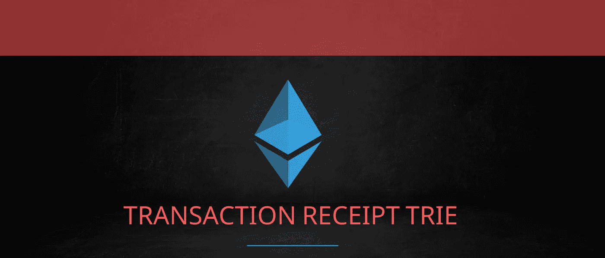
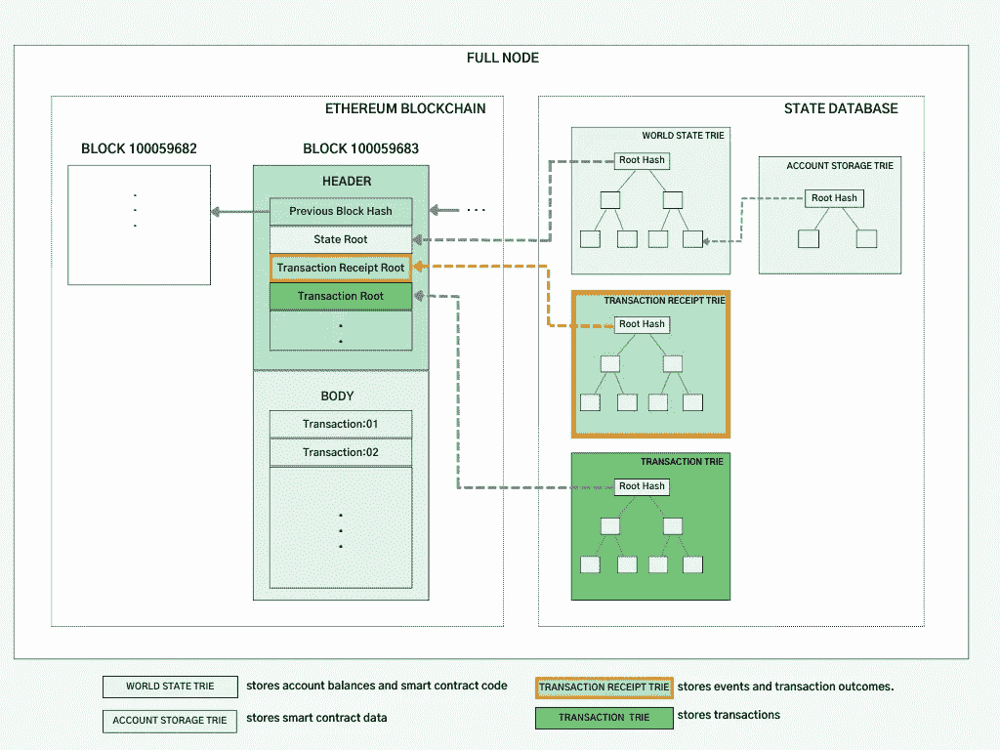
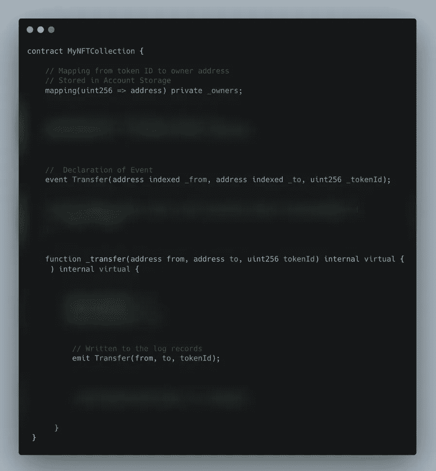
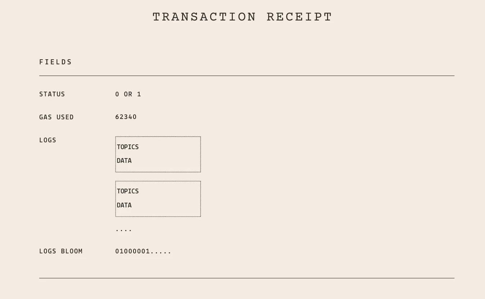
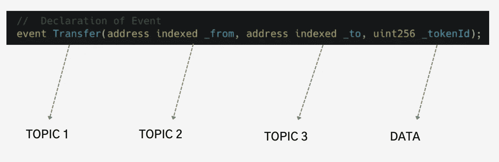
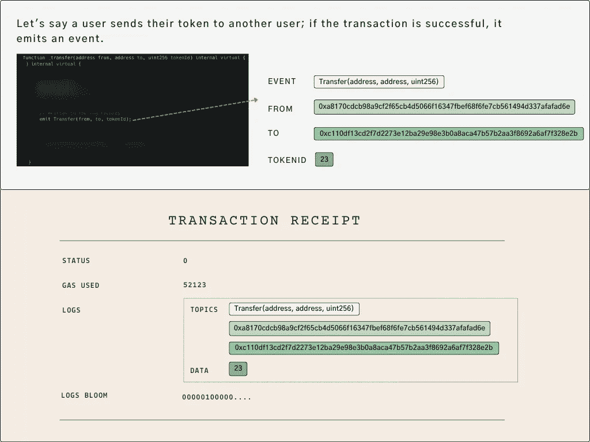
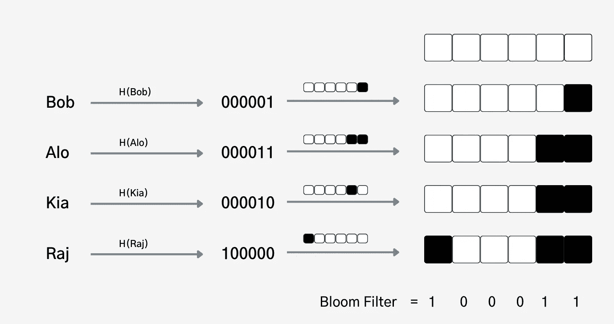
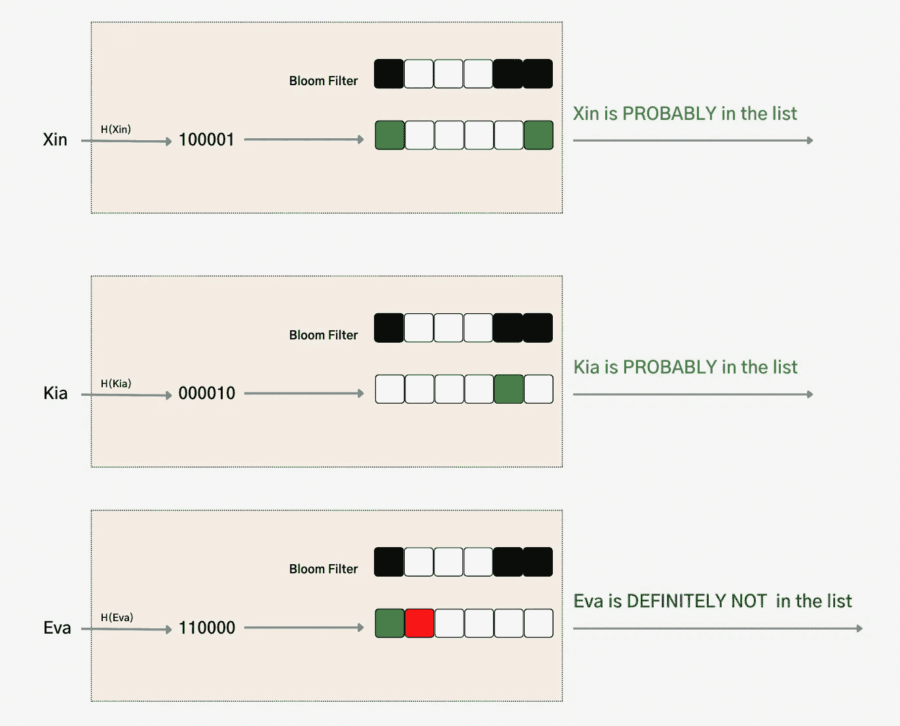
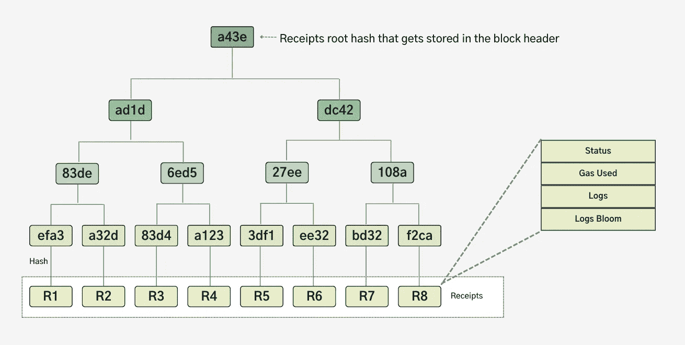

# 以太坊数据—简化的交易收据 Trie 和日志

> 原文：<https://medium.com/coinmonks/ethereum-data-transaction-receipt-trie-and-logs-simplified-30e3ae8dc3cf?source=collection_archive---------0----------------------->



交易收据包含交易结果(状态和日志),并以 trie 结构组织。收据数据驻留在状态数据库中，根散列存储在块头中。收据 trie 包含哪些信息？谁会受益？让我们更深入地探讨这些问题。



Ethereum Full Node — Transaction Receipt Trie

智能合约以两种不同的方式在区块链存储信息:帐户存储和日志。帐户存储包含定义智能合约状态以及合约可以访问的任何数据。日志用于存储合同不要求但必须由其他链外应用程序(前端、分析等)访问的信息。同样值得注意的是，日志存储比帐户存储便宜得多。

给定一个简单的令牌合同，允许用户拥有不可替换的(即唯一的)令牌，这就是数据存储的方式。

*   **令牌所有权→账户存储**:智能合约显然应该知道谁拥有哪个令牌。为了使合同能够证明所有权并提供所有权转移功能，应该将*令牌 id* 和*令牌所有者*存储在账户存储器中。
*   **令牌所有权历史记录→日志**:契约只需要知道当前令牌所有权就可以发挥作用。另一方面，投资者或决策者会对跟踪代币的所有权历史感兴趣。每当令牌被制造或转移时，该信息可以被捕获到日志中。然后，可以汇总日志以揭示任何此类见解。
*   **UI 通知→日志:**令牌生成(创建)时，前端应用程序可能希望向令牌所有者显示确认和其他详细信息。因为事务是异步的，所以智能协定不能向前端返回值。相反，当薄荷发生时，它可以将它写入日志。然后，前端可以监听通知并将它们显示给用户。
*   **链外触发→日志:**当您出于各种原因(例如，为了玩在不同区块链上构建的游戏)想要将您的令牌转移到另一个区块链时，您可以向一个公共网关发起转移，并且交易将记录该转移。然后，公共网关将挑选该信息，并在另一个链中铸造相应的令牌。

> 交易新手？尝试[加密交易机器人](/coinmonks/crypto-trading-bot-c2ffce8acb2a)或[复制交易](/coinmonks/top-10-crypto-copy-trading-platforms-for-beginners-d0c37c7d698c)

当智能合约想要记录上述场景的数据时，它可以发出一个事件(如下所示)，然后将该事件写入交易收据的日志记录。



Simple Non Fungible Token Contract — Events

每笔交易只有一张交易收据。除了日志记录之外，收据还包括状态、使用的气体和日志文件，我们将详细讨论这些内容。



Transaction Receipt — Fields

## 状态

状态为 0 或 1。它为调用者提供了一个线索来确定交易是否成功。因为事务是异步的，所以调用者必须等到块被挖掘出来才能从事务收据中读取状态。

```
💁 All events are also reverted when a transaction is reverted (due to running out of gas or condition failures). The caller can only read the status, not any further information as the logged events are reverted as well. The only way to understand what happened is to examine client node traces, which contains detailed information about the execution.
```

## 使用的气体

它是区块中所有先前交易(包括当前交易)消耗的天然气总量。

## 日志

日志只是日志记录的集合。单个日志记录包括主题和数据。主题是一个列表，其中包括事件签名以及任何索引字段。一个日志记录最多可以包含四个主题。主题的存储容量有限，不建议存储大量数据。一般来说，任何可能出现在日志搜索中的数据都应该存储在被索引的主题中。任何其他信息都存储在数据字段中。



Transaction Receipt — Log Record Indexing



Transaction Receipt — Log Record Creation

因为字段*事件名称、从、到*被索引，所以可以有效地检索下面的查询。

*   列出今天发生的所有令牌转移。
*   返回该用户(钱包地址)在过去一小时内售出的所有令牌。
*   获取该用户在上周购买的所有令牌的列表。

但是，因为*令牌 Id* 没有被索引，而是存储在*数据*字段中，所以任何检查“*的查询今天是否在此令牌 Id 上完成了任何传输？*“会极慢。

由于索引需要额外的计算，存储在主题中比存储在数据字段中稍微贵一些。让我们在下面的小节中看看索引是如何完成的。

## 原木开花

假设我们想要

> 查找特定用户(钱包)在特定区块出售的所有代币。

我们可以解析日志来回答这个问题，因为“发件人”地址已被捕获。但是，为了确定这一点，我们必须对块中的所有事务进行搜索。

假设该块包含 500 个事务，我们的搜索要求我们检查所有事务的所有日志记录(主题和数据)。相反，我们是否可以为每个事务创建一个字段，指示我们要寻找的信息是否存在于事务日志中？布鲁姆过滤器。

在我们继续之前，让我们看一下带有简单列表搜索示例的 bloom filter。假设我们想要找出一个用户是否存在于给定的列表中。找出答案的一个简单方法是浏览列表。然而，如果一个列表包含成千上万的用户，它会变得非常昂贵和非常慢。为了改进搜索，我们可以通过散列和映射列表中的每个用户来为列表创建一个有效的索引，如下所示。



Bloom filter construction— simplified

您可能已经注意到，Bloom filter 是通过合并各个哈希而创建的。假设我们想知道 Xin、Kia 和 Eva 是否在列表中。通过使用布隆过滤器，我们可以在不查询列表的情况下获得答案。



Bloom filter search — simplified

布隆过滤器是一种概率数据结构，可以说“可能存在”或“肯定不存在”。在这种情况下，Bloom filter 对于确定 Xin 或 Kia 是否在列表中不是很有用。要找到答案，我们必须实际查询列表。但是，它为伊娃提供了一个明确的答案，他们不在名单上。布鲁姆过滤器非常有用，尤其是当你认为大多数答案肯定不是的时候。

让我们回到查找特定用户在一个街区出售的代币的例子。假设事件在 500 个事务的特定块中发生了两次。我们不需要解析每个事务的所有主题，而是可以查询日志 bloom(根据主题创建)中是否存在用户地址，只有匹配时才进行主题搜索，否则跳到下一个事务。

除了事务级日志 bloom 之外，EVM 还会合并每个事务的日志 bloom，并在标头中创建一个日志 bloom。假设我们必须搜索相同的查询(特定用户出售的令牌),但是要跨越许多块。我们可以简单地查询头部的 bloom，而不是查询每个块中每个事务的 bloom。如果匹配，继续查询事务日志，否则跳到下一个块。因此，布隆过滤器有助于提高搜索效率。

## 为什么是这种结构

现在我们知道了什么是交易收据，我们需要理解为什么它是以 trie 结构组织的。



Transaction Receipt Trie — Merkle

这种 trie 结构的目的是使以太坊协议对客户端友好。因为轻客户端只存储块头，所以它们必须向一个完整的节点进行查询，例如"*检索最近 n 天内涉及从 wallet X 转移的所有交易。*”。因为区块链的固有假设是任何节点都不可信，所以除了结果之外，轻节点还需要来自完整节点的证明。在 Merkle 树结构中组织收据允许通过网络进行有效的证明分发。这篇[的文章](/coinmonks/ethereum-data-transaction-trie-simplified-795483ff3929)详细介绍了这一点。

我希望这篇文章能让你更好地理解以太坊区块链中的交易收据 trie 和事件日志。我将在以后的文章中解构 EVM 的痕迹。如果你想在帖子发布时得到通知，请确保关注。如果您有任何问题或意见，请随时联系我们。 [*推特*](https://twitter.com/kirubakumaresh) *|* [*领英*](https://www.linkedin.com/in/kirubakumaresh/)