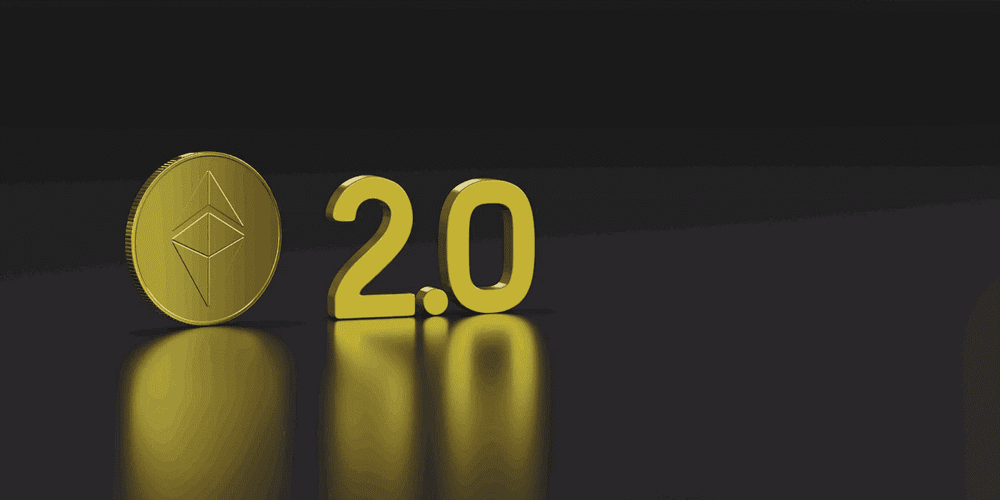

# 以太坊(ETH)合并完成；什么是合并，它对你有什么影响？

> 原文：<https://medium.com/coinmonks/ethereum-eth-merge-complete-what-is-the-merge-and-how-does-it-affect-you-e59c1be0ccf3?source=collection_archive---------8----------------------->

> **关于刚刚完成的以太坊合并和 ETH 2.0 升级，它如何影响网络，以及这对作为投资者的你意味着什么，你需要知道的一切。**

今天，2022 年 9 月 15 日，见证了期待已久的以太坊(ETH)升级“合并”的完成。

以太坊的联合创始人[维塔利克·布特林在推特上写道](https://twitter.com/VitalikButerin/status/1570306185391378434?s=20&t=_jBOoTDN-hRFoQhUmzF0tQ)“我们敲定了！快乐合并所有。这是以太坊生态系统的一个重大时刻。”

自 2021 年年中以来，“以太坊合并”和“ETH 2.0”一直是加密货币和区块链爱好者的热门话题。一些人很清楚什么是 ETH 2.0 和合并，以及它们要完成什么，但是大多数人仍然不确定这些事件实际上意味着什么。

**什么是 ETH 2.0，什么是合并？**

为了更好地理解这个概念以及它与我们散户投资者的关系，我们将尝试分解和简化下面的所有内容。

# 什么是 ETH 2.0？

为了理解什么是合并以及它试图完成什么，您应该首先真正理解什么是 ETH 2.0。

以太坊 2.0，有时被称为 ETH2 或“宁静”，是对当前以太坊[区块链](/coinmonks/blockchain-for-10-year-olds-c2728b94e00e)的改进。此次升级旨在提高以太坊网络的速度、有效性和可扩展性，以便它可以同时处理更多的交易并消除拥塞。

升级完成后，Eth1 将被指定为“执行层”，在这里维护智能合同和网络法律，而 Eth2 将充当“共识层”，确保为网络做出贡献的节点按照其规则运行。

[根据以太坊基金会的说法，预计到 2023 年将会完全过渡到以太坊 2.0。](https://ethereum.org/en/upgrades/shard-chains/)

# **ETH 2.0 升级流程**

以太坊 2.0 计划在三个主要阶段后实现完全功能，第一个阶段是信标链，[于 2020 年 12 月 1 日上线](https://ethereum.org/en/upgrades/beacon-chain/#:~:text=The%20Beacon%20Chain%20shipped%20on,upgrade%20on%20September%2015%2C%202022.)。

本地堆栈是网络向 PoS 共识协议过渡的关键组成部分，通过信标链引入以太坊区块链。顾名思义，这是一个不同于以太坊主网的区块链。

作为被称为“合并”的第二阶段的一部分，信标链今天与以太坊主网集成在一起，[今天完成，计划在 2022 年第二季度](https://ethereum.org/en/upgrades/merge/)上线。

[碎片链，最后一个阶段，计划在 2023 年的某个时候完成](https://ethereum.org/en/upgrades/sharding/)，将对扩展以太坊网络至关重要。shard networks 不是在一个区块链上解决所有交易，而是将它们分配给 64 个新的连锁店。

现在我们已经了解了什么是 ETH 2.0，让我们进一步解释什么是合并以及它的目标是什么。

# 合并是什么？

简而言之，合并是以太坊新的利害关系证明共识层(即信标链)与其原始执行层(即 mainnet)的统一，mainnet 自网络建立以来就一直存在。

*Source — ethereum.org*

ETH1 运行的工作证明模型，其中加密货币矿工使用强大的计算机来执行复杂的数学计算，现在已经被合并后 ETH 2.0 实现的赌注机制所取代。

# 工作证明(POW)与利益证明(POS)有何不同？

像比特币一样，[第一层区块链使用的共识过程被称为工作证明。](/coinmonks/defi-for-10-year-olds-what-is-a-layer-1-blockchain-cec892431281)

使用工作证明的系统消耗大量功率。例如，[比特币采矿的年用电量](https://www.forbes.com/advisor/investing/cryptocurrency/bitcoins-energy-usage-explained/)目前为 127 太瓦时(TWh)。目前，它消耗的能量比整个挪威还要多。

在这种方法中，矿工使用计算机的计算能力来解决具有挑战性的数学难题，并验证新的交易。区块链是所有交易的分类账，第一个解决问题的矿工会在所有交易的记录中增加一笔新的交易。网络的本地硬币随后被授予他们。

然而，因为没有弄清楚谜题的矿工所利用的处理能力被浪费了，所以这种方法可能是极其耗能的。

与工作证明(PoW)相反，利益证明(PoS)要求个人用户持有网络的本地货币，并充当验证者，而不是依赖于矿工。与矿工类似，验证者检查交易以确保网络没有处理欺诈交易。

这些验证者是基于他们所承诺的硬币的数量和持续时间来选择的。

然后，其他验证器可以证明他们已经查看了一个块。在收到足够的证明后，可以将数据块添加到区块链。一旦块提议成功，验证器就会得到补偿。锻造或铸造是用来描述这一程序的术语。

有了工作证明，以太坊的碳足迹相当于瑞士，年用电量大致相当于芬兰。作为对加密货币主要抱怨之一的回应，预计合并后以太坊将最大限度地减少其碳足迹高达 99.95%。

# 合并会对以太坊区块链产生怎样的影响？

可伸缩性是升级的主要理由之一。以太坊主网络(ETH1)每秒仅支持 30 次交易，因此网络上经常出现延迟和拥塞。以太坊 2.0 有望实现每秒 100，000 笔交易。碎片链的使用将被用来增加这个数量。

合并不会增加网络容量，因此，尽管它将改善一般共识算法，它可能不会导致天然气价格下降。然而，大多数针对第 2s 层的扩展解决方案现在正在开发中，旨在实现这一目标。

此外，在以太坊 2.0 的设计中，网络的安全性是一个优先考虑的问题。大多数 PoS 网络中使用的验证器数量较少，这导致系统更加集中，网络安全性较差。以太坊 2.0 的最低要求是 16，384 个验证器，它更加分散，因此非常安全。

# 合并对 ETH 价格和作为投资者的你有什么影响？

我相信更高的可伸缩性会导致使用量的增加，这反过来会导致需求的增加。至少从理论上讲，这应该会在不久的将来把以太坊的价格抬高。

预计以太坊合并后，网络交易不会马上变得更快或更便宜，但投资者可能会在以后受益。

尽管不能保证结果，但 King 认为，从长远来看，合并可能有利于加密货币投资者，因为它将为未来速度、成本和生态系统发展的改善奠定基础。

更快的交易和更低的费用最终可能会带来更多的用户，这可能会对 ETH 的价格产生影响，ETH 是该平台的本地加密货币，投资者使用它进行交易。

# 结论

毫无疑问，这一合并是加密货币历史上最重要的里程碑之一，因为它标志着最大协议之一的根本性转变。这一里程碑会为加密货币的全新时代奠定基础吗？只有未来能告诉我们。

> 如果你还有任何问题，请留下评论，或者更好的是，在 Twitter ( [@lanre_aderemi](https://twitter.com/Lanre_aderemi) )上直接给我留言，我会尽快回复。感谢您的阅读，如果您能为我鼓掌，那就太好了！

**别忘了点击关注按钮，获取更多像这样的故事；——)**

> 交易新手？试试[密码交易机器人](/coinmonks/crypto-trading-bot-c2ffce8acb2a)或[复制交易](/coinmonks/top-10-crypto-copy-trading-platforms-for-beginners-d0c37c7d698c)