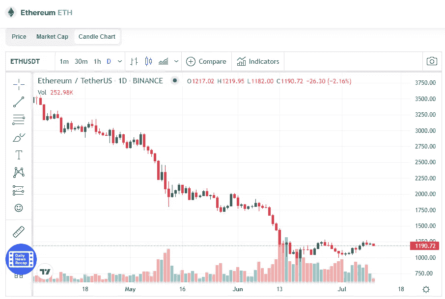

# 以太坊(ETH)价格分析 2022 年 7 月

> 原文：<https://medium.com/coinmonks/ethereum-eth-price-analyse-8907e0dc0451?source=collection_archive---------11----------------------->

Source photo [Ethereum price today, ETH to USD live, marketcap and chart | CoinMarketCap](https://coinmarketcap.com/currencies/ethereum/)

在本周的交易中，ETH/USDT 的价格令人印象深刻地上涨了 18 %,达到 1220 美元。6 月中旬，以太网找到了 880 美元的支撑，并在当月的最后几周开始回升。未能突破 1，280 美元(2 月 21 日低点)的阻力导致硬币在 2 月底滚动。