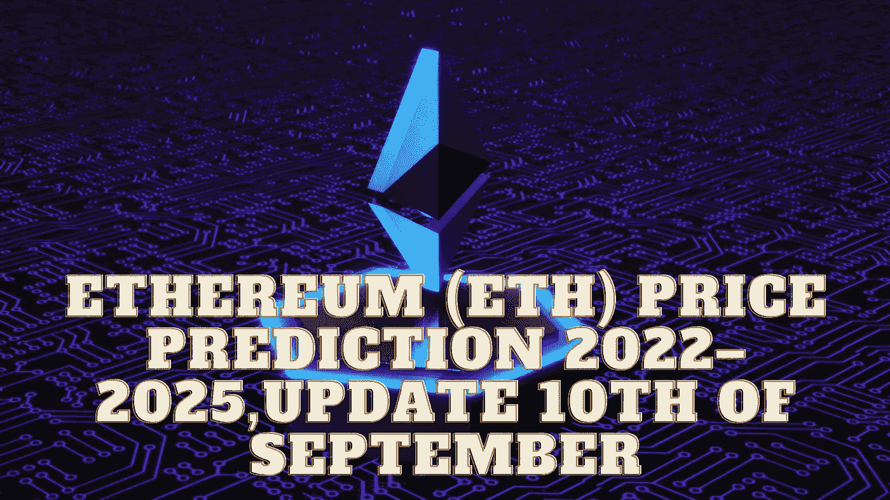

# 以太坊(ETH)2022–2025 年价格预测，9 月 10 日更新

> 原文：<https://medium.com/coinmonks/ethereum-eth-price-prediction-2022-2025-update-10th-of-september-75d9de331ff3?source=collection_archive---------11----------------------->

Source photo Unsplash.com

# 以太坊(ETH):是什么？

以太坊是一个开源的分布式区块链平台，强调智能合约功能。以太坊矿工生产以太作为在区块链做安全相关计算的奖励。