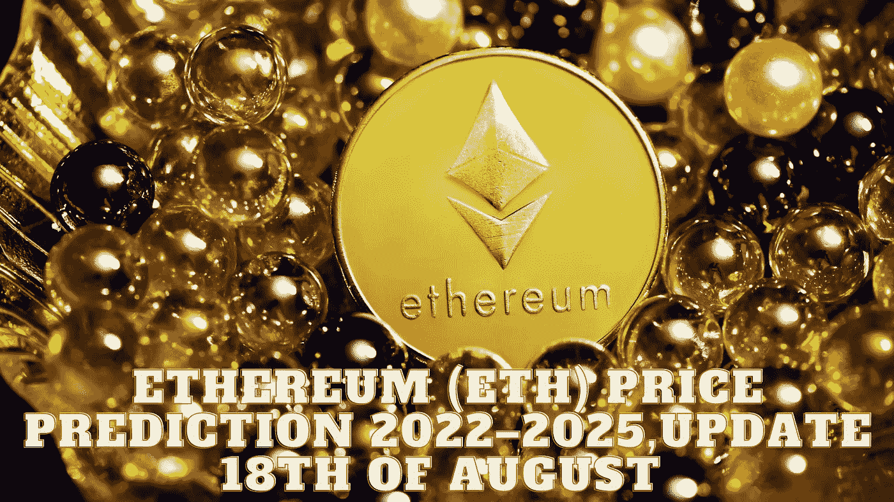

# 以太坊(ETH)2022–2025 年价格预测，8 月 18 日更新

> 原文：<https://medium.com/coinmonks/ethereum-eth-price-prediction-2022-2025-update-18th-of-august-484e7fa68b66?source=collection_archive---------13----------------------->

Source photo Unsplash.com

## 以太坊(ETH):是什么？

以太坊是一个开源的区块链平台，用于数据的分布式分类账。
支持智能合约功能的基础通信。以太坊矿工生产以太作为在区块链做安全相关计算的奖励。