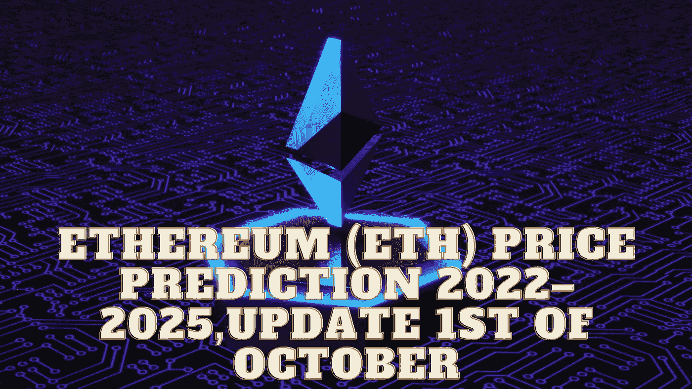

# 以太坊(ETH)2022–2025 年价格预测，10 月 1 日更新

> 原文：<https://medium.com/coinmonks/ethereum-eth-price-prediction-2022-2025-update-1st-of-october-fd766bdf510?source=collection_archive---------7----------------------->

Source photo Unsplash.com

# 以太坊(ETH)是什么？

以太坊是一个开源的分布式区块链平台，强调智能合约功能。以太币是以太坊的土生土长的货币，是矿工们为了奖励他们保护网络的工作而产生的。

2015 年 7 月 30 日午夜，网络直播。当时 7200 万…