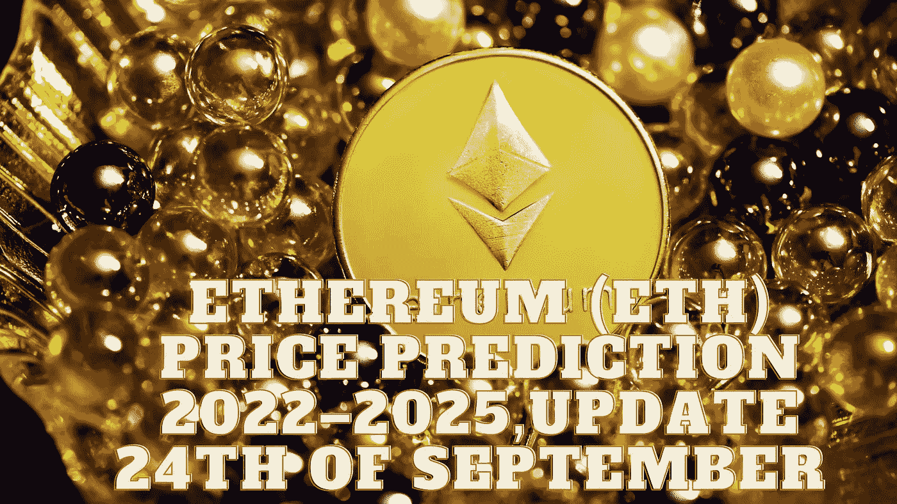

# 以太坊(ETH)2022–2025 年价格预测，9 月 24 日更新

> 原文：<https://medium.com/coinmonks/ethereum-eth-price-prediction-2022-2025-update-24th-of-september-5e5b76304427?source=collection_archive---------3----------------------->

Source photo Unsplash.com

# 以太坊(ETH)是什么？

以太坊是一个开源的分布式区块链平台，强调智能合约功能。以太币是以太坊的土生土长的硬币，是对矿工们努力保护网络的奖励。

自 2015 年 7 月 30 日起，该网络开始运行。到那时，7200 万枚硬币已经…