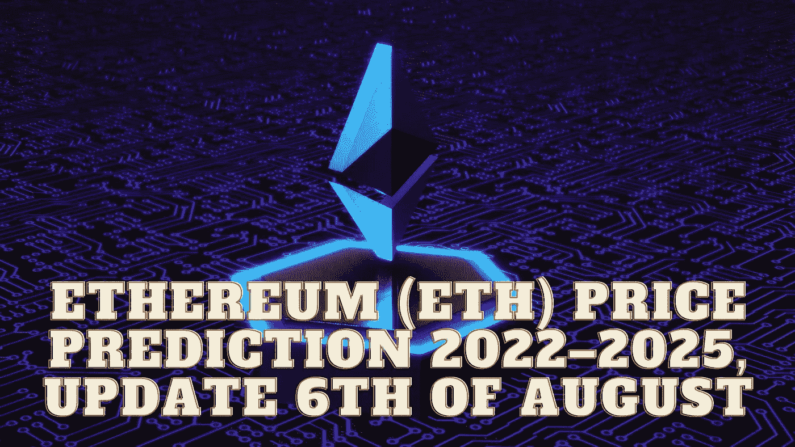

# 以太坊(ETH)2022–2025 年价格预测，8 月 6 日更新

> 原文：<https://medium.com/coinmonks/ethereum-eth-price-prediction-2022-2025-update-6th-of-august-8aa96cf26074?source=collection_archive---------12----------------------->

Source photo Unsplash.com

# 以太坊(ETH)是什么？

这是一个智能合约平台，建立在一个叫做以太坊的去中心化、开源的区块链上。为了奖励以太坊矿工保卫区块链的努力，矿工们得到了以太作为奖励。

当该网络于 2015 年 7 月 30 日上线时，已经生产了 7200 万枚硬币…