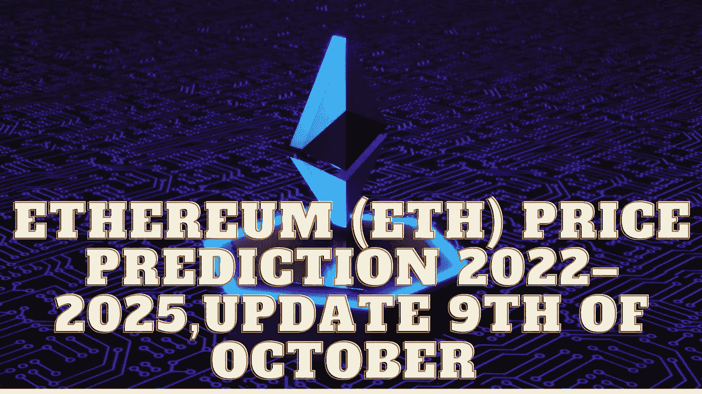

# 以太坊(ETH)2022–2025 年价格预测，10 月 9 日更新

> 原文：<https://medium.com/coinmonks/ethereum-eth-price-prediction-2022-2025-update-9th-of-october-b8dfe2269b97?source=collection_archive---------7----------------------->

Source photo Unsplash.com

# 以太坊(ETH)是什么？

以太坊是一个分布式、开源的区块链平台，强调智能合约功能。以太坊的土生土长的硬币，以太，是作为对保护网络安全的矿工的奖励而分发的。