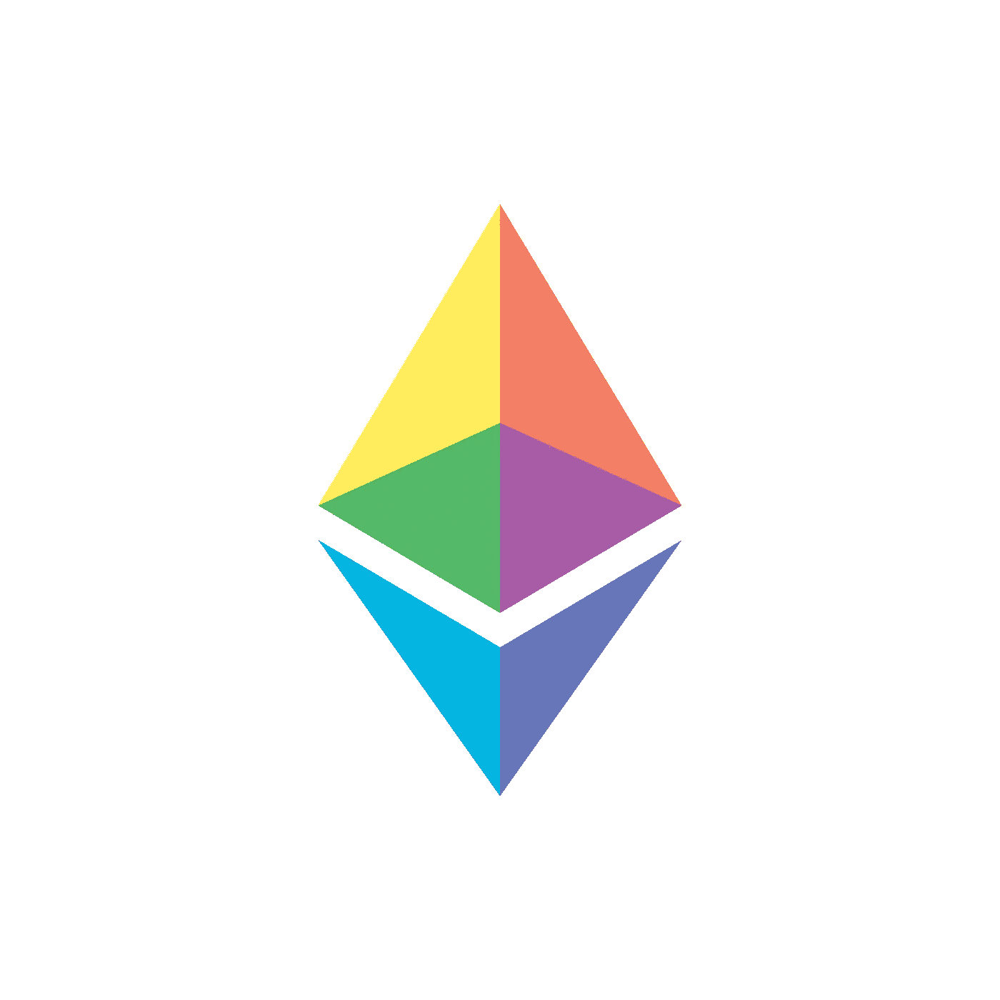

# 以太坊(ETH)价格预测 2022 年 12 月–2025 年，12 月 13 日更新

> 原文：<https://medium.com/coinmonks/ethereum-eth-price-prediction-december-2022-2025-update-13th-of-december-956f53d034b9?source=collection_archive---------16----------------------->

Source photo [Sigla Ethereum Pictograma — Grafică vectorială gratuită pe Pixabay](https://pixabay.com/ro/vectors/sigla-ethereum-pictograma-ethereum-6278328/)

## 以太坊(ETH):是什么？

以太坊是一个支持智能合约的公共分布式区块链平台。以太坊上的“矿工”为确保区块链的安全付出了努力，作为回报，他们将获得以太——一种本地加密货币。