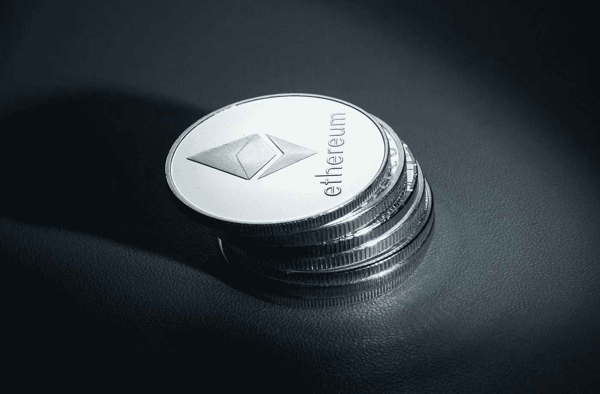

# 以太坊(ETH)价格预测 2022- 2025 年 12 月，11 月 30 日更新

> 原文：<https://medium.com/coinmonks/ethereum-eth-price-prediction-december-2022-2025-update-30th-of-november-978409a2cbad?source=collection_archive---------7----------------------->

Source photo [A Stack of Ethereum Coins · Free Stock Photo (pexels.com)](https://www.pexels.com/photo/a-stack-of-ethereum-coins-8185629/)

## 以太坊(ETH)是什么？

以太坊是一个独立的开源区块链，支持智能合约功能。当以太坊网络上的矿工完成计算以确保区块链安全时，他们会以以太的形式获得奖励，以太是该平台的原生硬币。