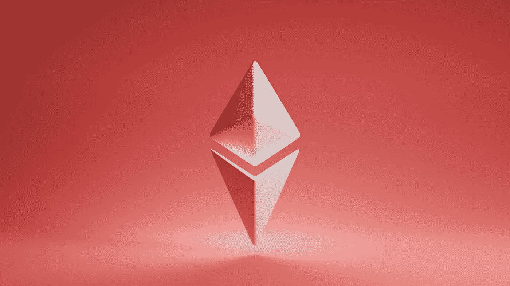

# 以太坊解释:意义、历史和技术

> 原文：<https://medium.com/coinmonks/ethereum-explained-meaning-history-technology-1938035d25d5?source=collection_archive---------26----------------------->

Photo by [Shubham Dhage](https://unsplash.com/@theshubhamdhage?utm_source=unsplash&utm_medium=referral&utm_content=creditCopyText) on [Unsplash](https://unsplash.com/s/photos/ethereum?utm_source=unsplash&utm_medium=referral&utm_content=creditCopyText)

继[比特币](/illumination/what-is-bitcoin-88540059839f)问世之后，以太坊被认为是第二种俘获人心的[加密货币](/coinmonks/what-is-cryptocurrency-a-beginners-guide-8fac78273459)。

以太坊由 Vitalik Buterin 创建和共同创立。继比特币之后，以太坊市值第二。

让我们来探索以太坊到底是怎么回事。

# 以太坊是什么？

以太坊是一个分散的系统，用于点对点交易、应用程序开发、资产所有权和其他目的。对于想要创建分散的、安全的和不可变的数字技术的开发人员来说，这是最好的选择。

以太坊使用 [***区块链技术***](/@i_am_Kayy/blockchain-explained-what-is-blockchain-technology-8ca4fbedcfca) ，这是大多数加密货币采用的技术。

以太坊也被称为以太，它的货币。

人们经常混淆以太坊和以太(ETH)。虽然可以互换使用，但还是有显著的区别。

# 以太是什么？

虽然以太坊是一个平台，允许可扩展的分散式基础设施，如分散式金融(DeFi)，但以太不是。

以太是以太坊的区块链本地货币。

如果想加入以太坊网络，就需要以太。正如 ethereum.org 所说， ***它是以太坊的命脉。***

例如，如果您希望使用以太坊网络向朋友转账(加密货币)，您必须支付以太币费用。

如果你想在以太网上使用一个分散的应用程序，你也需要在以太网上付费。

虽然乙醚看起来与现金相似，但事实并非如此。有一些区别；

*   ETH 是你的；在你和你的钱之间没有中央权力机构、政府或银行。
*   加密保护 ETH，保护您的资金免受有害攻击。
*   你可以自由地将你的 ETH 发送给任何人或任何地方。银行或任何其他中央实体不能对其施加任何限制。
*   你只需要一部智能手机、一个互联网连接和一个钱包就可以使用 ETH。
*   ETH 是灵活的。它能被 18 位小数整除。

# 什么是区块链技术？

[区块链](/@i_am_Kayy/blockchain-explained-what-is-blockchain-technology-8ca4fbedcfca)是一个数据库，然而，它和传统数据库不一样。区块链是一种将记录和信息保存在块中的数据库，这些块随后通过加密技术连接起来。

简而言之，区块链是交易记录的存储库，不能被更改、删除、编辑或销毁。

在将程序块添加到区块链之前，程序网络必须对其进行验证。在交易被网络认为是真实的之前，他们必须达成共识。没有人可以独立编辑记录，因为只有在达成共识的情况下才能进行更改。

共识机制是程序网络用来达成共识的协议。工作证明有助于本协议。

# 工作证明

工作证明，有时也称为 PoW，是一种旨在识别或阻止计算资源滥用的技术。

根据维基百科，工作证明是一种加密证明，其中一个网络必须向其他网络证明它已经使用了特定数量的处理资源。

在加密货币的世界里，这个过程被称为挖掘，验证其他网络的网络被称为矿工。

当打开一个新块时，来自前一个块的信息被加密。所有的网络都加密了。然后，他们用他们的计算能力来解密它。

第一个破解密码的矿工将获得额外奖励。

工作证明使用高计算能力，消耗大能量。由于高能耗，以太坊已经过渡到另一个名为**利益证明**的共识协议。

# 利害关系证明

与 PoW 相比，这种方法使用的处理能力要少得多。与工作证明相反，这种利害关系证明的运作方式不同。

为了证明利害关系，矿工必须以他们的 ETH 为赌注来参与采矿过程。这个 ETH 将作为抵押品和激励。

与股权证明相反，工作证明要求矿商为激励而竞争。交易由随机选择的矿工进行验证，这些矿工以他们的 ETH 为赌注。

他们在股权证明中被称为“验证者”，而不是矿工。如果交易被确认，他们将在 ETH 收到付款。

# 以太坊的独特之处是什么？

和所有其他加密货币一样，以太坊是一种数字货币。但是为什么这么有特色呢？为什么有人认为以太坊最终会超越比特币？

虽然以太坊和其他加密货币类似，但是它的技术是独一无二的。

让我们来看看以太坊和比特币是如何相互区别的。

比特币的唯一目的是作为点对点交易的交换媒介。以太坊提供了更多。

尽管区块链技术为以太坊和比特币提供了动力，但以太坊要复杂和优越得多。

以太坊是一种区块链技术，它有助于点对点交易，也使其他软件和技术进步能够建立在它的基础上。为了避免混淆，把以太坊区块链想象成一套乐高积木。

以太坊区块链被普遍认为是世界上可编程的区块链。

任何时候都只能有 2100 万个比特币在流通。可以产生多少乙醚是没有限制的。然而，有适当的结构来阻止乙醚过度循环。

在以太坊网络上，智能合约被用来编写程序和其他基于它的技术。

# 智能合同

智能合约是一种技术，它允许在满足特定标准的情况下执行交易，而无需第三方或其他实体的帮助。

不需要中央权威，因为智能合同是用代码行编写的，这是保护它的法律。

你可以创建一份智能合同，在拿到工资后，从你的工资中拿出一部分投资到一家公司。

# 区块链以太坊的历史性分裂

2016 年，以太坊区块链被一分为二——以太坊和以太坊经典。

以太坊社区决定使用名为 DAO 的智能合约来开展投资活动。

在短短 28 天内，该社区筹集了 1.5 亿美元。

投资活动结束后，黑客利用了智能合约代码中的一个漏洞。利用相同的漏洞，白帽黑客决定在黑客之前耗尽剩余资金。

白帽黑客能够获得 70%的资金。

之后提出了软叉和硬叉。

硬分叉对区块链的原始代码进行了大规模的重大修改。软分叉包括对区块链基本代码的微小更新。

以太坊社区被允许投票，大多数参与者决定实施硬分叉。最初的区块链，被命名为以太坊经典(ETC)后，硬叉，以太坊区块链保留了它原来的名字(ETH)。

反对硬分叉的人选择坚持以太坊经典，第一个区块链，而不是转换。

反对硬叉子的人决定继续使用最初的区块链以太坊经典。

# 什么是以太坊合并？

由于过多的能源使用，以太坊从工作证明切换到利害关系证明作为共识方法。这一改变将降低 99.95%的电力成本。

信标链是以太坊现有的利害关系网络证明。虽然它是在 2020 年推出的，但没有使用它进行交易。

人们错误地认为合并后，煤气费会降低。这不是真的。

然而，合并将创造未来降低天然气费用的机会。

**以太坊钱包**

如前所述，以太需要与以太坊网络交互。你需要一个以太坊钱包来存放你的以太。

虽然以太将永远存在于区块链，但你需要一个钱包来进入你自己的钱包。

你的钱包地址是一个公钥。你可以把它想象成一个银行账号。你可以用它来发送和接收密码。

私人密钥授予你帐户的所有权，从而也授予你金钱的所有权。私钥是你的以太坊钱包给出的种子短语。

如果你的私人钥匙泄露出去，你的资金就有危险了。

# 怎样才能买到以太坊？

你可以使用众多的中央交易所中的一个来买卖以太坊。出售以太坊的中央交易所有比特币基地、币安、北海巨妖、双子座等。

# 结论

以太坊区块链现在有如此多的科技基础设施。像 Defi 和 NFTs 这样的基础设施。

Defi 更像是一个金融基础设施，它希望结束金融服务的局限性。

NFT 是一种不可分割的数字令牌形式。拥有 NFT 证明你拥有资产、数字产品等。

如果你喜欢读这篇文章，请关注我。

别忘了给我 50 次掌声。

> 交易新手？试试[加密交易机器人](/coinmonks/crypto-trading-bot-c2ffce8acb2a)或者[复制交易](/coinmonks/top-10-crypto-copy-trading-platforms-for-beginners-d0c37c7d698c)