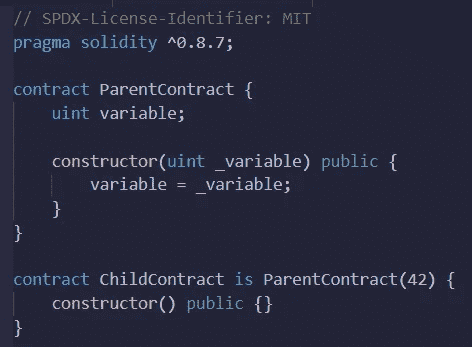

# 以太辐射——关于构造函数的一些话

> 原文：<https://medium.com/coinmonks/ethereum-fallout-a-few-words-about-constructor-76530a0c76c4?source=collection_archive---------54----------------------->

构造函数是使用**构造函数**关键字声明的特殊函数。这不是一个必须的函数，只能调用一个，不能再调用一个。呼叫时刻是我们的智能合同创建的时刻。构造函数给了我们初始化状态变量的可能性。在构造器代码执行后，最终代码被部署到区块链。该代码包括公共函数和可通过公共函数访问代码。构造函数代码或任何仅由构造函数使用的内部方法不包含在最终代码中。

# 创建构造函数

创建构造函数很容易。让我们看看。

Example of using of constructor.

当我们声明构造函数的时候，我们只使用这个关键字——没有这个构造函数的名字或者其他的。此外，我们必须添加**访问修饰符**(我稍后会谈到它们)。构造函数可以是空的，也可以有任何输入变量(就像我们的例子)。

每个合同只能有**一个建造师**。编写更多的构造函数会在编译过程中给我们带来错误。但有趣的是，如果我们不定义构造函数，在契约中就会有一个默认的构造函数。

Default constructor

# 继承中的构造函数

更有趣的是，当我们想要创建一个从其他契约继承而来的契约时，它需要构造函数的参数。我们不能给任何参数，我们的合同将必须是一个抽象的合同(这也将在后面解释)。或者我们可以传递每个需要的参数。这里我们又有两个选择:

1.  **直接初始化:**我们初始化父构造函数的契约使用硬代码方法，就像我们在例子中看到的那样。

Example of direct initialization

当我们定义 ChildContract 从 ParentContract 继承时，我们立即为 ParentContract 的构造函数传递值。

2.**间接初始化:**parent contract 的变量通过其构造函数进行初始化是在 ChildContract 内部进行的。

Example of indirect initialization

通过这种方法，我们可以在部署 ChildContract 时确定 ParentContract 的参数。这种方法更加灵活。

不允许同时通过直接和间接方式初始化 ParentContract。

# 函数和状态变量的可见性

也就是说，当我们想要声明构造函数时，我们必须添加访问修饰符。构造函数可以是**公共**或**内部**。

但是我们为什么要用这个词，它们是什么？Solidity 知道两种类型的函数调用:不创建实际的 EVM 调用(也称为“消息调用”)的内部调用和创建的外部调用。因此，函数和状态变量有四种可见性。

*   **外部:**外部函数是合同接口的一部分，这意味着它们可以从其他合同和通过事务调用。外部函数`f`不能在内部调用(即`f()`不起作用，但`this.f()`起作用)。外部函数在接收大型数据数组时有时会更有效，因为数据不是从 calldata 复制到内存中的。
*   **Public :** 公共函数是契约接口的一部分，可以在内部调用，也可以通过消息调用。对于公共状态变量，会生成一个自动 getter 函数。这意味着编译器生成一个函数，叫做 like 变量，不带任何参数，返回这个变量的状态值。
*   **内部:**这些函数和状态变量只能在内部访问(即从当前合同或从其派生的合同中访问)，不使用`this`。
*   **私有:**私有函数和状态变量仅对定义它们的契约可见，在派生契约中不可见。

本段信息来自[固化文件](https://docs.soliditylang.org/en/v0.6.2/contracts.html)。

公共构造函数的行为与本文开头描述的完全一样。当构造函数是内部的时，整个契约是抽象的。

# 抽象合同

我喜欢[教程观点](https://www.tutorialspoint.com/solidity/solidity_abstract_contracts.htm)中的描述。

> 抽象契约是包含至少一个功能但没有任何实现的契约。这种合同被用作基础合同。通常，抽象契约既包含实现的功能，也包含抽象的功能。派生契约将实现抽象函数，并在需要时使用现有函数。
> 
> 如果派生契约没有实现抽象函数，那么该派生契约将被标记为抽象。

抽象契约不能被编译。但是，它们可以用作其他协定可以继承的基础协定。

让我们看看这个例子。

Using of abstract contract

AbstractContract 包含没有主体的函数。我们知道它在输入端需要什么，在输出端会有什么。我们也知道这个函数是公共的。但除了“虚拟”这个神奇的词之外，别无其他。这个词通知 Solidity 这个函数将被其他函数覆盖，具有相同的名称和' override '修饰符。

abstract 和 virtual 关键字表示关联的代码将在代码中的其他地方实现或重写。主要区别是抽象适用于契约，虚拟适用于函数。

我希望这篇文章对你有用。如果你有任何想法，我如何能使我的帖子更好，请告诉我。我随时准备学习。你可以通过 [LinkedIn](https://pl.linkedin.com/in/szymon-skrzy%C5%84ski-881462214) 和 [Telegram](https://t.me/eszymi) 与我联系。

如果你想和我谈论这个话题或者我写的其他话题，请随意。我乐于交谈。

快乐学习！

> 交易新手？试试[密码交易机器人](/coinmonks/crypto-trading-bot-c2ffce8acb2a)或[复制交易](/coinmonks/top-10-crypto-copy-trading-platforms-for-beginners-d0c37c7d698c)