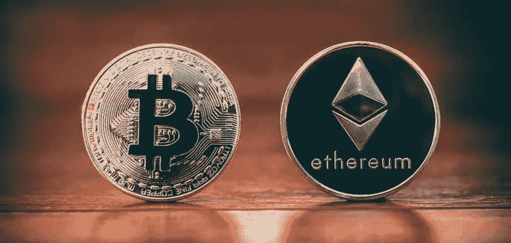

# 以太坊翻转比特币？合并可能会做到这一点

> 原文：<https://medium.com/coinmonks/ethereum-flip-bitcoin-the-merger-might-do-that-eabc37b4dcb0?source=collection_archive---------34----------------------->

八月到了，ETH 合并正在进行，PoS 粉丝希望以太坊翻转比特币的时刻到来。曾经的第二大工作证明加密货币，以太正在放弃耗油船。同时狡猾地将[等](https://blog.hi.exchange/ethereum-classic-etc-market-cap/)留给矿工去砍伐树木！新的和改进的以太坊 2.0 是以太坊翻转比特币的最大希望。有趣的是，这发生在最糟糕的熊市之一，大多数持有人仍在水下。迄今为止，以太坊就像是 BTC 的一个微不足道的影子，盲目地追随它的脚步。然而，带着如此强烈的大胆情绪，瑞士联邦理工学院正在从保守俱乐部和[最大主义者](https://blog.hi.exchange/tales-from-the-chain-chapter-v-bitcoin-maximalist/)兄弟团体中挣脱出来。这一次，数据显示了一些不同寻常的东西。

最近的研究表明，以太坊飞离交易所，而 BTC 则蜂拥而入。虽然这可能是一个购买谣言，出售新闻的时刻，但这次客户情绪可能更适合长期。毕竟，世界上所有的燃料和能源都短缺，矿工们还要继续他们的荒谬多久？

# 以太坊翻转比特币悖论

这个短语已经在所有博客文章和 Reddit 文章中流传了很长时间。这种现象可以废黜那些相互合作的巨型矿工。这个行业的巨头们崇拜一个看不见的神，名叫 Satoshi，在睡梦中印刷钞票。打着匿名和去中心化的旗号，他们一直可怜兮兮地保持每秒只完成几笔交易。与此同时，股权共识证明可以在一秒钟内处理数千笔交易。

很自然，我们在历史上见过这种情况。一种新的和改进的技术出现了，而旧行业中的领军人物抵制变革。他们这样做主要是通过文字游戏和机智恶毒的 T4 辩解。就看[飞行器](https://www.google.com/url?sa=t&rct=j&q=&esrc=s&source=web&cd=&cad=rja&uact=8&ved=2ahUKEwiI8tGG3cX5AhV6lIkEHVPTC3kQFnoECC8QAQ&url=https%3A%2F%2Ffloydmiddle.typepad.com%2Ffiles%2Fthe-flying-machine-text.pdf&usg=AOvVaw1TdxpGAKseHGTgvoEyTWXo)小故事，供参考。

然而，这就是加密市场的现状，以太坊正在向国王开战。虽然迈克尔·塞勒(Michael Saylor)已经出局，埃隆(Elon)已经背叛了这个群体一千次，但最大化主义者从未如此脆弱过。

# 数字

分析公司 IntoTheBlock 的研究主管 Lucas Outumuro 表示，本周以太网正以飞快的速度离开交易所。与此同时，比特币正在涌入交易所，投资者实际上并不拥有他们的资产(不得不这么做)。

根据一项新的[分析](/intotheblock/ready-set-merge-5037828e0c4f)，Outumuro 指出，以太坊中有近 10 亿美元流出了交易所。而这仅仅是在过去的一周。

对于那些没有意识到的人来说，将 crypto 移出交易所标志着强劲的购买活动和长期持有的趋势。根据 IntoTheBlock 的说法，净流量是通过将任何加密资产流入集中交易所的数量减去流出量来衡量的。

另一方面，在同一时期，BTC 的集中外汇净流入为 1.32 亿美元。从本质上说，这是抛售压力增加的一个迹象。然而，请记住，这种活动不一定意味着大规模的暴跌或重大的崩溃。

尽管如此，根据 Outumuro 的说法，这两种数字资产的网络活动都出现了激增。

尽管流入和流出的统计数据并不能保证我们会迎来一个以太坊翻转比特币的时刻，但它确实说明了市场情绪的转变。在上一次熊市期间，许多机构投资者通过出售 BTC 逃离了现场。其中最大的是特斯拉，比特币受到了重创。现在，看看市场的现状，以太坊作为机构投资者的长期选择更有意义。

首先，以太网是或者至少将是非常节能的。随后，环境条例将不会影响他们。此外，Satoshi 很酷，但他不说话，也不对自己的行为负责，政府不喜欢这样。以太坊没有那种神秘的面纱来娱乐 15 岁的孩子，它实际上是一个正常运转的、负责任的、反应迅速的机构。所以，有了这两大原因，ETH 就能长期吸引大笔资金。至于比特币，闪电网是老狗最后的希望。

这篇文章最初发表在同一作者[尼玛·阿斯加里](https://blog.hi.exchange/author/nimaasgari/)的 [HiExchange 博客](https://blog.hi.exchange)上。

> 加入 Coinmonks [电报频道](https://t.me/coincodecap)和 [Youtube 频道](https://www.youtube.com/c/coinmonks/videos)了解加密交易和投资

# 另外，阅读

*   [NFT 十大市场造币集锦](https://coincodecap.com/nft-marketplaces)
*   [AscendEx Staking](https://coincodecap.com/ascendex-staking)|[Bot Ocean Review](https://coincodecap.com/bot-ocean-review)|[最佳比特币钱包](https://coincodecap.com/bitcoin-wallets-india)
*   [Bitget 回顾](https://coincodecap.com/bitget-review)|[Gemini vs block fi](https://coincodecap.com/gemini-vs-blockfi)|[OKEx 期货交易](https://coincodecap.com/okex-futures-trading)
*   [美国最佳加密交易机器人](https://coincodecap.com/crypto-trading-bots-in-the-us) | [变化回顾](https://coincodecap.com/changelly-review)
*   [在印度利用加密套利赚取被动收入](https://coincodecap.com/crypto-arbitrage-in-india)