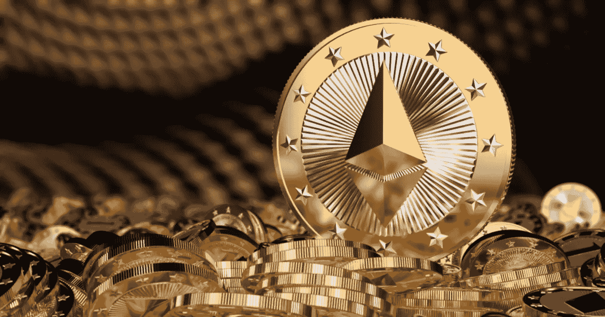
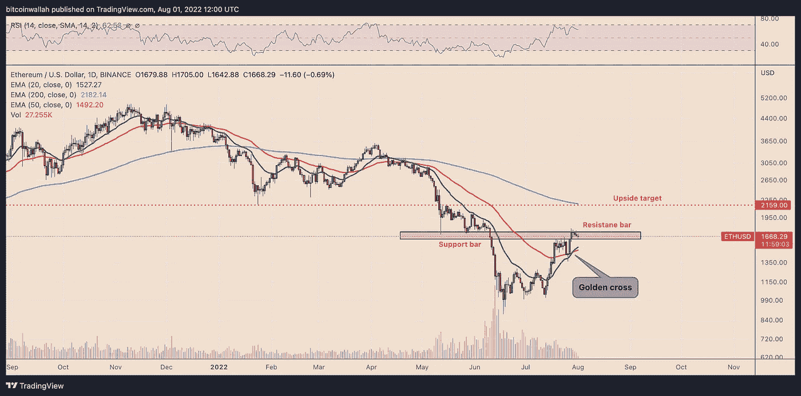

# 以太坊期货现货升水暗示合并前 30%的“空投反弹”

> 原文：<https://medium.com/coinmonks/ethereum-futures-backwardation-hints-at-30-airdrop-rally-ahead-of-the-merge-cc2c034316ae?source=collection_archive---------28----------------------->

乙醚(ETH)多头喜欢其现货和 ETH 期货价格之间的正价差，因为所谓的升水反映了对未来更高利率的乐观态度。但截至 8 月 1 日，以太坊期货曲线向相反方向下滑。

# 现货升水中的以太坊季度期货

在日线图上，计划于 2022 年 12 月到期的以太坊期货季度合约已滑入现货升水状态，这是一种与期货溢价相反的状态，即期货价格低于现货价格。

8 月 1 日，以太坊的现货和期货价格之间的价差扩大至负 8 美元。

一方面，当前的 ETH 现货价格高于其年终展望，这似乎是一个看跌的迹象。然而，目前乙醚现货和期货价格之间的负价差表明，交易者实际上可能看涨乙醚。

例如，自 6 月下旬比特币(BTC)期货一年来首次进入现货升水以来，比特币已经上涨了 15%。

# 瑞士联邦理工学院可能依靠“空投”希望重整旗鼓

此外，根据一些分析师的说法，在 9 月份合并之前，潜在的连锁拆分可能是有利的。

Genesis Trading 前机构贷款副总裁 Roshun Patel 指出，由于以太坊的“分叉赔率”，12 月以太期货已转向现货升水，这可能会促使交易员在合并前购买现货 ETH。

与此同时，帕特尔暗示，交易员可能会通过对 12 月期货合约采取看跌立场来抵消他们的上行现货风险。

这份声明是在 Galois Capital 对合并进行调查后发布的。在 7 月 28 日的 Twitter 投票中，加密对冲基金询问其追随者，合并是否会最终将以太坊分为 ETH1 和 ETH2。

33.1%的人认为升级会导致硬分叉，而 53.7%的人预计网络会平稳过渡。

以太坊潜在的链分裂意味着 ETH 持有者将在两条链上拥有等量的令牌。换句话说，一次空投，授予 ETH 持有者同等数量的 ETH1 代币，一次 2016 年的 la 以太坊经典赛(ETC)。

# ETH 价格技术面闪现“黄金十字”

乙醚现在在一个关键的 1650-1750 美元阻力位内整理，该阻力位在 2022 年 5 月至 6 月期间充当支撑。

与此同时，20 天(绿色)和 50 天(红色)指数移动平均线(EMA)也形成了“黄金交叉”，表明中期看涨。

突破 1，650-1，750 美元阻力位后，ETH eye 可能将 2，150 美元作为下一个上涨目标。这个价位在 5 月和 6 月是阻力，在 1 月是支撑。现在，它与 200 日均线(蓝色波浪)在 2180 美元附近重合，比今天的价格上涨了近 30%。

相反，从阻力线的回调可能会使 ETH 面临 20 日均线(约 15，250 美元)和 50 日均线(1，500 美元)的波动。

点击这里关注我们了解更多故事[。](http://t.me/etellworld)

> 交易新手？试试[密码交易机器人](/coinmonks/crypto-trading-bot-c2ffce8acb2a)或者[复制交易](/coinmonks/top-10-crypto-copy-trading-platforms-for-beginners-d0c37c7d698c)