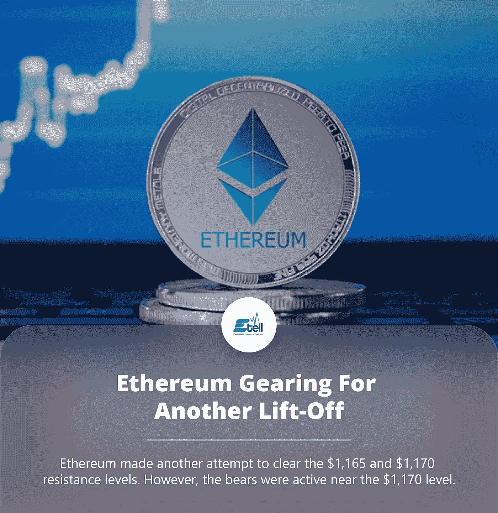

# 以太坊齿轮再次升空

> 原文：<https://medium.com/coinmonks/ethereum-gearing-for-another-lift-off-4dc26296e517?source=collection_archive---------45----------------------->

最近的高点是在 1169 美元附近形成的，然后才出现下跌修正。交易价格低于 1，150 美元和 1，130 美元的支撑位。乙醚价格低于从 1，076 美元的低点到 1，170 美元高点的 50% Fib 回撤线。

不过，多头似乎在 1120 美元支撑区附近表现活跃。它还在从 1，076 美元的低点到 1，170 美元的高点向上移动的 61.8% Fib 回撤位附近找到了支撑。

> 交易新手？试试[加密交易机器人](/coinmonks/crypto-trading-bot-c2ffce8acb2a)或者[复制交易](/coinmonks/top-10-crypto-copy-trading-platforms-for-beginners-d0c37c7d698c)

乙醚现在交易于 1120 美元和 100 小时简单移动平均线之上。在 ETH/USD 小时图上，在 1，120 美元附近形成了一条关键的看涨趋势线。上行的直接阻力在 1150 美元附近。

下一个主要阻力在 1170 美元附近，在此之上，价格可能会超过 1200 美元的阻力。在这种情况下，价格可能会上升到 1250 美元的阻力。任何进一步的上涨都可能将价格推向 1320 美元区域。ETH 出现新的下滑？

如果以太坊未能升至 1170 美元阻力上方，它可能会开始另一轮下行修正。下行的初步支撑在 1120 美元附近。

下一个主要支撑位在 1100 美元区域和 100 小时简单移动平均线附近。跌破 1100 美元支撑位可能会引发另一轮下跌。在这种情况下，价格可能会下降到 1070 美元的水平。

点击这里，关注我们的更多故事[。](http://t.me./etellworld)