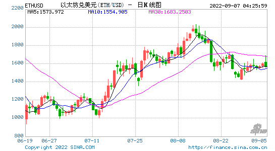
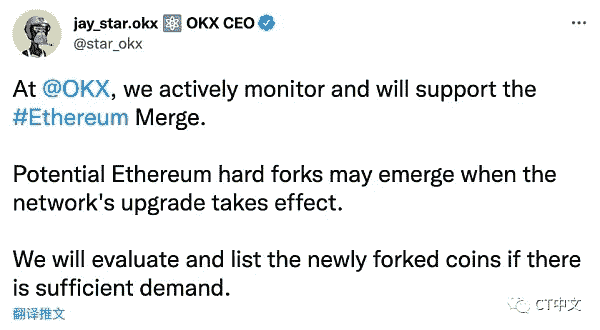

# 以太坊硬叉剧加剧。交易所和 Etherium 团队的立场是什么？

> 原文：<https://medium.com/coinmonks/ethereum-hard-fork-drama-intensifies-where-do-exchanges-and-etherium-team-stand-a5997a832f04?source=collection_archive---------30----------------------->

这是我翻译自[https://finance . Sina . com . cn/区块链/roll/2022-08-09/doc-imizmscv 5506124 . shtml 的一篇文章？finpagefr=p_111](https://finance.sina.com.cn/blockchain/roll/2022-08-09/doc-imizmscv5506124.shtml?finpagefr=p_111)

随着 Ethereums 合并(估计在 9 月 10 日)的临近，Ethereums 从工作证明(PoW)转移到股份证明(PoS ),争议围绕着最终的硬分叉。
最近，已经是 crypto exchanges 的一部分，merge 项目团队和社区已经开始为 fork 做准备，被称为“fork wars”，现在已经近在咫尺。

**交易所**

**Gate.io:支持即将到来的分叉，并将提前启用最终分叉货币的交易。**
Gate.io 是最近启用 Ethereums fork 交易的交易所之一。根据他们的官方网站，Gate.io 在 8 月 9 日之前，直到 Eth 2.0 的成功发布，将允许 ETHS 或 ETHW 的 Eth 交易。用户可以与 ETHS 或 ETHW 以 1:1 的比例进行交易。其中，ETHS 代表一种新的 PoS(赌注证明)硬币的令牌；一枚名为“candy”的分叉硬币，而 ETHW 代表当前存在的 PoW(工作证明)链的令牌，可能会继续存在。
与此同时，Gate.io 宣布，“如果硬叉失败，ETHS 将自动以 1:1 的比例换成 ETH，并关闭 ETHS 和 ETHW 的交易。”

**TRON Poloniex:支持 Ethereums 潜在 fork 并启用 fork tokens 的期货交易**
Poloniex 在其官网宣布:“我们将全力支持 ETH 的一个潜在 fork。以太坊可能会在升级过程中分叉成两条链，任何以太坊的持有者都将能够以 1:1 的比例获得分叉的硬币。

**Huobi:尊重社区共识，但不鼓励没有切实改善的分叉。**
8 月 5 日，火币宣布一直关注以太坊社区关于硬分叉的讨论，尊重他们的共识，但不鼓励新的和改动过的分叉，反对任何形式的预挖掘。
火币方面尽量保持中立客观，表示在保障已成功分叉的 ETH 链上用户资产(包括但不限于 mainnet 币)安全的情况下，只要符合资产安全要求，火币将优先支持用户领取。为此，霍碧制定了五个标准来处理分叉后的资产分配:
1。分叉前提前告知霍碧环球，得到霍碧环球的明确回复。
2。默认情况下，它有严格的双向重放保护，可以使一个链上的事务在另一个链上无效。
3。新链不会被原始链覆盖或消除。
4。交易有不同的格式，因此所有钱包(包括轻客户端)都需要升级以支持新的链。
5。官方客户端软件应在硬叉启用前发布，客户端软件应公开测试评估。
此外，火币呼吁行业主流平台参考上述必要标准进行叉前合理性评估，制定合理标准。

**OKX:根据需求评估推出硬分叉令牌**

8 月 8 日下午，OKX 首席执行官 Jay Hao 在 Twitter 上表示，OKX 正在积极关注对 Etherium 合并的支持。这次网络升级可能会有以太坊的硬叉，OKX 会根据需求评估硬叉币的上市。

bit MEX:eth pow 期货合约将于 8 月 9 日发布。
BitMEX 于 8 月 8 日宣布，他们将于本月 9 日发布 ETHPoW 期货合约 ETHPOWZ22，以 USDT (ERC-20)作为基础证券，最高杠杆为 2 倍。

在写的时候，交流；币安、比特币基地和库科恩还没有发布关于以太叉的声明。

**以太叉团队**
目前已经发声的主流项目方对以太叉硬持否定态度。

**Chainlink** 宣布，“在合并期间和之后，Chainlink 将合作并继续为 Etherium 运营服务，不会支持 Etherium 分支，包括 PoW。这是以太社区的共识。
钱包智能合约，**银**表示对 Etheriums 合并非常兴奋，但没有计划支持 fork。
Defi 钱包平台**Debank**8 月 9 日表示，Etherium 目前正在成为最有前景的 web3 应用链。硬分叉会给整个 Web3 生态系统带来灾难。因此，在以太坊的 PoS 合并过渡期间，其团队将不支持任何分叉链。
**Frax Finance** 联合创始人萨姆·卡泽米安(Sam Kazemian)在社区发起了反对分叉的提案。该提案呼吁 Frax DAO 选择 PoS 以太坊作为 Frax stable coin 认可的唯一以太坊网络。
提案称，“Frax 是第五大稳定硬币，具有至少-20%的 TVL(锁定的总价值)，是 Uniswaps 的第十大硬币，也是 Etherium 生态系统的重要组成部分。因此，通过治理公开澄清 FXS 持有者的意愿非常重要。"

上周在韩国 BUIDL 亚洲会议上，Vitalik Buterin 表示，像 USDC 和 USDT 这样的集中式稳定硬币将是未来硬叉子的重要决定因素。“现在 Frax Finance 已经支持我们，我们期待其他稳定硬币的位置。”
与此同时，Curve Finance 表示，Curve Dao 不可能强制做出有关分叉的决定(由于其分散性)。然而，一个硬叉子将不可避免地克隆刀和 CRV 令牌，刀将不得不作出决定，哪一个链将用于他们稳定的硬币和刀。
此外，以太矿第二大矿池 f2pool 声明，矿工是以太生态系统的无名英雄。他们是否支持 Etheriums fork 并不重要，这要由矿业团体来决定。社区领袖表示将继续为任何人提供采矿服务。

**业内人士观点**
**Crypto 实用主义创始人杰克·尼沃尔德**在推特上表示，Etheriums PoW hard fork 将没有开发者活动，没有投资，它将是一个没有媒体报道和没有人与菲亚特进行资产交易的鬼城。因为普遍的信念是，合并后的链条才是真正的以太坊。
杰克·尼沃尔德讨论了硬分叉的风险，称之为以太坊内的内战。目前已经有圈内人士公开主导以太坊硬叉，继续支持 PoW 网。与 Vitalik Buterins 的观点相似，Jack Niewold 认为以太坊的硬分叉可能依赖于稳定的硬币发行者，如 USDT (Tether)或 USDC (Circle)。但杰克·尼沃尔德表达了对稳定币发行者在以太坊硬分叉上的潜在立场的担忧。
因为，如果以太坊链条分叉，稳定币将面临分叉成两个稳定币的风险。作为一个稳定的硬币发行者，每发行一个稳定的硬币，你就突然多了两个债务义务。
虽然很多人相信稳定币的发行者会把 PoS 链当成以太坊的真实链，但是如果他们想支持 PoW 链呢？毕竟，他们(矿商)有足够的经济动机这么做。
比如他们可以做空以太坊，在 PoW 链上宣布赎回自己的 erc-20 代币，然后赚几十亿。这可能会扰乱新的以太坊网络，导致贷款被清算，协议、交易所、金库等被关闭。这将是彻底的混乱，并可能摧毁加密货币市场。这种做法很可能是非法的，但是在赚了几十亿美元之后你可以有足够的钱雇佣一个足够好的法律团队为你辩护，或者买一个私人岛屿出尽风头。
然而，杰克·尼沃尔德认为，PoW fork 不太可能被接受，从逻辑上讲也不太可能发生。抛开之前提到的稳定硬币问题，PoW forks 将成为一座鬼城，因为目前的社会共识是，合并后的链是“真正的”以太坊。
所以 PoW 将没有开发者、投资者、媒体报道，他们也没有办法把自己的资产卖出去变成现实世界的法定货币，更不用说与“难度炸弹”相关的一些技术挑战了。
**叉子的影响**
围绕以太坊硬叉子的争论似乎已经影响了市场。例如，stETH 目前的折现率为 3.7%。

stETH(Staked ETH)是在利多上打桩醚得到的令牌，与打桩醚 1:1 挂钩。储蓄代币在储蓄时铸造，在赎回时销毁。

> 交易新手？试试[加密交易机器人](/coinmonks/crypto-trading-bot-c2ffce8acb2a)或者[复制交易](/coinmonks/top-10-crypto-copy-trading-platforms-for-beginners-d0c37c7d698c)

— — — — — — — — — — — — — — — — — — — — — — — — — — — — — — — —

🔴点对点加密货币交易现在是、将来也会是规避日益恶化的资本管制的最重要工具。加入点对点加密交易革命。立即报名— [https://Wild-West。贸易](https://www.youtube.com/redirect?event=video_description&redir_token=QUFFLUhqbEs0WWgybWhXelY1SGZoRC1mN1FYS2tyZGRFd3xBQ3Jtc0tueUt1d01FcS00ZllzQzBBTndkOXktbVZnY2Rha1c1Q0xVWHp6aVJpNjdqMXUyN0FzMmpoaWJWT3NGQm5acE84V1Qtc0lUcGpaYU9ralN0NUVINlBlNGVzb1JCV3c3RElqaVVsQXRrUm9pR0RnTEFYaw&q=https%3A%2F%2Fwild-west.trade%2F&v=snmHTbk-DSU)