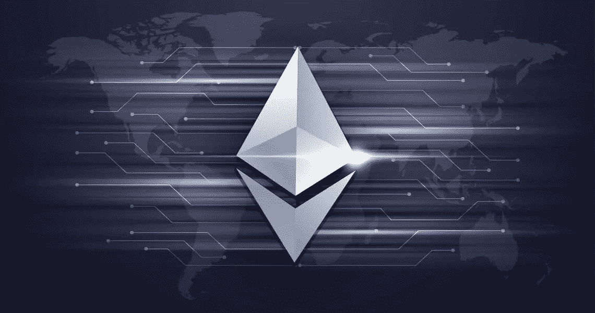

# 以太坊黑仔？

> 原文：<https://medium.com/coinmonks/ethereum-killer-56741d455a23?source=collection_archive---------23----------------------->

在这里，我来回答贾斯汀·贝尔关于潜在以太坊杀手的问题。

我认为我们需要做一个前提:尽管有重大的技术限制，如高费用、网络拥塞和前端运行问题，但从以太坊夺取土地是困难的。我没有贾斯汀，只是今天早上我看了他的文章，我想到了有关“以太坊杀手”的问题。以太坊是一个平台，现在它自称是一台世界计算机，一系列的应用程序将在这里运行，并且拥有自己的货币，比如以太。在文章中我读到了几个有趣的项目，我必须说，根据我的技术观点:索拉纳>列出了所有的项目。唯一一个从以太坊抢走了一点市场份额的密码，你认为索拉纳只存在了两年吗？？但是作为以太坊的竞争对手，我们还有什么没有提到的呢？有 [Mysten Labs](https://medium.com/u/6e1bfe4ca08e?source=post_page-----56741d455a23--------------------------------) (隋区块链)——[Aptos](https://medium.com/u/70211828fe2e?source=post_page-----56741d455a23--------------------------------)来自前 Meta 员工(原脸书)的团队。有一个从未被提及的密码叫做 [Telos Foundation](https://medium.com/u/5b1bafe9afd?source=post_page-----56741d455a23--------------------------------) ，它有一些有趣的规格。我在以前的帖子中提到过它，我想我会很快更新它的技术外观。如果我们只看一个项目的技术部分，以太坊将是最落后的，并且已经死亡。但它有一个强大的社区，大多数开发人员在那里工作，并在 Web3 领域引入了核心语言:Solidity。把他赶下台的时机成熟了吗？在我看来，是的，像 Move 这样的新语言的引入会把开发者带到其他平台。之后，如果 Move 被证明是伟大的，Solidity 可能会看到新的开发者减少。那些在以太坊背后工作的人很清楚，它享有最大的社区(将比特币从这个讨论中移除)——这是以太坊成功的主要因素，技术规范在后面。从社区的角度来看，Solana 做得很好，有很多开发人员在做这项工作，随着 SMS 和 Saga 的到来，他们将很快增加。你所列出的其他项目并不是最好的以太坊杀手，正如上面提到的，我们已经有了一些潜在的杀手，只是没有经常被提及。我相信你需要重新审视你的清单，在 Web3 领域有很多你没有考虑到的东西，它们比你谈论过的所有项目都更有潜力。

> 交易新手？试试[加密交易机器人](/coinmonks/crypto-trading-bot-c2ffce8acb2a)或者[复制交易](/coinmonks/top-10-crypto-copy-trading-platforms-for-beginners-d0c37c7d698c)