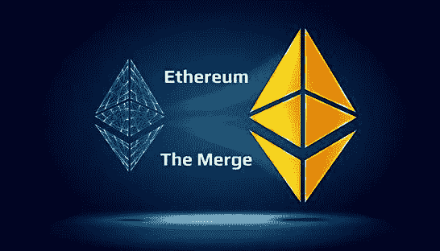
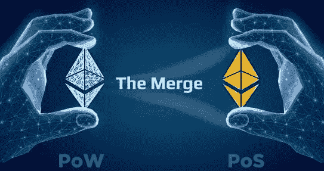

# 以太坊合并——Crypto 最值得期待的事件

> 原文：<https://medium.com/coinmonks/ethereum-merge-cryptos-most-anticipated-event-ae4a306dfd49?source=collection_archive---------14----------------------->

以太坊合并，尽管是加密货币历史上最重要的区块链改进之一，以太坊合并仍然是一个鲜为人知的话题。

那么什么是以太坊合并呢？

它的经济含义是什么？

主要的合并风险和误解是什么？

这里是你需要知道的关于 ETH merge 的一切。

首先，让我们了解一下合并的动机。合并的主要目的是将以太坊从其当前的工作证明共识机制过渡到利益证明模型。简而言之，在工作证明或 PoW 模型中，网络由必须购买和运行采矿硬件的矿工来保护。在这种模式下，矿工消耗电力以换取大宗保险和一部分交易费。在利害关系证明或 PoS 模型中，网络由验证者保护，验证者必须对网络进行利害关系验证。在这个模型中，验证器不会消耗太多的电力。

向 PoS 的过渡旨在使以太坊更节能、更安全，并为以后实现更大的可扩展性和共享打下基础。移动到 PoS 是最初以太坊路线图中的一个重要里程碑，研究在以太坊网络推出之前就已经开始了。以太坊的研究人员和开发人员决定将以太坊分为两步，而不是通过一个巨大的、潜在危险的变化过渡到 PoS。

第一步——发射信标链——已于 2020 年 12 月成功执行。这允许创建一个单独的并行 PoS 链，可以在生产中测试一段时间，而不会对现有的电力网络产生任何直接影响，该电力网络保障了数千亿美元的经济活动。更早启动信标链的另一个重要原因是给利益相关者足够的时间，因此在合并时，利益相关者的数量可以足够大以保证网络的安全。

合并是向 PoS 过渡的第二步，将信标链的共识层与以太坊 PoW 链的 EVM 状态合并。向 PoS 的过渡旨在将保护以太坊的功耗降低约 99.95%。**这反过来又带来了很多以太坊、DeFi、NFTs“扼杀星球”的论调。**

作为一个副产品，它也使以太坊 ESG 投诉，这可能有利于更多规则驱动的机构，这些机构可能希望开始探索以太坊生态系统。这也可以使以太坊对关心加密对环境影响的游戏玩家和 NFT 艺术家更加友好。

完成合并的另一个动机是减少 ETH 发行，因为 PoW 和 PoS 链的安全性由 ETH 发行提供资金。合并后，战俘网络将不复存在，这将大大减少 ETH 的发行。这被命名为三倍减半，因为发行下降类似于 3 倍比特币发行减半。最重要的是，合并和过渡到 PoS 的另一个论点是以太坊爱好者将能够在家保护以太坊。成为共识参与者将不再主要是机构和经验丰富的矿商。这将进一步分散网络，使其更能抵御攻击。

*合并说明:*

合并负责将以太坊网络的用户状态与 PoS 信标链合并。目前，在过渡到 PoS 之前，为了验证以太坊网络，节点运营商运行一个现有的实现，如 Geth、Erigon 或 Nethermind。这些客户端实现捆绑了执行层(EVM)和共识层(PoW)。为了将以太坊网络平稳过渡到 PoS 模型，执行层和共识层被解绑。这意味着这两层都可以单独运行。它们也可以由专门从事某一层的完全不同的团队来开发。合并后，一个完整的节点将由一个执行节点和一个共识节点组成。还有一个引擎 API 负责执行节点和共识节点之间的通信。将共识层和执行层解耦可以更快地启动信标链，而不必担心执行层。说到共识层，目前最流行的实现是 Prism、Lighthouse 和库特。现有的客户端实现将过渡到执行层客户端，并将与共识层客户端一起形成一个完整的以太坊节点，在两个层上都有多个客户端实现，有多个不同的执行和共识客户端组合。例如，一个验证者可能更喜欢用 Geth 运行 Prism。另一个可能更喜欢用尼瑟思维运行灯塔，有 4 个流行的执行客户端和 5 个共识客户端，有 20 个成对组合。

在合并时，Geth 等执行客户机将开始监听来自 PoS 链的块。这个开关的触发器将由一个称为 TERMINAL _ TOTAL _ difference 的新变量确定，该变量表示以太坊 PoW 网络上累积的每个块的工作难度证明的总和。当链积累了足够的工作证据超过终端总难度时，节点切换到遵循规范的 PoS 链。有趣的是，第一次以太坊升级将由总难度触发，而不是通常的方块高度。这是为了避免攻击者注意低难度的恶意分叉，避免攻击者挖掘低难度的恶意分叉来满足合并时的块高度要求，并在最终的 PoW 块上造成混乱。合并后，所有运行在 Ethereum 上的应用程序都应该像合并前一样运行，并保留状态和事务历史。这意味着，例如，如果我们在合并前是 Uniswap 的流动性提供商，合并后状态将是相同的，因此我们仍将在 Uniswap 上提供流动性。如果我们在 Aave 上有一笔未结贷款，这笔贷款仍然存在。最终用户不会注意到任何变化。过渡已经经历了多轮密集的测试，但包括合并影子分支和合并测试网。影子分叉是现有以太网的副本。合并它们有助于发现与网络当前状态相关的潜在问题。这些分叉通常在测试后被放弃，它们的目的是暴露任何潜在的问题。与大多数影子分支不同，合并的测试网通常作为 PoS 网络存在。这有助于开发人员在类似以太坊合并后的链上测试他们的应用程序。在 Ropsten 和 Sepolia 之后，最后一个也是使用最多的长寿命 testnet 合并的是 Goerli。在这成功执行之后，我们可以期待主网合并的公告。

像任何其他复杂的技术升级一样，这次合并不会没有任何风险。以下是一些值得牢记的潜在风险。其中大部分与向 PoS 的过渡有关，而不是与合并本身有关，但仍然值得一提。合并之后，作为公共选择过程的一部分，提议下一个块的验证者将提前知道。这使得提议者容易受到网络拒绝服务(DoS)攻击。例如，如果攻击者知道他们是队列中的下一个提议者之一，他们可以尝试拒绝当前的提议者，导致他们失去他们的位置，并且不包括现在可以被攻击者获得的任何高价值交易。目前，这个问题最流行的解决方案是一个单独的秘密领导人选举，它使用聪明的加密技术来防止攻击者知道下一个提议者是谁，同时仍然向实际的提议者提供这个信息。在丽都和比特币基地等资金池中，也存在股权集中的现象。这可能导致审查或勒索等攻击。在丽都案例中，还存在治理接管风险和智能合同风险。丽都社区提出的一个有趣的解决方案是允许向丽都存放 ETH 并接收 stETH 的人否决任何潜在的危险提议。

这些风险的潜在解决方案是:

这些解决方案，即使没有立即实施，也可以添加到以下硬分叉的网络中，使其在未来更具弹性。以太坊合并显然是加密货币领域历史上最大和最受期待的升级之一。当谈到合并的日期时，目前，大多数人预测它会在 2022 年 9 月左右发生。如果在 Goerli 状态合并期间没有发现重大问题，这应该是可能的。尽管有一些潜在的风险，研究人员和开发人员已经花费了无数的时间来确保在主网络合并期间没有意外。合并后，以太坊将变得更加安全和可持续。它还将被完美地定位于下一次大升级——激增、边缘、清洗和挥霍。

博客到此结束，希望这对你有所帮助。

> 交易新手？试试[加密交易机器人](/coinmonks/crypto-trading-bot-c2ffce8acb2a)或者[复制交易](/coinmonks/top-10-crypto-copy-trading-platforms-for-beginners-d0c37c7d698c)