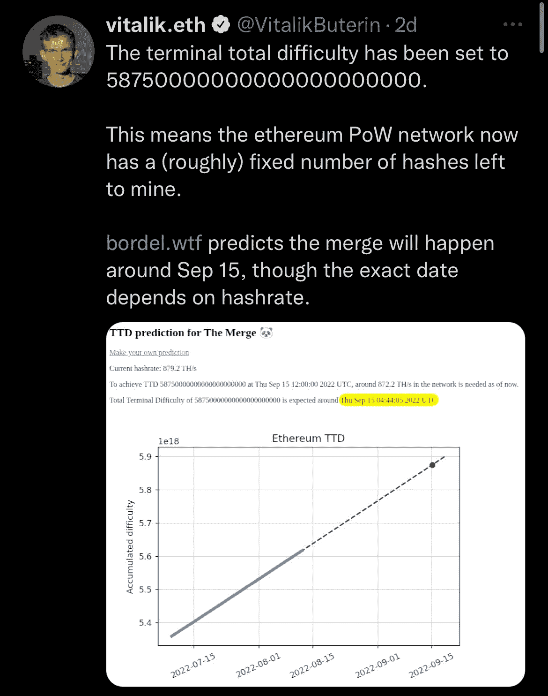

# 以太坊合并事件临近。这是怎么回事？

> 原文：<https://medium.com/coinmonks/ethereum-merge-event-approaches-what-is-it-all-about-ebfa1c35fe18?source=collection_archive---------19----------------------->

据网络联合创始人 Vitalik Buterin 称，备受期待的区块链以太坊软件升级，即合并，预计将在 9 月 15 日左右进行。

此次合并代表了以太令牌制造和交易验证方式的重大转变，从工作证明挖掘块转向利益证明。

POS 方法允许以太持有者注册以验证基于锁定令牌的以太坊交易。Pos 将为以太网开启一个环保、可持续的新时代，降低功耗，为进一步扩展奠定基础，这在工作验证中是不可能的

Buterin 补充说，在本周早些时候被称为 Goerli 的合并的最后测试阶段之后，以太坊的工作证明版本现在只有一个粗略的“固定数量”的采矿槽。这意味着开发者可以更加确定正式的网络升级何时开始。

# **合并带来的 3 个误解**

**误区一** : **合并后投资者将可以提取所持有的 ETH**

开发者社区已经证实，合并后，由 ETH 1:1 支持的加密货币 staked ETH (stETH)将被锁定，并在至少 6-12 个月内缺乏流动性

**误区二** : **合并后以太坊交易会更快**

可以有把握地认为以太坊交易不会明显更快。然而，这个谣言有一些真实性，因为 Beacon Chain 允许验证器每 12 秒发布一个块，在 Mainnet 上大约是 13.3 秒。

**误区三:合并后以太坊燃气费会降低**

投资者中最常见的误解之一是以太坊即将进行的升级将降低汽油费。虽然降低天然气费用是每个投资者的最大愿望，但合并是一种共识机制的改变，将以太坊区块链从工作证明转变为股份证明(PoS)。

预计此次上调将对 Eth 造成通缩影响。因为赌注很可能会减缓瑞士联邦理工学院的供应增长速度。如果供给增长放缓，需求就会上升(基本供需概念)。

这将是以太坊区块链的游戏规则改变者，为网络打开新的视野和能力。

截至发稿时，以太坊的价格已升至 2000 美元以上，较前一周上涨 19.42%。

> 交易新手？尝试[加密交易机器人](/coinmonks/crypto-trading-bot-c2ffce8acb2a)或[复制交易](/coinmonks/top-10-crypto-copy-trading-platforms-for-beginners-d0c37c7d698c)