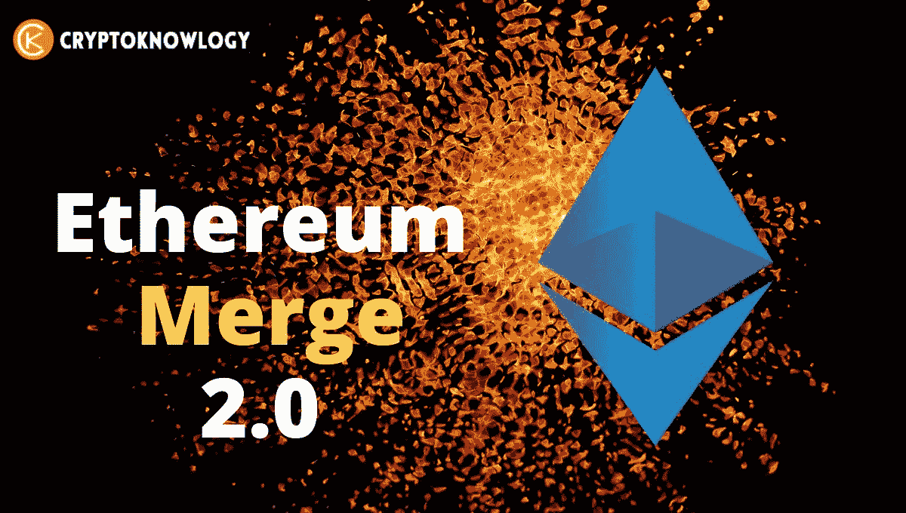
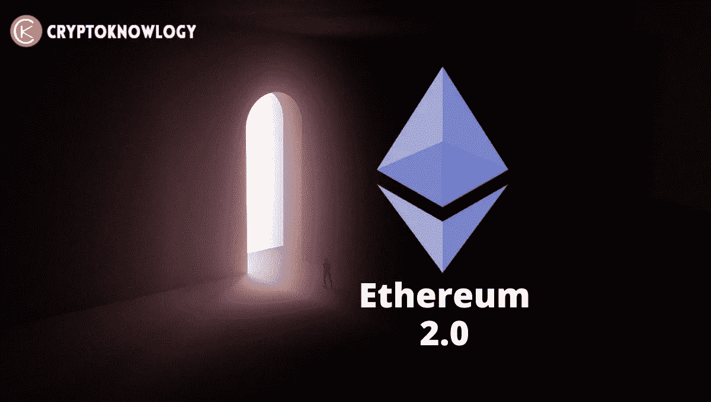
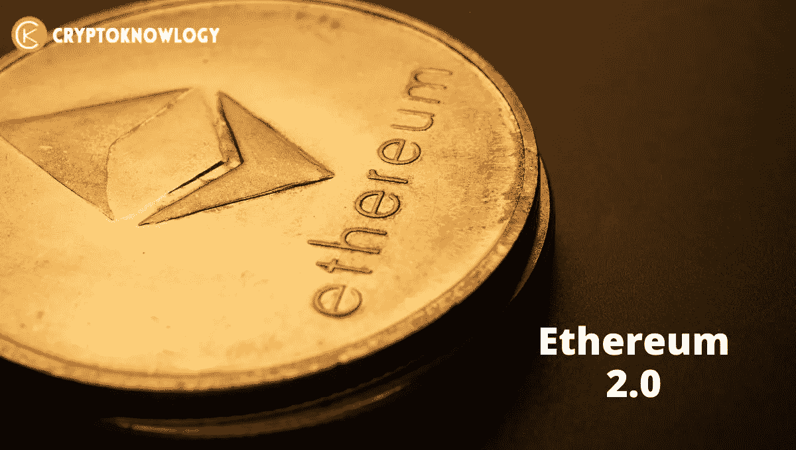

# 以太坊合并解释

> 原文：<https://medium.com/coinmonks/ethereum-merge-explained-5a587eefc656?source=collection_archive---------19----------------------->

期待已久的[以太坊](https://cryptoknowlogy.com/what-is-ethereum/)合并，将改变世界上第二有价值的加密货币的技术基础，预计将在 9 月 10 日至 9 月 20 日之间完成。

# 以太坊合并解释道:

由于以太坊在[加密货币](https://cryptoknowlogy.com/)领域的突出地位，这一调整可能会对整个行业的投资者产生影响。**以太坊**平台可以支持多种不同的[加密货币](https://cryptoknowlogy.com/what-are-altcoins/)，该平台也经常用于进行**去中心化** [加密货币](https://cryptoknowlogy.com/all-about-cryptocurrency-for-beginners/) **金融交易**。

虽然合并的技术方面很复杂，但最终结果是[以太坊的开发者](https://ethereum.org/en/upgrades/merge/#what-is-the-merge)准备改变其用户在其**去中心化**经济系统中验证新交易的方式。

即将到来的最重大变化是从**工作证明(PoW)** 模式向**利益证明(PoS)** 模式的转变，其目的是提高[区块链](https://cryptoknowlogy.com/what-is-bitcoin-and-how-does-it-work/)网络的安全性和可扩展性。

这一合并可以将网络的能耗降低 99.95%以上，并旨在将以太坊从高能耗的采矿过程中转移出来。

集成在过去已经被推迟，并且是 [crypto](https://cryptoknowlogy.com/how-to-buy-crypto-safely/) 社区中激烈争论的话题。

# 为什么会发生合并:

以太坊基金会将**以太坊**比作一艘飞行中的宇宙飞船来解释这种转变:“社区已经建造了一个新的引擎和一个硬化的船体。在广泛的测试之后，几乎是时候用新的引擎替换旧的飞行中的引擎了。通过这样做，现在的船和新的、更有效的引擎将被整合。”

那么，为什么旧发动机会出现故障呢？**工作证明**是一种用于向 **Mainnet 区块链**安全添加新交易和其他数据的技术，自以太坊 2015 年推出以来一直在使用。在被允许添加新数据块之前，工作验证要求用户计算机成功完成越来越具有挑战性的计算。许多[加密货币](https://cryptoknowlogy.com/top-10-crypto-research-tools/)，包括**比特币**，都采用了这个被称为**挖掘**的过程。虽然安全，但采矿消耗大量能源。以太坊的工作验证方法每年消耗的能量相当于一些国家在同一时间段内消耗的能量。

一种能源消耗较少的替代方案是**利害关系证明**。想要参与验证过程的用户下注他们自己的[加密货币](https://cryptoknowlogy.com/10-worse-crypto-beginner-mistakes/)，这是一个类似于下注的程序，而不是承诺电力，这为计算能力提供了动力。这些人被称为验证者，在新添加的信息被添加到块之前，他们被随机选择来验证新添加的信息。如果他们确认信息准确，他们就会收到加密货币。如果他们行为不诚实，他们就有失去股份的危险。

# 合并是如何工作的:

**合并**是以太坊新的**信标链利害关系证明**共识层与其当前执行层(我们当前使用的 **Mainnet** )的合并。它没有使用高能耗的采矿方法，而是使用桩钉 ETH 来保护网络。这是以太坊实现更高可扩展性、安全性和可持续性目标的激动人心的一步。

重要的是要记住信标链最初是独立于 Mainnet 发布的。以太坊主网及其所有账户、余额、智能合约和区块链数据继续受到工作证明的保护，即使信标链与利益证明同时运行。当这两个系统最终在下一次合并时重合时，利害关系证明将完全取代工作证明。

信标链没有处理 Mainnet 上的事务。然而，为了对自己的状态达成共识，它同意使用活动验证器及其帐户余额。经过漫长的测试，现在是信标链同意更多的时候了。在**合并**之后，信标链将充当所有网络数据的共识引擎，包括执行层事务和账户余额。

从合并开始，信标链将成为生产块的官方方法。挖掘不再能生成有效的块。取而代之的是，利益相关证明验证器承担这一职责，负责处理所有事务的有效性并提出阻塞。

历史没有丢失。以太坊完整的交易历史将合并为 Mainnet 和 Beacon Chain。你不需要做任何事情。你的资金很安全。

# 如果您目前拥有 ETH，您会受到什么影响:

如果你已经有了以太坊或 ERC-20 令牌(使用以太坊平台的加密货币)，你不需要采取任何行动，无论它们是存储在[软件钱包](https://cryptoknowlogy.com/what-is-crypto-wallet/)、[硬件钱包](https://cryptoknowlogy.com/best-hardware-wallet-2022/)还是交易所。如果一切按计划进行，以太坊在过渡后应该继续正常运行，没有停机。

随着以太坊主网的合并越来越近，你应该非常警惕试图在这个过渡时期利用人们的骗子。永远不要为了“升级到 ETH2”而把 ETH 给任何人或任何地方没有“ETH2”令牌，您的资金得到保护，无需您采取任何更多的行动。

# 以太坊变快的同时气体会变便宜吗？

关于合并的普遍误解包括认为合并将解决以太坊的所有问题，主要是高昂的天然气成本和缓慢的网络。这是不正确的。合并是一个多步骤的过程，这个阶段只是为将来的优化做准备。

特别是，合并后汽油价格不会下降。以太坊基金会声称，在合并之后，**交易速度**将“基本保持不变”。

最后但并非最不重要的一点是，那些期待合并的人现在还不能撤回他们的 ETH。在一个名为上海的以太坊升级后，这将会在稍后的日期(根据目前的计划，从现在起六到十二个月)推出。

# 以太坊会因为合并而价格暴涨吗？

以太坊的价格很难预测，因为它取决于如此多的多重参数。合并有各种可能导致以太坊价格上涨的因素。例如，传统采矿的结束将导致更少的以太币被判给为网络供电的计算机作为补偿，这将导致以太币的总体供应增长非常缓慢。一些 ETH 被特定的网络操作破坏(或者用密码术语来说是“烧毁”)的事实使得以太坊通货紧缩，这意味着 ETH 的总量会随着时间的推移而逐渐下降。

你可能已经看到类似的东西被提到，作为以太坊的原生硬币 ETH 的价值将会增加的迹象。但是还有其他因素需要考虑。

合并是一个筹备多年的公共事件。合并带来的任何调整很可能已经被计入了 ETH 的当前定价。此外，ETH 的价格可能会因不相关的变量而变化，如宏观经济环境的变化。

*最后，如果你喜欢我们在* [***【密码学】***](https://cryptoknowlogy.com/) *这里所做的，请在你自己的对* [*加密货币*](https://cryptoknowlogy.com/why-cryptocurrency-is-so-volatile/) *感兴趣的奇妙人类社区中给我们大声喊出来。*

> 交易新手？尝试[加密交易机器人](/coinmonks/crypto-trading-bot-c2ffce8acb2a)或[复制交易](/coinmonks/top-10-crypto-copy-trading-platforms-for-beginners-d0c37c7d698c)