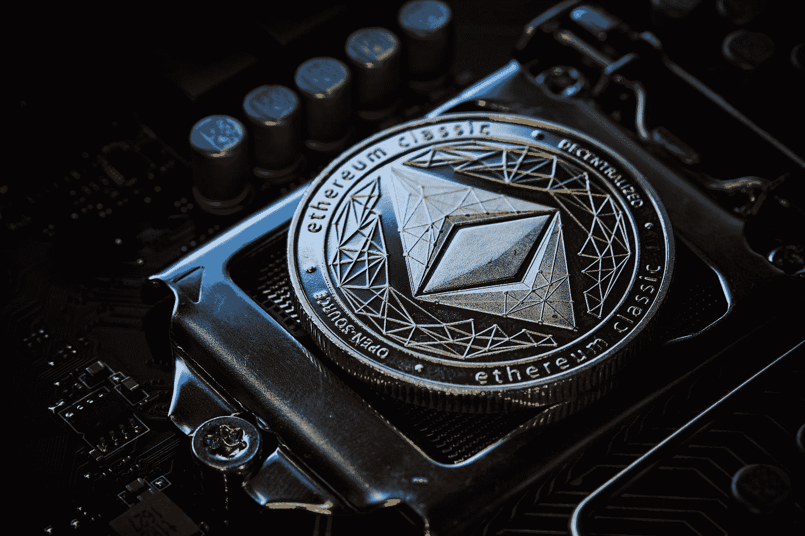

# 以太坊合并:你可能不知道的五件事！

> 原文：<https://medium.com/coinmonks/ethereum-merge-five-things-you-may-not-know-489dbb6f57eb?source=collection_archive---------8----------------------->

Photo by [Michael Förtsch](https://unsplash.com/@michael_f?utm_source=medium&utm_medium=referral) on [Unsplash](https://unsplash.com?utm_source=medium&utm_medium=referral)

> 几天前，我和几个朋友谈论了即将到来的以太坊合并。随着讨论的进行，出现了许多问题。其中一个说了些关于低汽油费的事情。合并将如何带来即时的低气费和提高交易速度。

从我们的讨论中，我发现很多人仍然对合并和从中可以期待的事情感到困惑。我做了调查，发现了我认为每个人都应该知道的关于以太坊合并的五件事。但在此之前，让我们看看以太坊合并的意义以及工作证明和利害关系证明的作用。

## **什么是以太坊合并？**

有人称之为 Eth 2，以太坊 2.0，或者 ETH 2.0。不管你选择叫它什么，合并将取代以太坊主网的工作证明和信标链的股份证明。

以太坊合并是计划已久的以太坊网络升级。虽然升级是正常的，但这是最大的一次，它将带来可能决定以太坊区块链未来的变化。它将当前以太坊主网(每个人都使用的公共以太坊区块链)与信标链合并。目前，两个链以不同的方式存在，但是只有 mainnet 及其工作证明可以验证事务。

一旦合并完成，以太坊主网将从工作证明转移到采用信标链利益一致机制证明。这意味着以太坊区块链将依靠被称为验证者的可信实体来验证交易并向区块链添加新块，而不是矿工。任何人都可以通过存款 32 以太(以太是以太坊区块链的本地令牌)来申请成为验证者。作为回报，验证者将获得乙醚作为奖励。

## **为什么合并如此重要？**

你可能想知道为什么所有这些关于以太坊的噪音会融合在一起。答案并不牵强。以太坊在区块链生态系统中扮演着非常关键的角色。首先，它是使用最多的区块链和 powers Ether，是第二大加密货币(仅次于比特币)，市值约为 2020 亿美元。以太坊区块链是众多分散应用(dApps)和分散金融(DeFi)协议的家园，并建立了数百万不可替代令牌(NFT)的真实性。言下之意是，无论合并发生什么，都不仅仅会影响以太坊区块链，还会影响依赖它的其他产品和服务。

## **工作证明&股权证明？**

Photo by [Shahadat Rahman](https://unsplash.com/@hishahadat?utm_source=medium&utm_medium=referral) on [Unsplash](https://unsplash.com?utm_source=medium&utm_medium=referral)

理解这两个概念将有助于你轻松理解主题。PoW 和 PoS 是密码中两种主要的共识机制(共识机制是区块链确定交易合法性的一种方式)。

自从以太坊区块链诞生以来，工作证明就是共识机制。它涉及到世界各地的矿商通过解决一个数学难题来验证交易。获胜者可以用最新验证的交易更新区块链，并由网络奖励一定数量的密码。但是这种活动需要大量的处理能力，对环境不安全。

作为赌注的证明，代替矿工，个人下注一定数量的以太币将有助于验证交易和保护网络。要在合并后验证股权证明，您需要至少存款 32 Eth。

## **关于以太坊合并你必须知道的五件事**

关于即将到来的合并，以下是每个区块链爱好者必须知道的五件事；

## **升级不需要您采取任何行动**

根据以太坊基金会提供的信息，作为以太坊的用户或持有者，您无需采取任何行动。在合并之前，您不需要对您的资金或钱包做任何事情。合并前您钱包中的任何资金在合并后仍可使用。这也是对试图在合并期间利用用户的骗局感到厌倦的呼吁。小心任何要求你采取行动的人。

## **交易速度不会有明显变化**

与街上的话相反，合并不会加快以太坊处理交易的时间。但是只会有微小的变化(不足以显著到以太坊用户注意到)。

## 运行一个节点不需要 32 个 ETH

在以太网上运行一个节点是免费的。运行验证程序需要 32 乙醚。注意，验证器不能改变协议规则，所有节点都验证协议规则。投资者将不能在合并后立即提取他们的股份，他们将不得不在合并后等待 6 到 12 个月。

## **合并不会减少以太坊燃气费**(燃气费是在以太坊区块链进行交易的费用)

与普遍认为的合并将导致更低的汽油费相反。以太坊的汽油费暂时保持不变。合并将以太坊移动到股权证明，但它不会扩大网络容量。从而不会影响气费价格，这被认为是以太坊用户的巨大痛点。好消息是，合并将为切分创造条件，为未来更便宜的汽油费铺平道路。

还有，有分叉的可能(分叉是以太坊分裂成两个不同网络的情况)。这种情况可能会发生，也可能不会发生，但根据以太坊团队的说法，合并期间的任何硬分叉都应该被视为非官方的。

## **环境的胜利**

电力共识机制包括消耗大量能源的采矿。但这种从工作证明到利益证明的转变将使以太坊的整体能耗降低 99.9%或更多。这是以太坊社区绝大多数人的巨大胜利，也是可持续环境的胜利。

## **结论**

现在大家嘴边的问题就是“放权”的问题。批评者认为，股权证明将使以太坊更加集中，并指向少数持有股权以太的实体的主导地位。这可能是一个挫折，因为区块链的核心价值观之一是权力下放，这意味着任何一个实体都不应该掌权。嗯，这是改天的话题。在此之前，让我们希望以太坊合并实现其潜力。

> 交易新手？试试[密码交易机器人](/coinmonks/crypto-trading-bot-c2ffce8acb2a)或者[复制交易](/coinmonks/top-10-crypto-copy-trading-platforms-for-beginners-d0c37c7d698c)