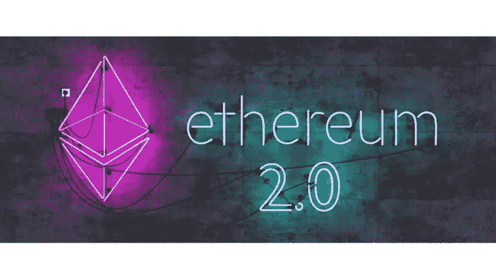

# 以太坊合并，从工作证明到股权证明，现在怎么办？

> 原文：<https://medium.com/coinmonks/ethereum-merge-from-proof-of-work-to-proof-of-stake-what-do-now-3532b0cae404?source=collection_archive---------20----------------------->

~dwulf

ETH 2.0

## **隐潮的转移**

以太坊合并试图用一种叫做“股权证明”的替代方法来取代旧的工作证明系统，类似于比特币的系统。在股权证明系统中，以太坊加密货币所有者能够创建“验证器”，以分享他们的以太坊硬币，换取被随机选中验证交易并将其记录在新区块中的权利。这样做是为了奖励更多的以太网验证块。这为向验证器付费的以太坊用户创造了以太网的创收收益，以换取其验证服务。

警告:如果验证者离线或试图通过向中继链中继虚假数据来欺骗网络，该验证者将受到惩罚并被削减 ETH 奖励和/或 ETH 原则赌注。

合并和股权证明带来了投资和获得投资回报的机会。

## **听起来都一样**

以太坊是一个使用分片的加密生态系统。波尔卡多特，我们的道也使用，是另一个使用准链的生态系统，宇宙是另一个使用 IBC 的加密生态系统。

他们都试图建立万能钥匙和稳定的桥梁，来翻译信息和一致(最终确定)的状态。

EVM 或以太坊虚拟机与坚固性成对，但 WASM 或 Web 组装与生锈环境成对。

## **集权还是分权，这是个问题，不是吗？**

那么随着合并，以太坊在去中心化的尺度上处于什么位置呢？它转向股权证明，在允许验证者持有人产生收入的同时，股权证明也可能带来最终的合并(和控制？)的验证者，在中继链上利用共识和终结来支持他们。

斜线意味着防止验证器将错误数据传递到中继链。但是如果大多数验证者都同意，这将如何实现呢？

通常使用本地硬币/代币来控制生态系统的投票也可以用于对赌注加密生态系统的证明施加控制。这就是为什么让更多的用户参与进来并与验证者合作是很重要的，这样生态系统实际上会变得更加分散。

## **比特币，手到擒来，去中心化的唯一选择？**

老实说，对我来说，比特币是最好的选择，但不是唯一或最佳的选择。赌注加密资产的创收机制使区块链保持有趣，从赌注流动性中获得的资本实际上节省了解决无脑和复杂谜题的计算成本，如工作证明。硬币/代币的投票效用使得股份证明生态系统更加灵活。

但是，可以说，比特币具有来之不易的价值。这很好，但是一个非图灵的生态系统只是选择代码，不像一个可靠或底层智能契约那样可编程或灵活。

最好的建议是分散你的投资组合，以优化适当的投资回报率。

## **为刀构建 ETH 或 DOT**

构建到 DAO 中的大部分焦点是硬币/令牌交换，因此 DAO 而不仅仅是用户可以实现交换。道，拥有所有权，使用者只是管家。这样做是考虑到所有权的合理否认，这反过来又代表了所得税负债。

Polkadot 是一个第 0 层解决方案，XCM/XCMP 用于本地 para-chain 与其 para-chain 的 para-chain 通信，Astar 提供强大的 WASM 工具，以及基板托盘。我也嫁接了宇宙生态系统来帮助道处理 IBC 事务。

以太坊是可靠性的第 1 层，(EVM 是第 0 层)，现在它是一个完整验证器集的 32 ETH(48，000.00 美元)或 16 ETH(24，000.00 美元)的 Rocketpool 共享验证的证据。应该有 6%的收益率，再加上你在支持网络。

DAO 将处理验证器和交换。像加密购买者(purse.io)一样，可以用礼品卡绕过菲亚特桥。我仍然在寻找其他菲亚特旁路机制。由于法规的完全疯狂，将会有许多可供选择。

## **AWS 还是 Avado Metal 来握刀？**

云还是自我管理？为什么不两者都要？

我们买了一辆 Avado，因为我对金属很敏感。AWS 运行验证器是完全有效的，无论是在以太坊还是 Polkadot，只要付钱给 AWS，你就能得到一个运行验证器的空间。

Avado 是一个运行节点和验证器的硬件设备，了解这两者，并有应急计划来保持您的验证器 24/7 运行，以避免削减费用。

DAO 支持所有的东西，不管是云还是设备，反正云只是别人的设备。

## **结论**

小心地构建 DAO 的基础，DAO 应该能够在 AWS (cloud)上运行，或者在具有 Starlink ISP 连接的 Avado 上运行。我不是一个相信地面互联网服务提供商的人。

从那里让它们继续运行，使用 Git (Github 是有风险的，因为他们把代码库从他们的平台上拉下来，所以 Gitlab 可能是一个好的选择)、Docker、K8 和 DevOps Grafana。这些工具应该能让它保持有序。

> 交易新手？尝试[加密交易机器人](/coinmonks/crypto-trading-bot-c2ffce8acb2a)或[复制交易](/coinmonks/top-10-crypto-copy-trading-platforms-for-beginners-d0c37c7d698c)