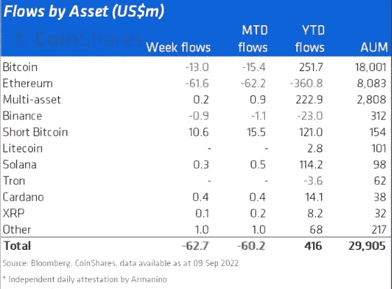

# 以太坊合并、倒计时和机构投资者

> 原文：<https://medium.com/coinmonks/ethereum-merge-the-countdown-and-institutional-investors-d898c890cdd?source=collection_archive---------11----------------------->

此时此刻，所有的目光都集中在以太坊合并和倒计时的最后阶段。这对区块链来说是革命性的一步，对一个希望扩大的 1 万亿美元市场来说是重要的一步。当然，以目前的能源消耗速度，开采加密货币是不可能的。当白宫正在对数字资产进行大量的监管时，以太坊还需要几个小时才能进入这个新领域，这是利益攸关的证明。这会是所有在疫情期间抢走我们 120 fps 游戏的 GPU 黄牛吸取教训的时刻吗？它最终会打倒在第三世界国家造成电网故障的四大矿业公司并变得更加富有吗？更重要的是，克劳斯·施瓦布同意这样做吗？

按市值计算，以太坊是第二大加密货币，现在它正在跨越一座桥梁，远离[比特币狂热分子](https://blog.hi.exchange/tales-from-the-chain-chapter-v-bitcoin-maximalist/)。所有人都准备好了，甚至谷歌也为以太坊合并加入了新年倒计时。但是，也有一个陷阱，它会给这篇文章带来悬念，让你继续读下去。所以，继续浏览这篇文章，找出机构投资者在这场所谓的革命前几个小时在做什么。

## **在谷歌上搜索“以太坊合并”**

是的，谷歌上有以太坊合并的倒计时，比《CS:GO》里的炸弹倒计时更刺激。开玩笑，没有什么比 CS:GO 中的炸弹倒计时更令人兴奋的了，当你在板条箱后面露营，从一个有毒的孩子身上狙击出 bejesus。尽管如此，现在所有的事情都是新闻，所有的新闻都应该是超级令人兴奋的。这是我个人在谷歌上拍摄的倒计时的最新图片，目的是让文章更具视觉吸引力。

Two Bears Dance Together Because They Are Happy and This is Fun!

很自然地，对于过渡完成后会发生什么的猜测越来越多。有鉴于此，一些人认为 ETH 将会上涨，而其他人则预计会下跌。与此同时，很可能不会发生什么重大事件。很像托尔金的故事，我们有一场乐观与悲观的战斗在秘密推特上进行，因为他们在他们的提及战中流血。一场由机器人、散户投资者和社交媒体营销专家组成的宏伟战役正在 Twitter 上如火如荼地展开，或者我应该说是在 Twitter 上？

不管怎样，当倒计时结束时，我们会有一些答案。然而，在那之前，机构投资者正在抛售 ETH，跳上他们的救生艇。没错，大玩家现在正在退出以太坊合并。

## **机构投资者**

也许，以太坊合并不是令人兴奋的，而是令人焦虑的。毕竟，在 CS: GO 中放置炸弹是令人兴奋的，但当另一个团队这样做时，它会引起你的焦虑。想象一下你自己，当你知道有一个 14 岁的坏孩子正等着给你来一个完美的 360 度爆头时，你冲过去拆除炸弹。

因此，快速浏览一下 [CoinShares](https://coinshares.com/research/digital-asset-fund-flows) 的数字资产资金流周报，就能了解到很多关于合并的信息。根据这份报告，机构投资者正在撤出，也许是从倒计时开始。

Uh Oh!

“数字资产投资产品的流出总额为 6300 万美元，这是连续第五周的流出…

以太坊是外流的主要焦点，上周总计 6200 万美元，尽管合并的确定性有所提高，但这可能凸显了投资者对事件可能不会按计划进行的担忧。"

与此同时，BTC 也经历了糟糕的五周，上周只损失了 1300 万美元。虽然与 BTC 和瑞士联邦理工学院所见的一些最大的资金外流相比，这只是小儿科，但也不完全是好的。

卡尔达诺(ADA)、索拉纳(SOL)和瑞波(XRP)本周都有少量资金流入。CoinShares 的数据显示，索拉纳今年获得了 1.14 亿美元的最大资金流入。也许，非常令人兴奋的索拉纳电话是没有人担心 SOL 网络中断的原因。

“以太坊合并、倒计时和机构投资者”最初由同一作者[尼玛·阿斯加里](https://blog.hi.exchange/author/nimaasgari/)发表在 HiExchange 博客上。

> 交易新手？试试[密码交易机器人](/coinmonks/crypto-trading-bot-c2ffce8acb2a)或[复制交易](/coinmonks/top-10-crypto-copy-trading-platforms-for-beginners-d0c37c7d698c)