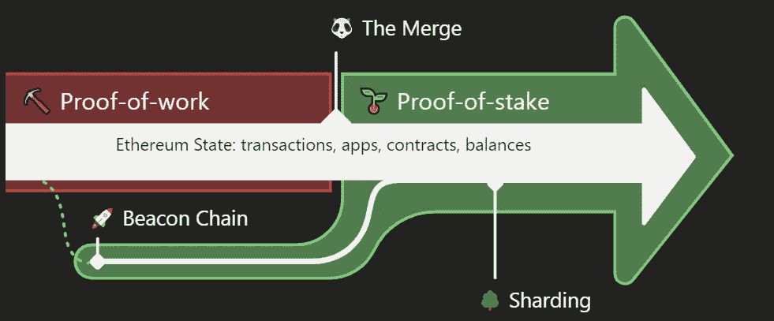
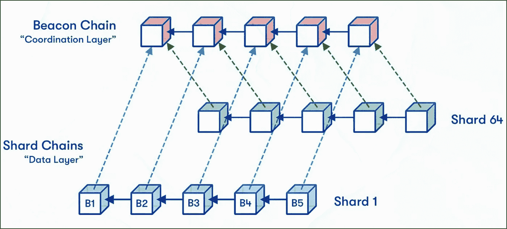

# 以太坊移动到股权证明

> 原文：<https://medium.com/coinmonks/ethereum-move-to-proof-of-stake-79da32a41741?source=collection_archive---------12----------------------->

以太坊的开发者已经宣布了 9 月 15 日迁移到 Proof-of-Stake 的日期。

让我们看看什么是 POS，什么是 POW。

## ⚒ |工作证明(PoW)

使用工作验证(PoW)是因为采矿者的技术设备可以解决复杂的数学问题。矿工因向区块链中添加了经验证的区块而获得加密货币形式的奖励。

➕ |这种方法有自己的优点:
-防御 DoS 攻击。当然有可能，但是在高成本的背景下无利可图。
-防止初步取证。每个区块链都需要一组新的任务，算法不能预先计算，所有部分都按顺序处理。

➖ |也有劣势:
——“51%攻击”的威胁
-昂贵的设备
-不环保-高能耗。以太坊目前的年能耗与芬兰相当

## 🥩利益证明

POS(Proof-of-stage)-与工作证明不同，在 Proof-of-stage 中，新块的创建者由系统根据其在 steak 中的状态(即在加密货币总量中的份额)提前选择。

利益验证背后的想法是解决与高功耗相关的工作验证问题。重要的不是参与者的计算能力，而是他们账户中加密货币的数量。

➕ |的加分项在这里可以包括:
-环保
-限制硬币，硬币的通货膨胀会保持，但会大大降低。
-比 POW 更好的防御“攻击 51%”。

➖ |来自缺点:
-没有中介的全牛排需要 32 Eth。你不能半年不吃牛排。
-每年 5%:(只有外国银行的客户才会对这种兴趣感到惊讶，而在加密货币的世界里，这个数字听起来很荒谬。

诚然，它不会一下子全部完成，只会有 5 个阶段:合并、激增、濒临、净化、挥霍。

🛡| " attack 51% "
51%攻击是对区块链的攻击，在这种攻击中，单个实体或组织获取了最大部分的哈希码，这可能导致网络中断

Buterin 建议降低 51%针对 ETH 2.0(利害关系证明(PoS)网络)的攻击的相关风险，指出:

> “攻击者将能够攻击一次，但会很快被赶出网络，或者更改会被 hardforward 回滚，后者将失去对维持攻击所需的硬币的控制。”

Vitalik 将 PoS 与工作证明(PoW)进行了比较，他强调了 51%的攻击对 PoW 网络(如当前实现中的比特币和以太坊)构成的风险增加:

> “因为[在 PoW 算法中]没有硬币可以‘捡’,也没有办法在不禁用其他所有人的设备的情况下禁用攻击者的设备，所以这种网络更容易受到 51%的攻击，这表明 PoS 相对于 PoW 的关键基本优势被低估了。”

当然，“51%的攻击”在 POS 也是可能的，但是这样做更困难且无利可图。

# 路标

## 在合并阶段等待协议的是什么

合并只是第一阶段，但一旦完成，以太将有 55%准备就绪(正如 Vitalik 告诉我们的)

Can you see the panda? We’re here now.

合并更新是期待已久的以太坊从工作证明(PoW)到利害关系证明共识协议的迁移。支持者认为这次更新是迄今为止以太坊代码最复杂和最彻底的改变。
开发者认为，合并被激活后，以太坊的功耗会降低[99.9%](https://blog.ethereum.org/2021/05/18/country-power-no-more)以上。

## 在激增阶段等待协议的是什么

预计第一阶段将引入分片技术。它会将整个以太坊网络分割成更小的碎片。这对于提高网络的可扩展性是必要的。

例如，假设我们需要在电话簿中检查 1000 个地址。一个人做需要很长时间，但是如果你问 10 个朋友，每个人查 100 个地址，会快很多倍。
当前版本的协议每秒可以处理多达 100 笔交易，而带有 rollups 和 sharding 的以太坊至少在理论上每秒可以处理十万笔交易。

自以太坊于 2013 年推出以来，分片的想法就一直存在。分片计划在 2023 年进行。

## 处于边缘阶段的协议等待着什么

下一阶段的变化将是 Merkle 树，它也解决了可伸缩性问题。

Merkle 树是一种散列大量数据元素(块)的数据结构。为此，将几个元素组合成桶，对这些桶进行散列，将得到的散列组合成新的桶，等等。，直到我们最终得到一个根哈希。
所谓的边缘将优化存储和减少节点的大小。最终它将使以太坊更具可扩展性。这种方法首先在比特币区块链上被探索，然后被应用于以太坊。

因此，浪涌阶段将处理分片和卷起。边缘阶段将决定网络如何处理以太坊网络上的可扩展性和验证。接下来将是“清洗+挥霍”的新时代。

## 清洗+挥霍的新时代

清除(“Purge”)是减少或“清理”冗余的历史数据。

该协议旨在减少硬盘上可用空间的需求，并随着时间的推移简化协议。这将使系统更加强大，故障安全和安全，甚至更加分散。一旦前面所有的步骤都完成了，那就是挥霍的时候了。

简而言之，挥霍是对所有过去协议的研磨，因此网络工作迅速，没有中断，没有任何问题。

# ⚖️ |联邦理工学院的现状

到目前为止，我们离所有这些阶段都很远，但让我们仍然相信不会有太多偏离最后期限的情况。所有这些工作都是一条巨大的艰难道路，它将向加密货币和你我的未来迈出巨大的一步。我迫不及待地想看到它应该是什么样子。

现在，Beacon 网络已经拥有超过 1300 万 ETH，占总供应量的 11%。转向 PoS 后，牛排店在 6-12 个月内不能出售他们的 ETH。堆垛机同时提款也是有限制的。每个人每天最多可提取 43，200 ETH。所有这些都导致 Eth 的价值很可能会增加。

总的来说，过渡预计会顺利进行。你的钱包、Defi 协议、NFT 等——它们将继续工作，你不需要做任何事情来过渡。

# 💭结论

经过几年的等待，维塔利·布特林说以太坊将于 9 月 15 日在🥳.从工作证明转向利益证明
在转向 PoS 后，预计 ETH 的供应将会出现通缩和萎缩，而不是逐年增加。长期来看，价格会因此发生什么变化——我认为这是非常清楚的

最后，我要留给你一个爆笑的 Vitalik(之后你怎么能不抱 ETH？)

> 交易新手？试试[加密交易机器人](/coinmonks/crypto-trading-bot-c2ffce8acb2a)或者[复制交易](/coinmonks/top-10-crypto-copy-trading-platforms-for-beginners-d0c37c7d698c)