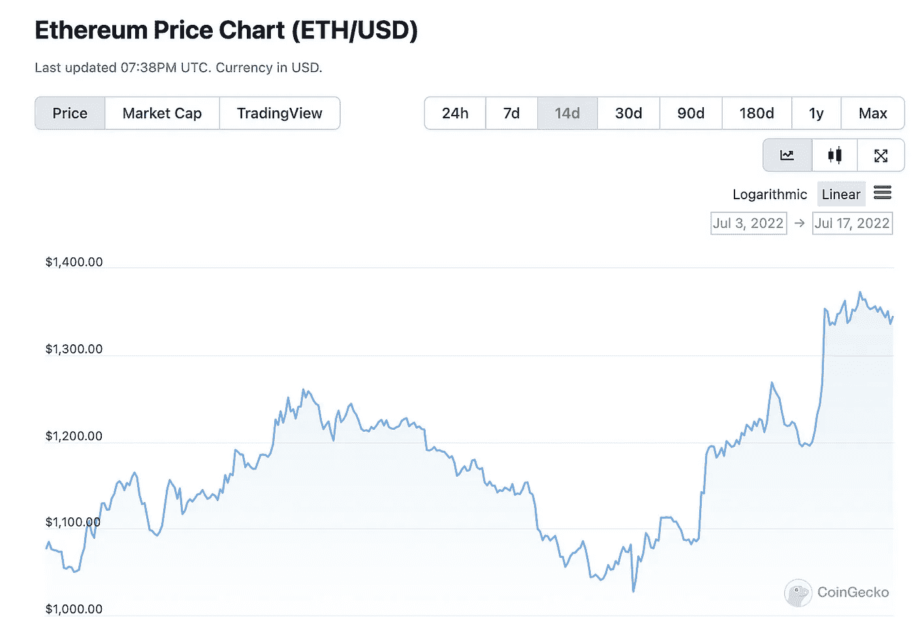

# 👍以太坊预“合并”特效？

> 原文：<https://medium.com/coinmonks/ethereum-pre-merge-effects-ad61ea878f0c?source=collection_archive---------41----------------------->

# 内容(3 分钟阅读):

*   👍这些以太坊是不是“合并”前的效果？
*   🤗 **Aave 提议推出一种与美元挂钩的稳定货币，名为 GHO**
*   💔航海家申请破产
*   🤷沙盒是怎么回事？
*   **摄氏度破产**
*   👨‍👩‍👧‍👧[startup y](https://beta.startupy.world/membership/?ref=yarocelis)——社区管理的搜索引擎
*   🏖️个人退休帐户，避税帐户
*   📰基督教青年会
*   🙏🏻感激…

# 👍这些是以太坊“合并”前的效果吗？

以太坊在过去的 14 天里升值了 25%。上周五，7 月 16 日，以太坊发布了期待已久的“合并”时间表后，看涨的势头蔓延开来到 9 月 19 日，该网络预计将从目前的 [**工作验证**](https://decrypt.co/?post_type=post&p=5733) (PoW)区块链*合并为一个节能的[利益验证](https://decrypt.co/resources/proof-of-work-vs-proof-of-stake) (PoS)网络。*

几天来，以太的价格一直在绿色中交易，延续了在基础以太坊区块链从工作证明过渡到股份证明的软时间表发布后开始的反弹。

最后一次检查时，乙醚的交易价格为 1371 美元(见下图)

熊市可能还没有结束，但一些好消息是，以太坊的成功合并正是我们需要的，可以给这个行业注入信心。这一合并在许多不同的层面上有着巨大的影响，因为它将降低天然气费用，加快交易速度，并促进加密市场的绿色可持续性。

[**super phez . eth🦇🔊🐼** @superphiz](https://twitter.com/superphiz/status/1547643255335968771?ref_src=twsrc%5Etfw%7Ctwcamp%5Etweetembed%7Ctwterm%5E1547643255335968771%7Ctwgr%5E%7Ctwcon%5Es1_&ref_url=https%3A%2F%2Fdecrypt.co%2F105177%2Fethereum-devs-pencil-in-september-date-for-merge)

这个合并时间表还不是最终的，但是看到它一起到来是非常令人兴奋的。请将此视为规划时间表，并留意官方公告！hackmd.io/@benjaminion/B…T2

【https://twitter.com/superphiz/status/1547643255335968771? ref _ src = tw src % 5 etfw % 7 ctw camp % 5 etweembed % 7 ctw term % 5E 1547643255335968771% 7 ctw gr % 5E % 7 ctw con % 5es 1 _&ref _ URL = https % 3A % 2F % 2f decrypt . co % 2f 105177% 2 fethereum-devs-pencil-in-June-date-for-merge

我个人一直看好以太坊，并坚信它将继续成为游戏规则的改变者。这种推动变革的巨大力量是他们的团队愿意竭尽全力让区块链的采用更具吸引力的又一个范例。

[现在就订阅](https://yarocelis.substack.com/subscribe?utm_medium=web&utm_source=subscribe-widget&utm_content=64515795)

# 🤗Aave 提议推出一种与美元挂钩的稳定货币，名为 GHO

一项新的[提案发布在](https://substack.com/redirect/41460b38-205d-4e60-b80d-44cffadc23d4?u=8728742)GHO Aave 治理论坛上，这是一种与美元挂钩的本地分散稳定货币&，由 Aave (aTokens)的抵押品支持。Aave 正试图通过利用其现有的货币市场协议进入 1500 亿美元的稳定币市场，该协议目前部署在几乎所有的主要连锁店上。此外，Aave 上超过 60 亿美元的可用存款流动性可用作发行 GHO 的抵押品。

# 💔航海家申请破产

[航海家数码](https://substack.com/redirect/04e3af97-bcd3-45be-92bc-f6df60347d94?u=8728742)，[CeFi 公司，于 2022 年 7 月 5 日](https://substack.com/redirect/9c864dc3-4be1-4eb9-9609-d068c475ab55?u=8728742)申请破产。Voyager 是一家加密货币公司，提供经纪等服务，其中包括定位客户想要购买或出售的加密货币的最便宜利率，以及借用客户的数字资产，以换取高达 12%的收益率，然后将其借出。

# 🤷沙盒是怎么回事？

尽管远非理想的市场条件，沙盒继续履行其承诺，为其日益多样化的社区建设一个强大的元宇宙。只需要一点“缩小”就能看到沙盒财务状况的明显积极面。[很少有平台能够在二级市场销量下降 90%的情况下存活下来，并且仍然以同样的标准宣称同比增长 300%。](https://messari.us17.list-manage.com/track/click?u=5b89525c77acdd986027c25d1&id=c2a97a3a2b&e=ff52bce978)而且，通常情况下，投机者的大规模撤离最终可能是该平台最健康的事情。熊市是为了构建下一个牛市。

> 交易新手？尝试[加密交易机器人](/coinmonks/crypto-trading-bot-c2ffce8acb2a)或[复制交易](/coinmonks/top-10-crypto-copy-trading-platforms-for-beginners-d0c37c7d698c)

[启动-](https://beta.startupy.world/membership/?ref=yarocelis)

我很高兴地宣布，我已经成为 Startupy 的策展人和成员。一个社区管理的搜索引擎。零 SEO BS。我邀请你加入这个为漫游、研究和思考而设计的知识和见解的令人愉快的图书馆。

# 摄氏温度下降

在偿还完他们在[大院](https://newsletter.coingecko.com/click.html?x=a62e&lc=Ur7&mc=0&s=P1PM&u=p&z=h2813dg&)的所有违约贷款后，[摄氏度](https://newsletter.coingecko.com/click.html?x=a62e&lc=Uri&mc=0&s=P1PM&u=p&z=hCYxaYb&)宣布他们已经在周四早上申请了第 11 章破产。Celsius 还透露，它仅持有 1.67 亿美元现金，将用于“支持运营”。

投资者担心，他们希望能够归还的资金已经被用来偿还 DeFi 贷款，而不是客户。

[留言评论](https://yarocelis.substack.com/p/-is-the-swift-payment-system-bound/comments)

在巅峰时期，[的应用程序拥有多达 170 万用户。由于管理着数十亿美元的资产，许多人涌向 Celsius，因为各种加密货币提供了诱人的收益率。](https://newsletter.coingecko.com/click.html?x=a62e&lc=UPn&mc=0&s=P1PM&u=p&z=hQ0L4Rb&)

然而，它在过去遭受了重大损失，最近申请了第 11 章破产。这使得许多用户的资金被锁定在应用程序中，看不到解决方案。

[连同 iTrustCapital](https://itrustcapital.com/referral100?utm_source=partner&utm_medium=youtube&utm_campaign=partner637&oid=10&affid=637)

加密货币是这些天每个人都在谈论的东西之一。有各种不同的交易所进行加密交易……但是许多人没有意识到他们在税费上损失了多少。

iTrustCapital 允许其客户通过个人退休账户或个人退休帐户投资 crypto，而不必担心税收或费用。

IRA 是避税账户，这意味着你所有的加密交易都是免税的，并且可以随着时间的推移免税增长。

没有隐藏的费用。[要了解更多信息，请点击此处并开通免费账户。](https://itrustcapital.com/referral100?utm_source=partner&utm_medium=youtube&utm_campaign=partner637&oid=10&affid=637)

[分享 Yaro 的技术& WebX 简讯](https://yarocelis.substack.com/?utm_source=substack&utm_medium=email&utm_content=share&action=share)

# 📰基督教青年会

*   [前比特币基地高管以 a16z 为首为去中心化社交网络协议筹集了 3000 万美元](https://www.theblock.co/post/157271/farcaster-a16z-round-for-decentralized-social-network-protocol?utm_source=feedly&utm_medium=rss)
*   [Celsius 偿还了一笔 ave 贷款，将 4.18 亿美元的“资产”转移到未知的钱包中](https://www.coindesk.com/markets/2022/07/12/celsius-pays-off-aave-loan-moves-418m-steth-stack-to-unknown-wallet/?utm_medium=referral&utm_source=feedly&utm_campaign=headlines)
*   比特币矿工的麻烦会引发 BTC 价格的“死亡螺旋”吗？
*   [NFT 公司是今年上半年的一大并购目标](https://www.theblock.co/post/158034/nft-companies-were-a-big-ma-target-during-first-half-of-the-year?utm_source=cryptopanic&utm_medium=rss)
*   [以下是柴犬(SHIB)持有者在出售前应该知道的事情](https://ambcrypto.com/heres-what-shiba-inu-shib-holders-should-know-before-selling/)
*   顶级密码分析师 Michal van de Poppe 预测 Polygon、THORChain 和两个以太坊竞争对手将强劲反弹
*   [本周最值得关注的五种加密货币:BTC、瑞士联邦理工学院、马蒂奇、FTT 等](https://cointelegraph.com/news/top-5-cryptocurrencies-to-watch-this-week-btc-eth-matic-ftt-etc)
*   [澳大利亚央行行长更喜欢私人发行的代币，而不是中央银行发行的代币](https://beincrypto.com/australian-central-bank-governor-prefers-privately-issued-tokens-over-cbdcs/)
*   [中非共和国批准比特币成为储备资产](https://en.ethereumworldnews.com/central-african-republic-bitcoin-reserve/)
*   [巴拉圭国会通过加密法案，送交总统](https://www.theblock.co/post/157991/paraguays-congress-passes-crypto-bill-sends-to-president?utm_source=cryptopanic&utm_medium=rss)

> 加入 Coinmonks [电报频道](https://t.me/coincodecap)和 [Youtube 频道](https://www.youtube.com/c/coinmonks/videos)了解加密交易和投资

# 另外，阅读

*   [Bitget 评论](https://coincodecap.com/bitget-review) | [双子星 vs BlockFi](https://coincodecap.com/gemini-vs-blockfi) cmd| [OKEx 期货交易](https://coincodecap.com/okex-futures-trading)
*   [AscendEx Staking](https://coincodecap.com/ascendex-staking)|[Bot Ocean Review](https://coincodecap.com/bot-ocean-review)|[最佳比特币钱包](https://coincodecap.com/bitcoin-wallets-india)
*   [霍比审核](https://coincodecap.com/huobi-review) | [OKEx 保证金交易](https://coincodecap.com/okex-margin-trading) | [期货交易](https://coincodecap.com/futures-trading)
*   [网格交易机器人](https://coincodecap.com/grid-trading) | [Cryptohopper 审查](/coinmonks/cryptohopper-review-a388ff5bae88) | [Bexplus 审查](https://coincodecap.com/bexplus-review)
*   [7 个最佳零费用加密交易平台](https://coincodecap.com/zero-fee-crypto-exchanges)