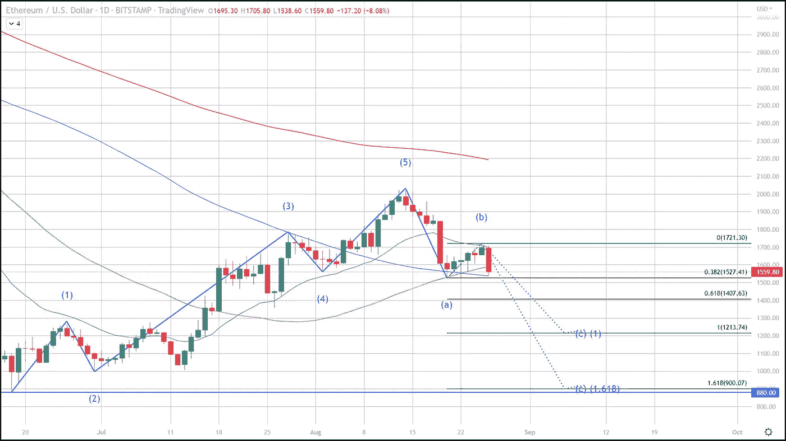
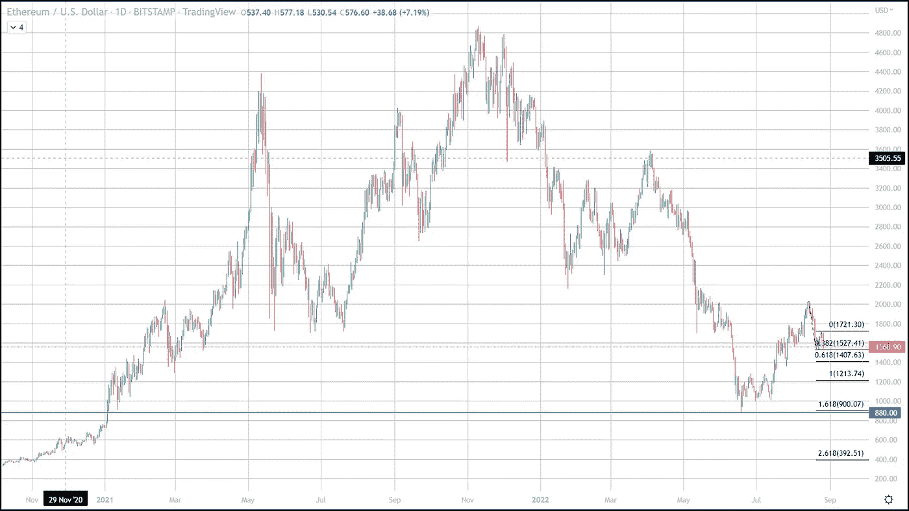

# 以太网价格下跌，“波数意味着什么？”

> 原文：<https://medium.com/coinmonks/ethereum-price-drop-what-does-the-wave-count-say-12f734d0ff88?source=collection_archive---------40----------------------->

今天，风险资产暴跌，纳斯达克下跌超过 4%，标准普尔 500 当天下跌超过 3%。Crypto 也大幅下跌，但截至美国东部时间下午 4 点，比特币的表现比大多数 crypto 要好，亏损超过 4%。以太网遭受了更大的打击，损失超过 8%，所以随着下个月合并的到来，以太网真的能交易得更低吗？

杰罗姆·鲍威尔(Jerome Powell)今天在杰克逊霍尔(Jackson Hole)经济研讨会上的讲话对风险更高的资产给出了暗淡的前景，因为他暗示激进的加息将持续到“任务完成”。他指的是将通货膨胀降低到可接受水平的工作。这让我相信，即使有即将到来的合并带来的乐观势头，Ethereum 也能以较低的价格交易。

在撰写本报告时，Ethereum 的交易价格约为 1560 美元，100 天移动平均线的试探性支撑位约为 1530 美元。这正是今天的低点，如果这种下降趋势继续下去，联邦医疗保险可能会下降到？

为了回答这个问题，让我们来看看埃利奥特波，以及 Ethereum 的当前波数。最新的波数将我们置于 C 波的开始，埃利奥特波指出，C 波最合理的距离等于 A 波的距离，或 A 波的 1.618 倍。

当我们将 A 波与 C 波的开始进行基于趋势的 Fibonacci 回撤比较时，我们会得出一个更为悲观的结论(C 波相当于 A 波的 1.618)，这将把我们带回到过去几年的低点。

6 月 18 日，以太博物馆一年半以来的最低价格是 880 美元，这是我们当前统计的第一波的开始。对于 C 波来说，这是更为看跌的情况，如果 C 波的涨幅等于 A 波，那么我们可能会看到 1200 美元左右的底部，这也是非常看跌的。

因此，如果人们相信杰罗姆·鲍威尔或拉尔夫·尼尔森·埃利奥特的话，那么他们也应该预计 Ethereum 会在未来几周内达到这些目标之一(1200 美元或 900 美元)。

任何对我们专门交易比特币和选择密码货币的免费服务感兴趣的人，只需点击此[链接](https://www.thegoldforecast.com/bitcoin)。

> 交易新手？试试[密码交易机器人](/coinmonks/crypto-trading-bot-c2ffce8acb2a)或者[拷贝交易](/coinmonks/top-10-crypto-copy-trading-platforms-for-beginners-d0c37c7d698c)