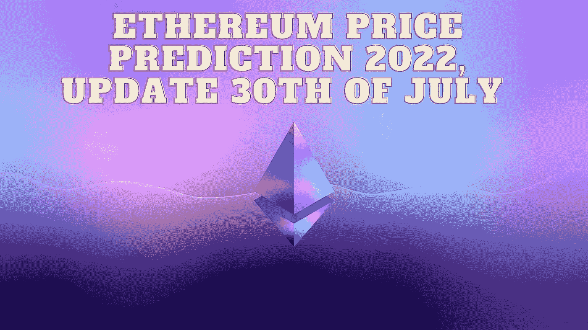

# 以太坊 2022 年价格预测，7 月 30 日更新

> 原文：<https://medium.com/coinmonks/ethereum-price-prediction-2022-update-30th-of-july-c6c29f84548f?source=collection_archive---------0----------------------->

Source photo Unsplash.com

# 以太坊(ETH)是什么？

以太坊区块链是一个去中心化、开源的智能合约平台。作为对他们保卫以太坊区块链工作的奖励，矿工们创造了被称为以太的本地硬币。

2015 年 7 月 30 日，网络直播。在那之前，已经铸造了 7200 万枚硬币。这是…