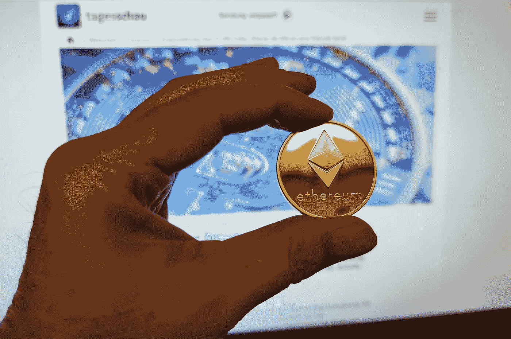

# 以太坊价格预测 2023–2025，12 月 20 日更新

> 原文：<https://medium.com/coinmonks/ethereum-price-prediction-2023-2025-update-20th-of-december-e587ea65a7d8?source=collection_archive---------36----------------------->

Source photo [Bani Monede Ethereum — Fotografie gratuită pe Pixabay](https://pixabay.com/ro/photos/bani-monede-ethereum-bitcoin-6312510/)

## 换句话说，以太坊(ETH)到底是什么？

以太坊是一个开源的区块链平台，支持智能合约功能，并且是去中心化的。以太是以太坊矿工创造的本地加密货币，作为处理区块链交易的奖励。