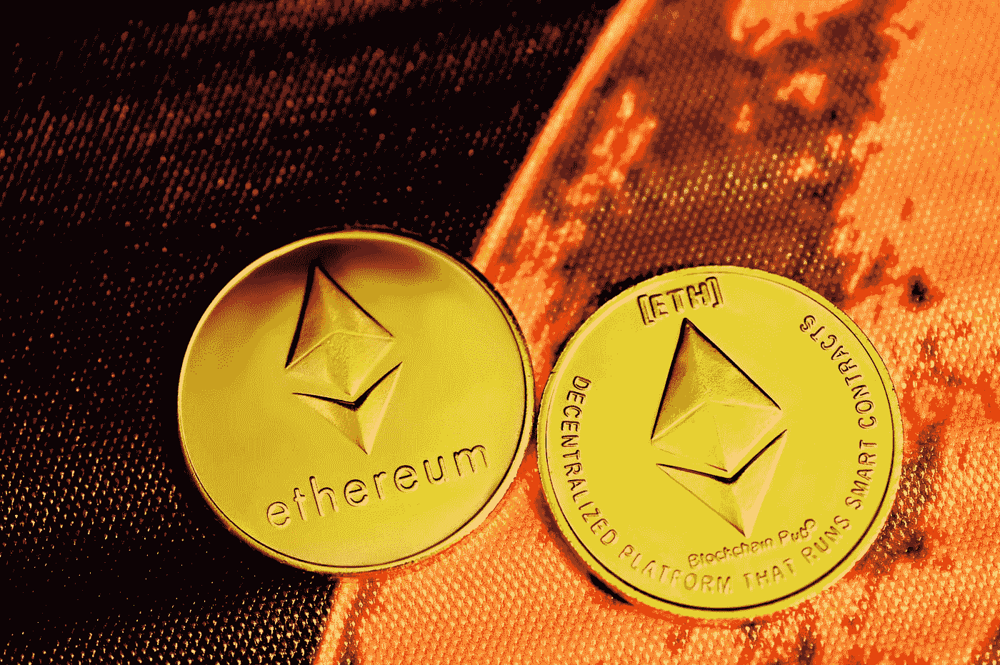

# 以太坊节省的能量相当于整个爱尔兰的需求

> 原文：<https://medium.com/coinmonks/ethereum-saves-as-much-energy-as-all-of-ireland-needs-d4c2ec287f53?source=collection_archive---------24----------------------->

## 在 9 月中旬的“合并”之后，围绕加密货币以太网的技术正在以一种更加节能的方式发展。

Photo by [Kanchanara](https://unsplash.com/@kanchanara?utm_source=medium&utm_medium=referral) on [Unsplash](https://unsplash.com?utm_source=medium&utm_medium=referral)

以太坊技术拥有自己的加密货币以太，能够通过 9 月份的一次系统变更大幅抑制其能源消耗…