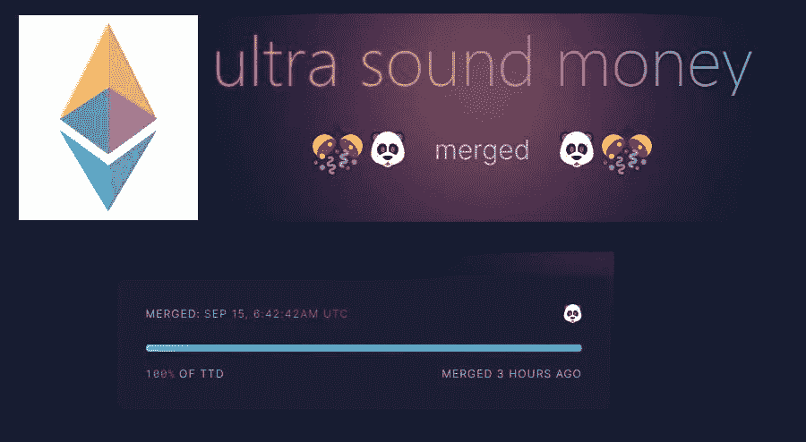
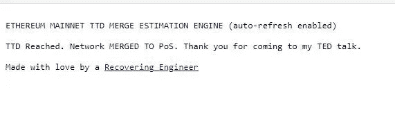
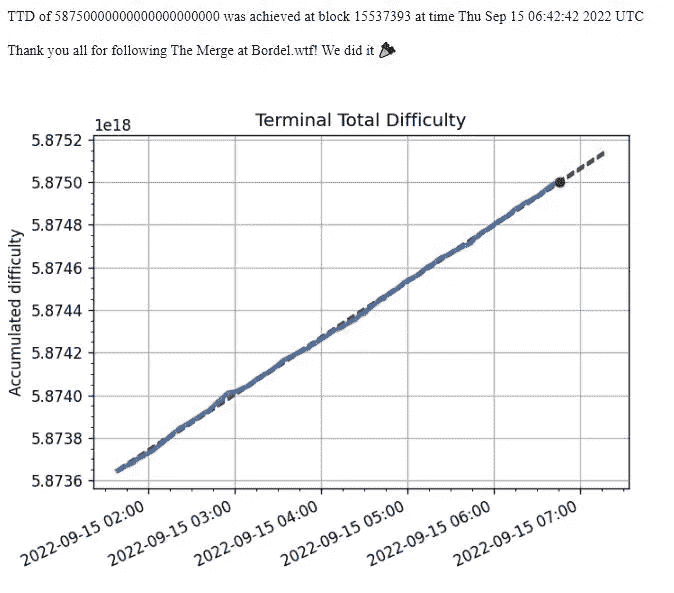
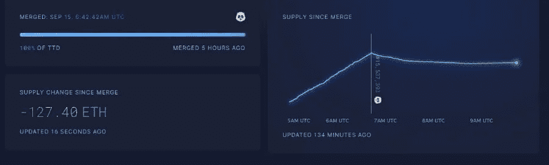
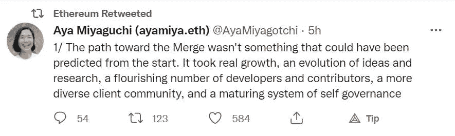

# 以太坊成功完成合并，现为 POS 连锁！！

> 原文：<https://medium.com/coinmonks/ethereum-successfully-completes-the-merge-and-is-now-a-pos-chain-a90f1add549b?source=collection_archive---------21----------------------->

From [Ultrasound.money](https://ultrasound.money/)

我可能度过了忙碌的一天，但这并不妨碍我在检查今天以太坊区块链成功完成合并时高兴地大叫一声。

[Ethereum Merge Countdown Clock and tracker](https://797.io/themerge/)

因此，以太坊的执行层现在实际上是以太坊的历史状态链，现在与以太坊的共识层合并，这是以太坊的信标链，以太坊不再是工作链的证明，它现在是利益链的证明！！。

以太坊从 POW 到 POS 状态链的转换发生在以太坊的执行层(现在是以太坊历史状态链)中引入的终端总难度范围为 587500000000000000，这触发了以太坊区块链到共识层的转换过程，其中下一个区块由信标链的验证器产生！！

[Ethereum Merge Countdown tracker](https://bordel.wtf/)

***呜呜！！***

所有这些都是历史，但我在之前的文章中详细解释了以太坊即将到来的合并过程，这是庆祝以太坊合并系列的第一篇文章。

[以太坊本月将举行盛大活动，即将合并为一家销售点连锁店！！](/coinmonks/grand-event-this-month-for-ethereum-with-the-merge-happening-soon-transitioning-it-into-a-pos-chain-9683d86ad89b)

# 合并后以太坊网络的主要变化

自 2019 年以来，作为一名狂热的加密追随者，我很高兴以太坊幸存下来，现在有望得到很大发展。

无论如何，随着以太坊作为 POS 链开始一个新的阶段，从以太坊区块链的功能方式随着其共识方法的变化，到影响以太坊供应的以太坊发行率，都发生了很多变化。

***现在，以太坊的发行率下降了 90%，正如我之前的文章所解释的，显然这影响了它的供应。***

你可以在这里读到-

[随着 ETH 的通货膨胀率变为零，ETH 的 tokenomics 发生变化](/coinmonks/eths-tokenomics-changes-with-the-merge-with-eth-s-inflation-rate-becoming-zero-25626f6979a2)

# 瑞士联邦理工学院的供应现在经历了大幅下降

所有被锁定的 ETH 仍将保持锁定，直到上海升级被激活，这将使 ETH 能够从锁定账户中提款。新发行的 ETH 也会被锁定在验证器账户中，只有在上海升级完成后才能进入流通领域。

Ultrasound.money 的图表已经显示，在几个小时前发生的合并之后，ETH 的供应量有所下降。

[ultrasound.money](https://ultrasound.money/)

我强烈推荐你们所有人阅读这篇文章，这篇文章解释了以太坊合并后的通货紧缩的象征经济学，哦，是的，你没听错，通货紧缩！！

合并使以太坊成为超声波货币！！

[合并如何影响能源供应](https://ethereum.org/en/upgrades/merge/issuance/)

# ETH 对合并的价格反应

虽然以太坊在 9 月 13 日经历了从 1770 美元到 1585 美元的 9-10%的下跌，但是在合并日，加密没有经历任何重大的价格变动，ETH 的价格现在是 1585 美元。

From [Tradingview](https://www.tradingview.com/x/ETm0pkkK/)

*这就是所有的人…以太坊现在已经完成了合并，所有的以太坊开发者在他们多年的辛勤工作后可能正在聚会，这使得合并成为可能！！*

[Tweet](https://twitter.com/AyaMiyagotchi/status/1570304013996032000?s=20&t=PH1VMsTiyU_1QaprPsv4HA)

我现在应该把我的 ETH 和以太坊(现在是 POS 区块链)的验证器联系起来。这是以太坊的新开始。

***感谢阅读！！***

> 交易新手？尝试[加密交易机器人](/coinmonks/crypto-trading-bot-c2ffce8acb2a)或[复制交易](/coinmonks/top-10-crypto-copy-trading-platforms-for-beginners-d0c37c7d698c)