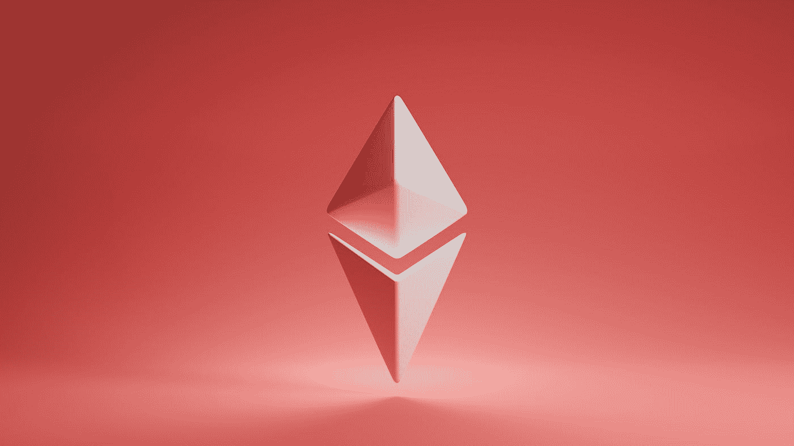

# 以太坊:去中心化加密货币的未来

> 原文：<https://medium.com/coinmonks/ethereum-the-future-of-decentralized-cryptocurrencies-4385d250fa80?source=collection_archive---------39----------------------->

## 加密货币的未来是一项极具颠覆性的技术。

Photo by [GuerrillaBuzz Crypto PR](https://unsplash.com/@theshubhamdhage?utm_source=medium&utm_medium=referral) on [Unsplash](https://unsplash.com?utm_source=medium&utm_medium=referral)

通过以太坊，开发者可以在一个去中心化的平台上创建和管理数字合同，这使得进行交易比传统货币更简单、更快捷。