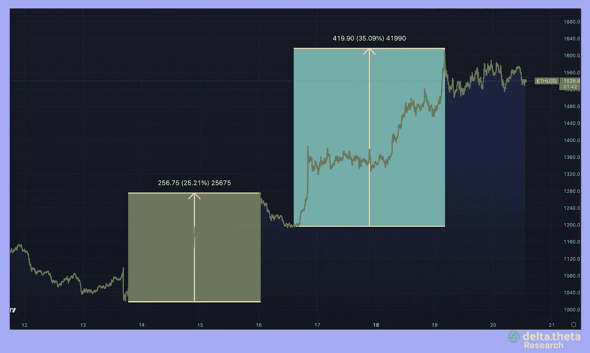
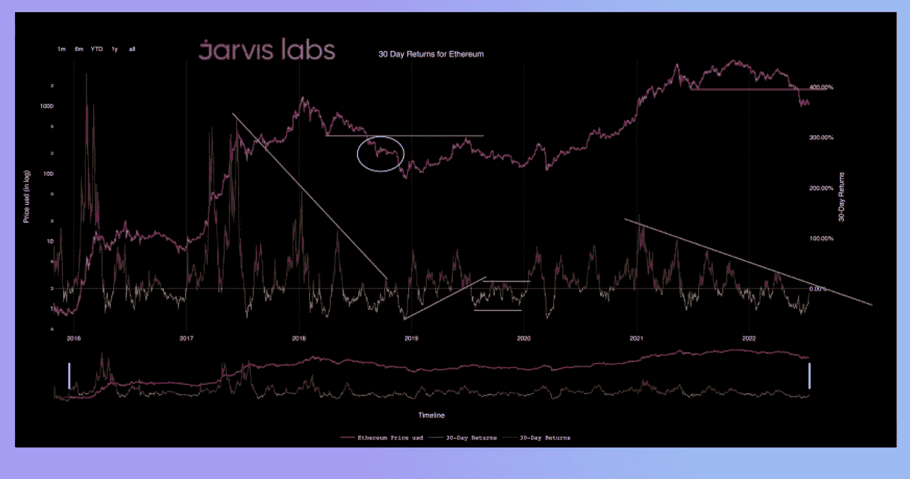
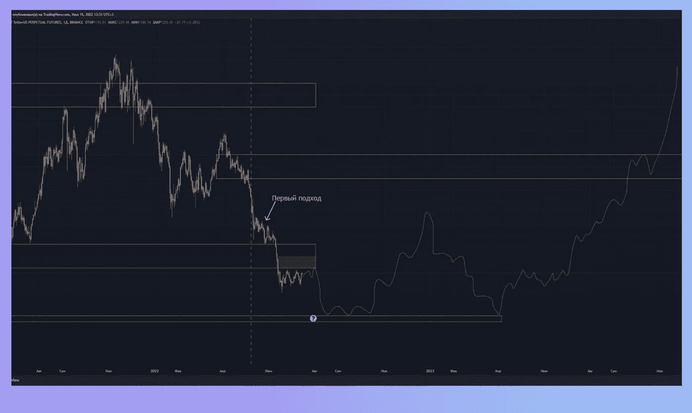
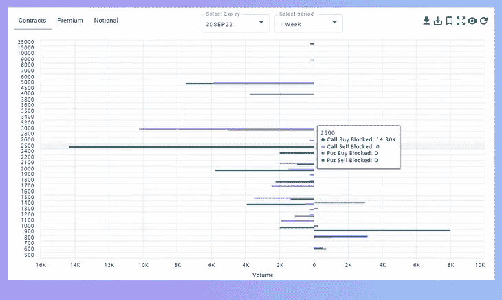
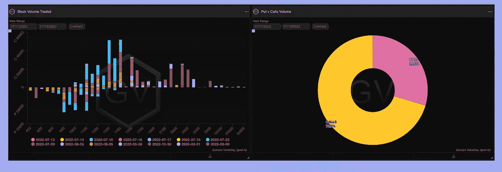
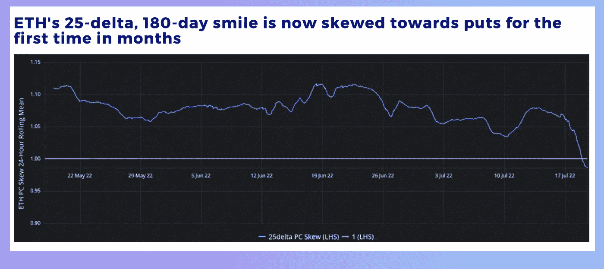
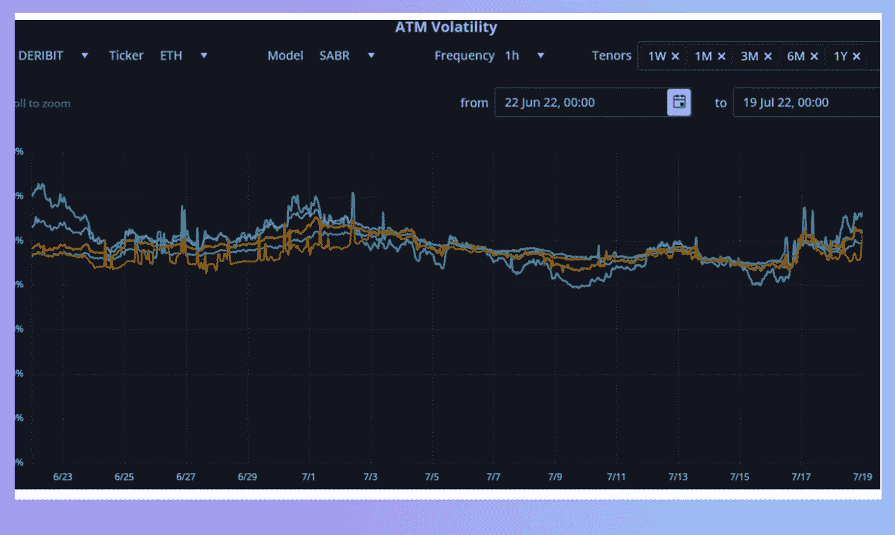
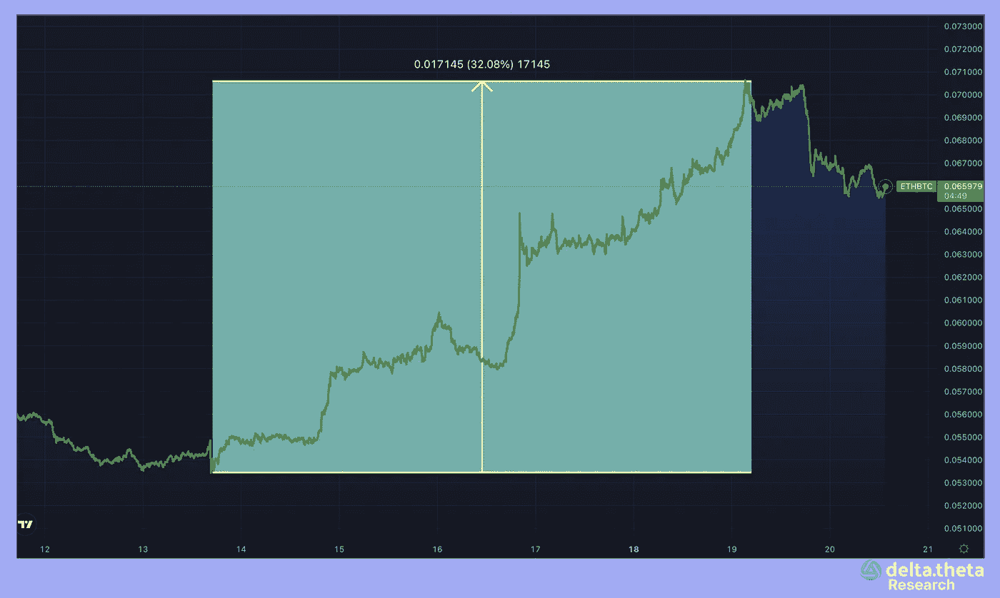

# 以太坊——新的山丘之王？

> 原文：<https://medium.com/coinmonks/ethereum-the-new-king-of-the-hill-55100622710c?source=collection_archive---------19----------------------->

上周末，近几个月持续的负面趋势告一段落。5 月份特拉区块链生态系统的崩溃导致主要加密公司 Celsius、Voyager 和 3AC 被迫清算，这已经停止了对市场的压力。

以太坊是第二种资本化的加密货币，在即将到来的网络更新“合并”中受到交易员的关注，该更新将把区块生成的共识原则从工作证明改为利益证明，从而改变验证新区块的奖励分配方式。虽然关于这种方法在两个测试子网中成功的消息在几周前就公开了，但 price 直到现在才做出反应。

就在价格飙升前几个小时，几位在线分析师(@ TheWolfOfYourStreet 和@Jarvis_Labs_LLC)发布了他们对近期增长的公开预测。原因是历史价格相关性和交易员长期 ETH 积累模式的变化。

技术分析的使用，即资产的累积范围和 30 天平均盈利能力(开始进入正区域)，使我们可以预计价格在不久的将来会上涨。它发生了！它发生在周末——市场流动性最少的传统时间，影响了所有可能的工具:现货交易、期权和期货。只有分散的交易协议仍未使用，但目前说增长动力已经耗尽还为时过早，或许这些储备也将在不久的将来被激活。

onchain analytics services[@ g _ vol](https://substack.com/profile/8858819-g_vol)和 [@laevitas1](https://twitter.com/laevitas1) 注意到，上周末看涨期权的使用大幅飙升，在现货和期货市场的强劲购买热潮中，这导致主要交易所 Derebit 的做市商受到极大挤压。持续的增长吸引了新的进入者，看涨期权买家的数量大幅增加，不仅是未来几个日期，还有 9 月和 12 月。[。](https://twitter.com/laevitas1)

有必要澄清一下什么是伽玛挤压。交易可能涉及交易者通过购买基础资产或基于 delta 水平购买期货来对冲卖出负债的情况。如果头寸的 delta 开始急剧上升，则必须通过从市场回购或从其他参与者处借入抵押品来增加抵押品的数量，以维持对冲。在以太坊的情况下，在上涨开始时，有几笔大交易(每笔交易 15 000-20000 份合约，几个小时内总计超过 100 000 份合约)购买了到期日为 7 月 29 日的看涨期权，行权价为 1400、1500 和 1700，对应于 15-5 的 delta。现货价格上涨后，三角洲也发生了很大变化，这为基础资产创造了额外的需求，并导致价格进一步上涨。

> 交易新手？试试[加密交易机器人](/coinmonks/crypto-trading-bot-c2ffce8acb2a)或者[复制交易](/coinmonks/top-10-crypto-copy-trading-platforms-for-beginners-d0c37c7d698c)

根据 blockscholes.com 分析服务公司的数据，ETH 期权的波动反转在周末已经形成。这种变化更多地表明了当前上涨的市场性质，并让人怀疑这一趋势的时间范围。看跌期权和看涨期权比例的急剧变化也证实了我们的观察，即期权是影响价格运动的最重要工具之一，这与以前的价格运动不同。

还应该注意的是，ETH 在上周对 BTC 的价格有了令人印象深刻的飞跃，超过了 30%的价格涨幅。这在很大程度上是由于一个强大的媒体事件的存在，合并，其重要性堪比减半(BTC 的区块链矿业奖励减半)。从历史上看，加密市场的增长顺序如下——首先是比特币增长，然后是以太网，接着是所有其他替代硬币。这一次以太是主要推手，比特币到最后反应迟钝。仅次于 SP500 指数在周一和周二的“第一次”上涨(或者它很快就不再上涨了？)加密货币势头强劲，朝着 23，000-25，000 美元大关迈进。

以太坊目前的市值为 1880 亿美元，略高于比特币的一半。然而，如果这种增长速度继续下去，市场参与者可能很快就会看到一个新的王者——以太坊！