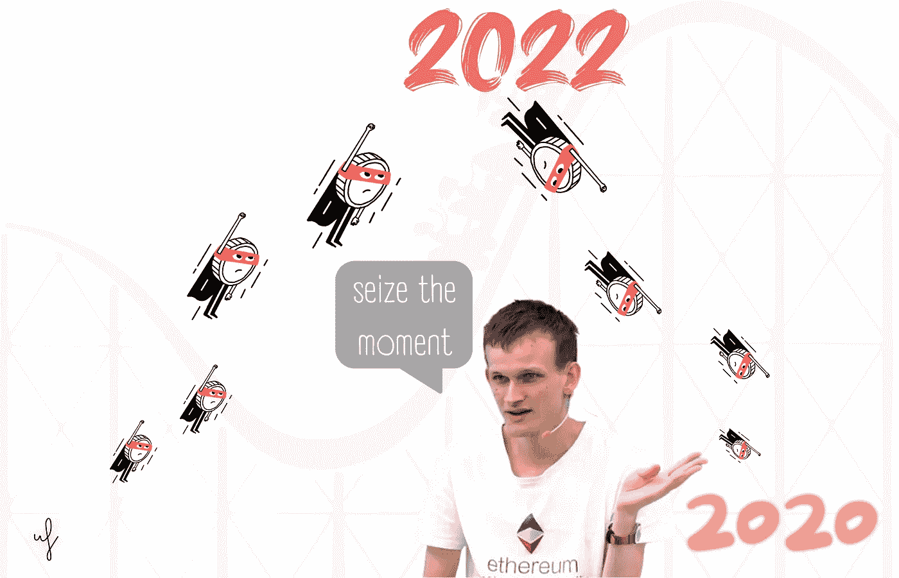
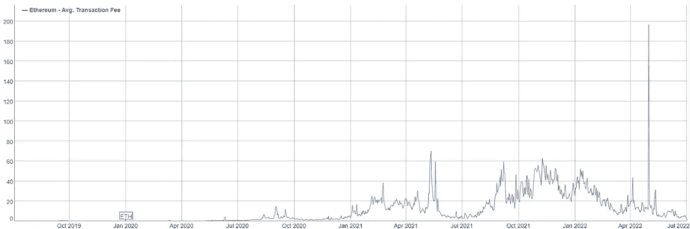
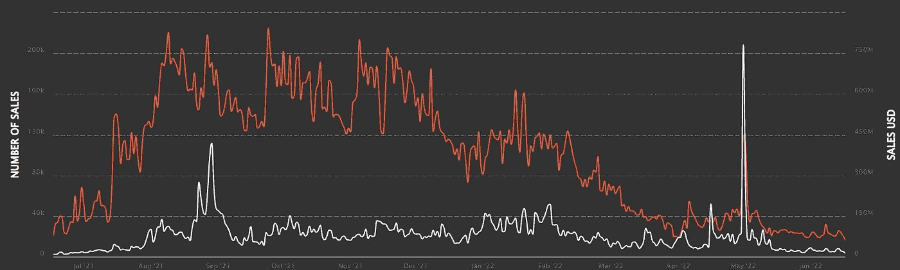
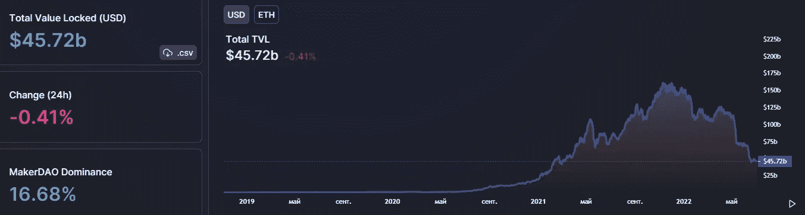
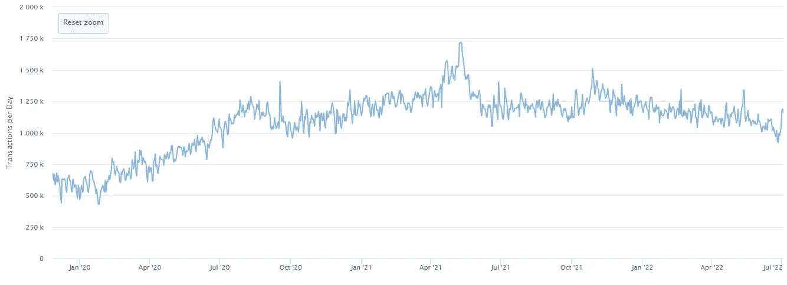
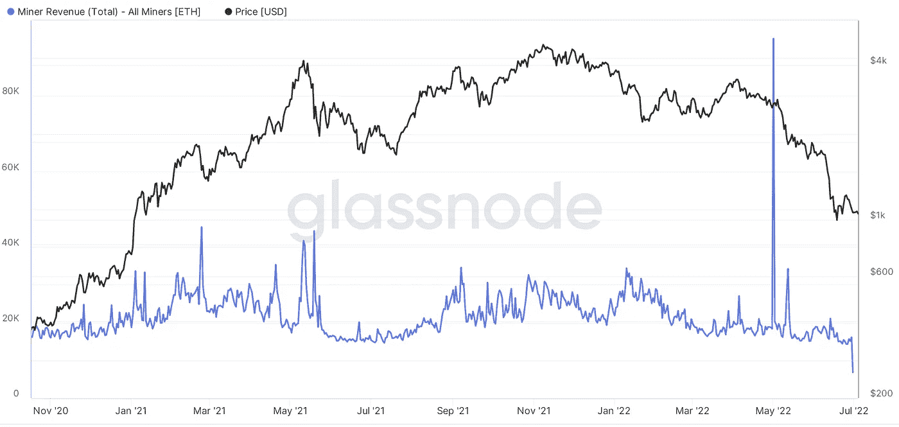

# 以太坊交易费用降至 2020 年 12 月水平

> 原文：<https://medium.com/coinmonks/ethereum-transaction-fees-drop-to-december-2020-levels-ac85a88118a?source=collection_archive---------30----------------------->

## 6 月 2 日周六，以太坊网络上的平均交易费为 1.67 美元。根据 BitInfoCharts 的数据，该指标上一次处于这样的水平是在 2020 年 12 月。

This preview will be included in the NFT collection called “[Uncle Fibonacci News](https://opensea.io/collection/uncle-fibonacci-news)”

自 2021 年 1 月以来，随着 DeFi 行业的爆发和 NFT 的繁荣，学费一直在上涨。平均费用金额在 2022 年 5 月 1 日达到最高值 196，683 美元。之后随着市场的降温而减少。

> 交易新手？试试[加密交易机器人](/coinmonks/crypto-trading-bot-c2ffce8acb2a)或者[复制交易](/coinmonks/top-10-crypto-copy-trading-platforms-for-beginners-d0c37c7d698c)

6 月，NFT 销售额创下一年来最差表现。根据 NonFungible 的数据，截至本月中旬，日交易量为 1380 万美元，交易量约为 16200 笔。

以太坊网络中 DeFi 协议冻结的资金总量降至 457 亿美元，即 2021 年 3 月初的数值。总数为 728 亿美元。

6 月 26 日，以太坊日交易量达~92 万笔。上一次在网络上观察到如此低的活跃度是在 2020 年秋季。

截至 6 月 30 日，矿工的日收入已降至约 6784 ETH 或约 720 万美元(Glassnode)。在 5 月 1 日平均费用的高峰期，矿工们赚了 2.693 亿美元。

📰 ***订阅*** [***斐波那契***](/@unclefibonacci) ***我来保持最新***

☕️eth:0x40a 8443813 e 8 fa 4a 9 f 88 f 18 b 77442 aa 4ed 91 fd4c

☕️BTC:1kkekcmdrghajztfxjoq 5 otg bv 1 mgucwdj