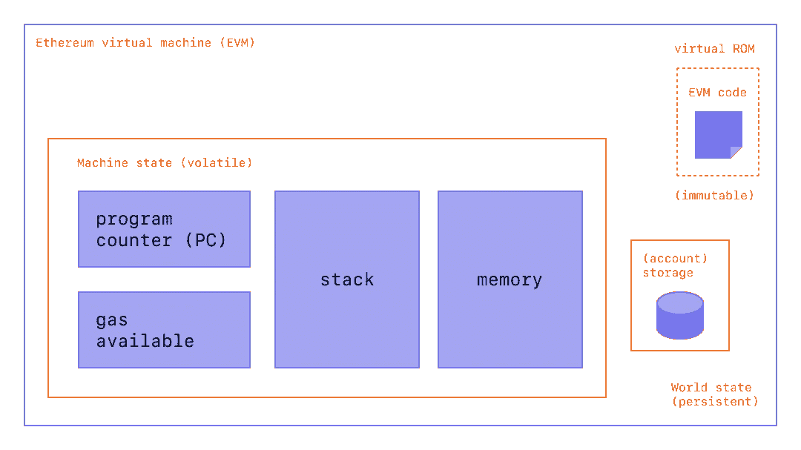
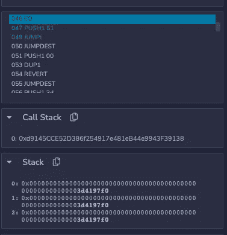

# 以太坊虚拟机

> 原文：<https://medium.com/coinmonks/ethereum-virtual-machine-ea62cdea954d?source=collection_archive---------2----------------------->

## solidity 开发者实用指南

# 什么是 EVM？

你可能听说过 **Java 虚拟机**，开发者用 Java(或其他语言)编写的代码编译成 Java 字节码，JVM 是一个运行时引擎**执行 Java 字节码**。以太坊虚拟机在高层次上是类似的，开发者用 Solidity(或其他语言，如 Vyper)编码，并向下编译成 EVM 字节码，EVM 是一个运行时引擎，执行 EVM 字节码。



credit to ethereum.org on a high level of EVM

**它是如何工作的？**

EVM 是一个基于事务的状态机——如果事务失败，状态不会更新，除了发送者支付汽油的 nonce 和 eth 余额。

1.  **EVM 代码—** 开发人员编写智能合同，将其编译成字节码，然后签署并在链上推送交易，以在 EVM 创建智能合同。
2.  当用户或另一个智能合约与智能合约交互时，EVM 会将合约字节码(操作码序列)加载到**内存**中。
3.  然后，EVM 将执行操作码序列。当执行正在进行时，**程序计数器**(下一条指令的地址)将增加。**可用气体**将根据操作码减少，如果可用气体不足则终止。任何在存储器中存储数据的操作将在**账户存储器**中持续存在(仅适用于智能合约)。

# **什么是操作码？**

总共有 141 个 EVM 操作码可以执行如下几类任务(不完全)。完整的清单及其相关的天然气成本可在以下位置找到: [https://www.evm.codes/](https://www.evm.codes/)

1.  加载并保存到内存/存储器(`mload` | `mstore` | `sload` | 【T3)
2.  工艺流程(`jump`
3.  算术(`add` | `mul` | `sub` | `div`等)
4.  比较(`eq` | `isZero`)
5.  EVM 环境相关(`gas` | `caller`)

# 例如:可靠性->字节码->操作码

在本节中，我们将使用一个简单的 Solidity 代码示例和演练

1.  一个契约在字节码和操作码中是什么样子的
2.  EVM 如何知道函数调用要执行哪个操作码

## **在字节码和操作码中，契约看起来像什么**

我们将使用如下所示的简单契约:

通过 [solcjs](https://github.com/ethereum/solc-js)
`> solcjs -o BytecodeDir --bin src/Demo.sol`编译成字节码后

```
608060405234801561001057600080fd5b50610133806100206000396000f3fe6080604052348015600f57600080fd5b506004361060325760003560e01c80633c6bb4361460375780633d4197f0146051575b600080fd5b603d6069565b604051604891906090565b60405180910390f35b606760048036038101906063919060d5565b606f565b005b60005481565b8060008190555050565b6000819050919050565b608a816079565b82525050565b600060208201905060a360008301846083565b92915050565b600080fd5b60b5816079565b811460bf57600080fd5b50565b60008135905060cf8160ae565b92915050565b60006020828403121560e85760e760a9565b5b600060f48482850160c2565b9150509291505056fea26469706673582212202008ce9f466108e302b16a0a7d864882e3925c470c9a7371c7c03dfa5083b56f64736f6c63430008110033
```

您还可以使用 [Etherscan 的](https://etherscan.io/opcode-tool)工具转换成操作码(也可以使用`solc`命令)

```
[0] DUP1
[2] PUSH1 0x40
[3] MSTORE
[4] CALLVALUE
...
```

当你调用一个函数时，例如`setVal(uint256)`——你的输入数据将包含你的方法签名和输入值。例如，当您调用`setVal(10)`时，前 4 个字节是`3d4197f0`，接下来的 32 个字节包含您的输入值`10`

```
> abi.encodeWithSignature("setVal(uint256)", 10)0x3d4197f0000000000000000000000000000000000000000000000000000000000000000a
```

您可以尝试搜索`3d4197f0`——它存在于字节码中！这是第一个关于 EVM 如何知道为一个方法调用执行哪个操作码的提示😀

## **EVM 如何知道函数调用要执行哪个操作码**

**第一步:**
将上面的`Demo.sol`复制到 [Remix](https://remix.ethereum.org/) 中，编译部署。然后调用`setVal(10)`并按下“调试”图标，它会把你带到调试器

你应该看到它直接把你带到了这个操作码，它在函数体中，尽管我们热衷于 EVM 如何把我们带到这个操作码，而不是函数执行的操作码。

```
112 DUP1 
113 PUSH1 00
115 DUP2 
```

**第二步:** 按下后退，直到看到这条指令高亮显示。



此时，您可以看到方法签名在堆栈中。从堆栈中取出两件物品。如果相等，则按 1，否则按 0)是下一个要调用的操作码。立即堆叠:

```
Since both value are equal
0: 0x..01
1: 0x..3d4197f0
```

随后是将`0x51`推入堆栈的`PUSH 51`。立即堆叠:

```
0: 0x..51
1: 0x..01
2: 0x..3d4197f0
```

之后是关键部分`JUMPI`(从堆栈中弹出 2 值，如果 index 1 大于 0 则进行 index 0 程序计数器，否则继续)。

在我们的例子中，由于堆栈的索引 1 是非零的，程序计数器将前进到我们的方法体`0x51`。这就是 EVM 如何看待函数签名，并继续执行正确的操作码。

**如果在 JUMPIO** 中不相等怎么办？程序将不会跳转，并最终在操作码`054`处到达`REVERT`调用

# **结尾注释**

理解 EVM 是如何工作的有助于成为更好的可靠性开发人员，就像 Java 开发人员应该理解 JVM 一样。例如，查看[操作码](https://www.evm.codes/) `mstore`和`sstore`的 gas—您会看到存储在内存和存储中的 gas 差异。

我真的希望这篇文章能有所帮助！在下一篇文章中，我们将讨论智能合约的 gas 优化，这些操作码知识应该会派上用场！

# 参考

这些文章极大地帮助了我了解 EVM，这要归功于他们！

1.  [https://www.evm.codes/](https://www.evm.codes/)
2.  [https://leftasexercise . com/2021/08/08/q-smart-contracts-and-the-ether eum-virtual-machine/](https://leftasexercise.com/2021/08/08/q-smart-contracts-and-the-ethereum-virtual-machine/)
3.  [https://noxx . substack . com/p/EVM-deep-dives-the-path-to-shadow](https://noxx.substack.com/p/evm-deep-dives-the-path-to-shadowy)

> 交易新手？尝试[加密交易机器人](/coinmonks/crypto-trading-bot-c2ffce8acb2a)或[复制交易](/coinmonks/top-10-crypto-copy-trading-platforms-for-beginners-d0c37c7d698c)