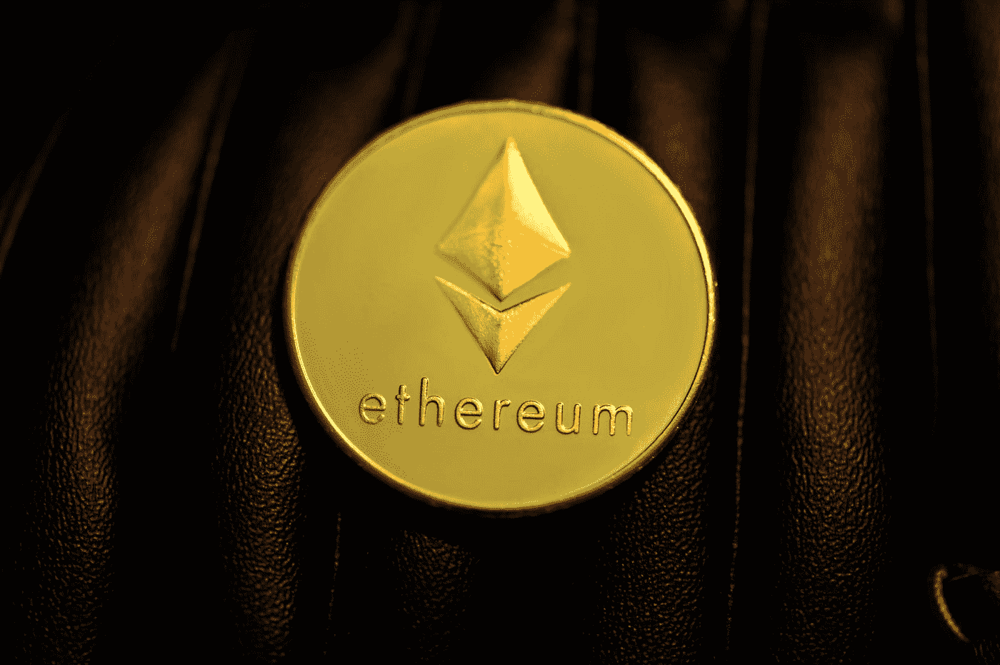

# 以太坊会爆炸！2023 年的 ETH 价格

> 原文：<https://medium.com/coinmonks/ethereum-will-explode-eth-price-for-2023-a19b9c703e68?source=collection_archive---------4----------------------->

## 从美联储主席杰罗姆·鲍威尔(Jerome Powell)的最新声明来看，控制通胀似乎仍是美联储的首要任务。这对股市和加密货币市场来说是个坏消息，预计抛售压力将持续存在。

Photo by [Kanchanara](https://unsplash.com/@kanchanara?utm_source=medium&utm_medium=referral) on [Unsplash](https://unsplash.com?utm_source=medium&utm_medium=referral)