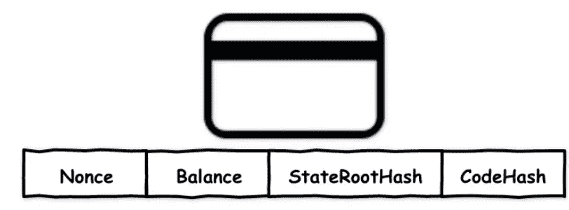

# 以太坊世界状态评论

> 原文：<https://medium.com/coinmonks/ethereum-world-state-review-486ecfa44f76?source=collection_archive---------22----------------------->

在这篇博客中，我将谈论

*   以太坊世界状态

以太坊丰富了账号的内容，除了剩下的，你想存多少数据都可以。并利用帐户数据的可维护性来构建智能合约帐户。以太坊是为实现智能合约而改进的帐户模型。按帐户安全地隔离数据。账户之间的信息是独立的，互不干扰。然后配合以太坊虚拟机，让智能合约沙盒运行。以太坊作为智能合约运营平台，将账户分为外部账户(EOAs)和合约账户。

如果你想了解更多关于 EOA 和合同账户的信息，请查看我的文章。

## 以太坊世界状态

世界状态是帐户地址(160 位标识符)和帐户状态(如帐户余额)之间的映射。Merkle 树用于维护状态。

**账户状态包括四条数据。**



对应的代码如下:

```
// core/state/state_object.go:100
type Account struct {
    Nonce    uint64
    Balance  *big.Int
    Root     common.Hash
    CodeHash []byte
}
```

以太坊数据以账户为单位进行组织，账户数据的变化引起账户状态的变化。结果以太坊的状态被改变。

```
WorldState = [(address, AccountState)]AccountState = [Nonce, Balance, StorageHash, CodeHash]
```

以太坊使用 Merkle 帕特里夏尝试结构。Markle patricia trie 使用以太坊而不是朴素映射来存储< *Worldstate* >的键值对。因为它在 trie 中存储了键值对和证明某个键值对的证明。然而，这些状态并不直接存储在区块链上，而是保存在 Merkle 前缀树中，并且只有相应的树根值被记录在区块链上。一个简单的数据库用来维护树的持久内容，用来维护映射的数据库叫做**状态数据库。**

**现在的问题是 StateDB 如何管理状态？**

从程序员的角度来看，State DB 有多种用途。

> 1.维护帐户状态到世界状态的映射。
> 
> 2.支持修改、回滚和提交状态。
> 
> 3.支持将状态保存到数据库。
> 
> 4.是状态进出 Merkle 树的媒介。

StateDB 充当状态、树、级别 DB(存储)的协调者

参考:

[](https://ethereum.org/en/whitepaper/#ethereum-accounts) [## 以太坊白皮书| ethereum.org

### 以太坊的介绍性论文，于 2013 年推出前出版。

ethereum.org](https://ethereum.org/en/whitepaper/#ethereum-accounts) [](/@eiki1212/ethereum-state-trie-architecture-explained-a30237009d4e) [## 以太坊状态 Trie 架构解释

### 解释以太坊状态，加深对以太坊区块链的了解。

medium.com](/@eiki1212/ethereum-state-trie-architecture-explained-a30237009d4e) [](https://brilliant.org/wiki/merkle-tree/) [## Merkle Tree |卓越的数学和科学维基

### Merkle 树是一种基于散列的数据结构，是散列列表的推广。这是一个树形结构，其中…

brilliant.org](https://brilliant.org/wiki/merkle-tree/) 

> 交易新手？试试[加密交易机器人](/coinmonks/crypto-trading-bot-c2ffce8acb2a)或者[复制交易](/coinmonks/top-10-crypto-copy-trading-platforms-for-beginners-d0c37c7d698c)