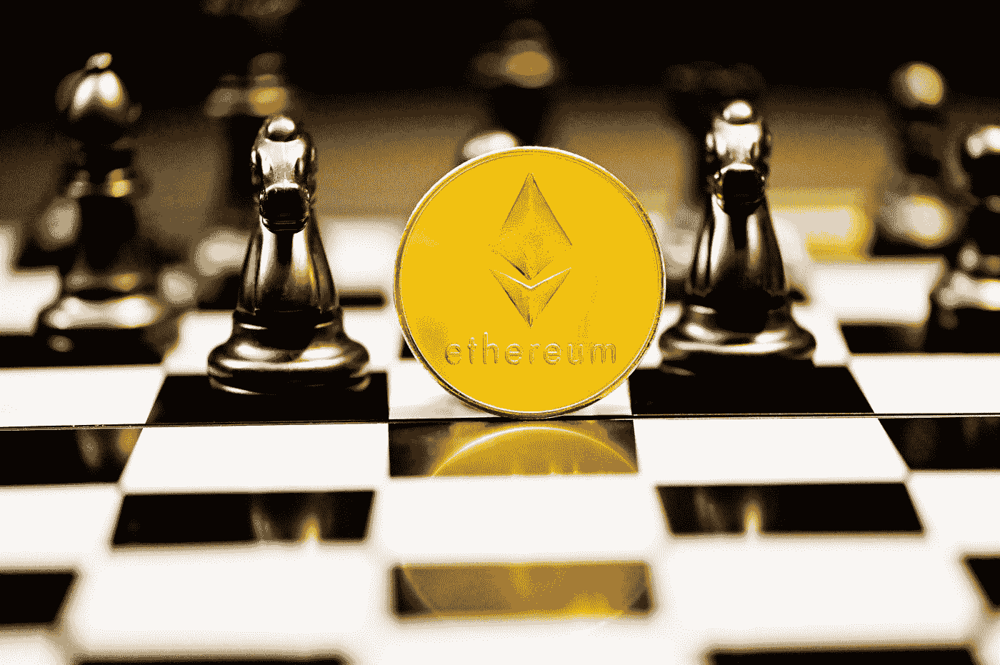
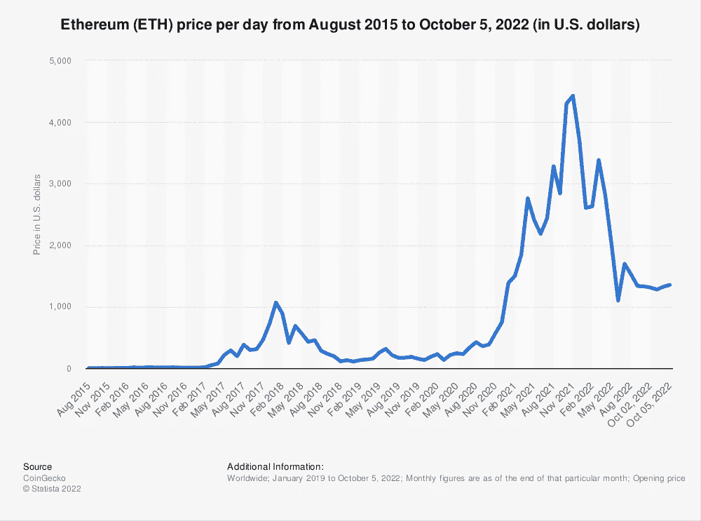
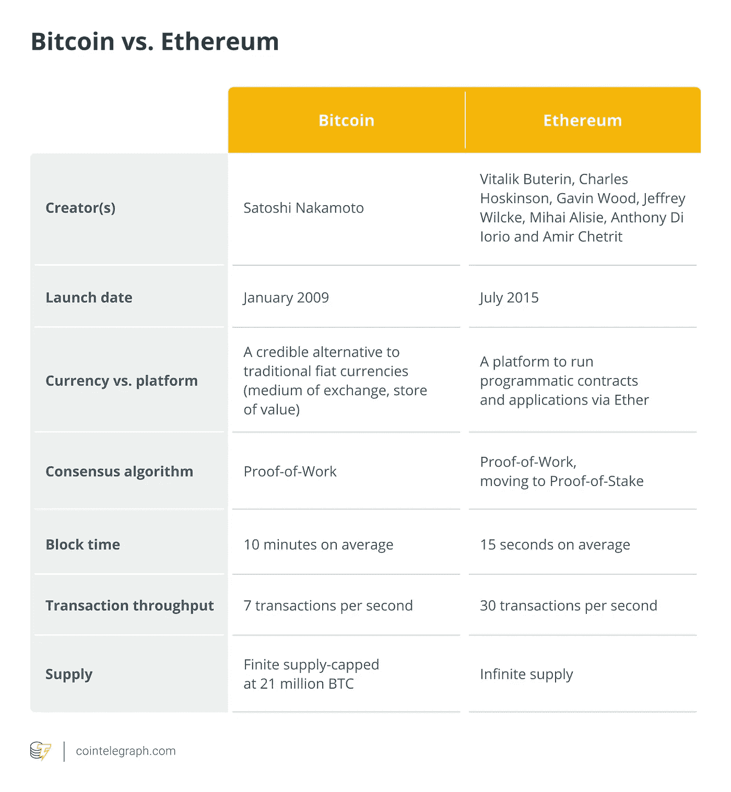

# 以太坊的代价:变得比比特币更富有

> 原文：<https://medium.com/coinmonks/ethereums-price-to-get-richer-than-bitcoin-6e230e3a5d16?source=collection_archive---------23----------------------->

Photo by [Kanchanara](https://unsplash.com/@kanchanara?utm_source=medium&utm_medium=referral) on [Unsplash](https://unsplash.com?utm_source=medium&utm_medium=referral)

> 比特币是无可争议的加密货币之王。以太坊是一项全球性的努力，旨在创造一种虚拟货币的替代品。更侧重于为智能合同环境提供灵活性。

**以太坊是什么？**

本质上，智能合约是一个完全按照编程运行的应用程序，没有任何篡改。它也缺乏第三方的潜在干扰。以太坊是一个运行智能合约的去中心化平台。

这是一个独特的平台，允许你创建可以从世界上任何地方访问的应用程序，同时还可以控制资金。

因此，开发商可以创建市场，存储债务或承诺的登记册，并根据很久以前发出的指令转移资金。在未来，我们可能可以做一些我们甚至还无法想象的事情，不需要中间商或交易对手。

## 以太坊的价格历史

Picture Credit: Statista

以太坊早期，它的价格低于 1 美元。到 2015 年底，已经涨到 0.43 美元。2016 年，以太坊的价格涨到了 14 美元。这是短短一年时间增长了 3000%以上！

以太坊的价格随后在 2017 年初回落至 8 美元左右。然而，到了年底，它已经回升到近 800 美元！这是一个在短短一年内超过 9000%的增长。

2018 年对于加密货币价格来说是艰难的一年，以太坊也不例外。今年年初，它的价格约为 750 美元，到年底跌至 100 美元以下。

到目前为止，2019 年对以太坊来说是好得多的一年。它的价格已经从年初的 100 美元左右涨到目前的 250 美元以上。这一数字今年已经增长了 150%以上！

看起来以太坊的价格在未来可能会继续上涨，特别是如果更多的人开始使用它，并且它的技术继续得到进一步发展。谁知道呢？也许有一天它会比比特币更值钱！

## 以太坊和比特币的比较

Picture Credit: Cointelegraph

在全球最受欢迎的加密货币中，比特币和以太坊脱颖而出。虽然比特币是加密货币的先驱，但以太坊是市值第二大的加密货币。

当谈到比较以太坊和比特币时，有几个关键的区别。第一，以太坊的交易速度比比特币快很多。其次，以太坊提供智能合约，允许比比特币更复杂的交易。最后，以太坊的总供应量高于比特币。

投资者经常争论哪种加密货币是更好的投资。虽然两者各有利弊，但以太坊可能是一个更有吸引力的投资选择，因为它的交易速度更快，合同更智能。

## ETH 为什么会升值？

*由于种种原因，ETH 正在升值。*

一个原因是 ETH 比 BTC 更快，更易扩展。这使得它对那些希望利用区块链技术的速度和效率的企业和开发者很有吸引力。

另一个原因是 ETH 的应用范围比 BTC 广得多。这使得它对用户和投资者更有用，更有价值。

最后，ETH 拥有强大的社区支持，这给了它额外的支持和稳定性。

## C结束语

我希望你从这篇关于以太坊的价格和它变得比比特币更富有的潜力的文章中学到了很多。从以太坊目前的发展轨迹来看，它的市值肯定会超过比特币。对于任何对投资加密货币感兴趣的人来说，以太坊绝对是一个值得警惕的地方。

> 交易新手？试试[密码交易机器人](/coinmonks/crypto-trading-bot-c2ffce8acb2a)或[复制交易](/coinmonks/top-10-crypto-copy-trading-platforms-for-beginners-d0c37c7d698c)