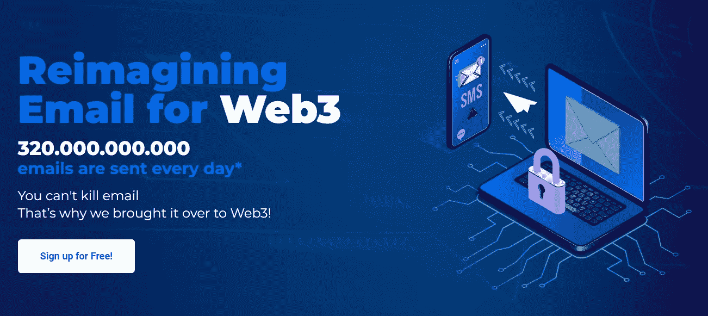

# 以太邮件:有偿阅读

> 原文：<https://medium.com/coinmonks/ethermail-get-paid-to-read-12069497e04f?source=collection_archive---------0----------------------->

免费申领您的 Web3 电子邮件

# 什么是以太邮件？

## 第一个使用以太坊加密并提供匿名的邮件服务叫做[以太邮件](https://ethermail.io/?afid=632435a7f7bc7e0ddc564f56)。

Fabric Ventures 和 Greenfield One 最近领导了第一个为匿名和加密钱包对钱包通信设立标准的 Web 3.0 电子邮件解决方案 [**【以太邮件**](https://ethermail.io/?afid=632435a7f7bc7e0ddc564f56) 的种子融资轮，他们宣布已经筹集了 300 万美元。由于该业务正在为第三季度推出其加密钱包对钱包电子邮件通信系统做准备，该系统已经吸引了数千人的预注册，这笔投资将用于员工扩充和加快解决方案测试。

# EMCs 是什么？

[以太邮件](https://ethermail.io/?afid=632435a7f7bc7e0ddc564f56)硬币被称为 EMCs。

一旦推出代币，这些 EMC 奖励将转换为 EMT 美元。

在令牌发布时，将确定 EMC:EMT 转换率。

# 立即注册试用版，申领您的 Web3 电子邮件！

1.  维护您的隐私，同时获得更多的安全性。通过加密，完全匿名和安全的 P2P 通信成为可能。
2.  让您所有的数字资产保持最新。
    区块链活动支持的是[以太邮件](https://ethermail.io/?afid=632435a7f7bc7e0ddc564f56)在您的收件箱中接收您拥有的令牌的最新信息！
3.  阅读赚钱
    为了让你收到时事通讯的邮件，公司必须为侵入你邮箱的行为向你付费。通过我们的$EMT 获得优势！
4.  利用额外的垃圾邮件预防层，因为企业必须付费才能联系到您。对等体之间发送的电子邮件可以继续正常工作。

# 对 Web3 企业、DAOs 和 NFT 的补救措施

基于与区块链实时同步的信息，公司可以通过[以太邮件](https://ethermail.io/?afid=632435a7f7bc7e0ddc564f56)将丰富、相关的内容直接发送给资产所有者。

## 钱包电子邮件和收件箱

Web3 用户接收和存储电子邮件的电子文件夹，由链上事件支持。区块链将信息即时发送到您的收件箱

## 付费墙(即将推出)

一个定制的垃圾邮件过滤层，奖励接受广告的读者。客户将能够根据各种个人偏好来管理他们的付费墙。

## 令牌$EMT

参与该生态系统的用户将很快需要一个 [EtherMail](https://ethermail.io/?afid=632435a7f7bc7e0ddc564f56) 电子邮件帐户，并将能够通过奖励系统获得$EMT。

## 自动驾驶仪上的联系人列表

创建一个基于 onchain 活动自动更新的邮件列表。不需要你做任何事情就能联系到你所有的代币持有者:即使收件箱没有被认领，电子邮件仍然在那里等着。

## 30 个分段过滤器

基于 Web3 的过滤器，让您针对各种目标群体(以前的持有人、当前持有人……)定制个性化信息。无论您的代币或 NFT 转移的频率如何，电子邮件始终会发送给适当的收件人。

## 活动创建者

使用我们用户友好的“营销活动构建器”，您可以创建一个基本的电子邮件营销活动或多阶段的电子邮件之旅。提高沟通相关性的最佳工具。

## 合作伙伴计划

由于我们的集成会员系统，我们鼓励社区成员邀请其他人。减少社区管理开支，同时提高成员参与度

[领取你的第一封 Web3 电子邮件。](https://ethermail.io/?afid=632435a7f7bc7e0ddc564f56)

> 交易新手？试试[密码交易机器人](/coinmonks/crypto-trading-bot-c2ffce8acb2a)或[复制交易](/coinmonks/top-10-crypto-copy-trading-platforms-for-beginners-d0c37c7d698c)