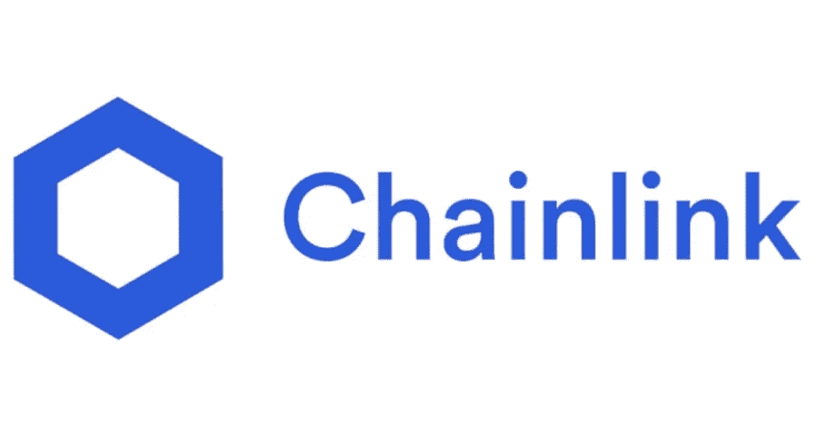

# 以太币翻转——没有随机性的领域

> 原文：<https://medium.com/coinmonks/ethernaut-coinflip-realm-of-no-randomness-a2bf05faac80?source=collection_archive---------40----------------------->

区块链是一个巨大的 huuuuuge 数据库，其中没有任何东西在幕后运行。所有的交易、合同、变量状态和其他一切都在那里——等待任何想看的人。当然，这可能会产生很多安全、隐私的问题……因此，我们使用加密技术。好吧，但是如果我们不公开所有信息，事情不是更简单吗？如果有些信息不会保存在区块链呢？这个问题的答案是‘也许吧，但是我们想要区块链的所有信息’。我们需要它的原因之一是新块的生成机制。

# 区块链的新街区

区块链是一系列相连的区块。每个块包含关于区块链内部的交易、在某段时间内创建的合同等信息。每个块都由一个特殊的函数散列，比如 [keccak256](https://ethereum.stackexchange.com/questions/11572/how-does-the-keccak256-hash-function-work) 。在下一个块中使用输出散列来创建该块的散列，等等。通过这种方式，我们得到了我们的区块链。当任何块中的任何信息发生变化时，哈希也会发生变化。因此，这个街区不适合区块链的其他地方。什么时候会出现这样的事情，有两种选择:

*   有人改变了这个街区，
*   这条街之后每个街区都有人换了。

为了判断哪个场景是真实的，区块链的节点(拥有整个区块链副本的机器)将它们的副本与区块链进行比较，寻找不同之处。如果节点间的区块链不同，算法接受最长的区块链，数据不正确的节点将被视为恶意节点。

因为我知道一个视频比文字更能给予 1000 倍，我在这里放了一个 YT 的电影，它精确地描述了所有这些是如何工作的。

因此，我们看到，为了安全起见，区块链的一举一动的信息都是必要的。这适用于所有类型的证明，如[工作](https://www.investopedia.com/terms/p/proof-work.asp)、[股份](https://www.forbes.com/advisor/ca/investing/cryptocurrency/proof-of-stake/)或[产能](https://www.investopedia.com/terms/p/proof-capacity-cryptocurrency.asp)。

# 随机性

嗯，但是当其他节点必须拥有相同的数据时，我们如何在智能契约中使用随机性呢？有人可能会考虑使用散列函数，并使用块的数量、某种契约的地址以及其他一些类似于以太网中的[这一阶段](https://ethernaut.openzeppelin.com/level/0x4dF32584890A0026e56f7535d0f2C6486753624f)中制作的东西。但这不是真正的随机，其结果是可以预测的，就像我在[我的解决方案](https://github.com/eszymi/Ethernaut)中所做的那样。我是怎么做到的？让我们提醒我，我们能够从区块链获得每一个信息，所以我们可以让我们的程序并行工作，并以同样的方式作为我们想要复制的合同(关于以太网合同中使用的 blockhash 和 block.number，我在另一篇[帖子](/@eszymi/ethernaut-telephone-who-are-there-a2a24c65a129)中写了)。

所以现在我们有一个问题。随机性在各种场合都是非常必要的。我们应该想出如何取代它，我们应该只创建不需要随机的程序吗？幸好没有。

Chainlink 是一个创造了工具的组织，感谢我们可以在智能合同中自由使用随机性。因为他们对这个工具做了很好的介绍，所以我只添加了一个[链接](https://docs.chain.link/docs/vrf/v2/introduction/)并跳过了我自己的描述。

Logo of Chainlink

当我们想使用随机性时，总是使用像 Chainlink 这样的工具是非常重要的。因为在其他任何情况下，我们的合同都是脆弱的。

我希望这篇文章对你有用。如果你有任何想法，我如何能使我的帖子更好，请告诉我。我随时准备学习。你可以在 [LinkedIn](https://pl.linkedin.com/in/szymon-skrzy%C5%84ski-881462214) 和 [Telegram](https://t.me/eszymi) 上和我连线。

如果你想和我谈论这个话题或者我写的其他话题，请随意。我乐于交谈。

快乐学习！

> 交易新手？尝试[加密交易机器人](/coinmonks/crypto-trading-bot-c2ffce8acb2a)或[复制交易](/coinmonks/top-10-crypto-copy-trading-platforms-for-beginners-d0c37c7d698c)