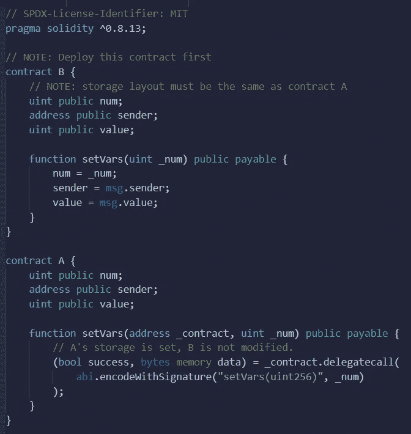

# 以太网授权—“危险的”委托呼叫

> 原文：<https://medium.com/coinmonks/ethernaut-delegation-dangerous-delegatecall-e6d7a759d4f9?source=collection_archive---------12----------------------->

*Delegatecall* 是一个非常特殊的函数，贸然使用可能会非常危险。但是使用后的反思给出了大量的便利和可能性。这个函数产生什么？

> 当协定使用 delegatecall 进行函数调用时，它会从另一个协定加载函数代码，并像执行自己的代码一样执行它。
> EIP-2535 钻石

这听起来很有力，不是吗？让我们从
[看一下合同的例子](https://solidity-by-example.org/delegatecall/)。



Example contract using delegatecall

在这个例子中，当某人将调用来自契约 A 的函数`setVars`时，将调用 *delegatecall* 。在 *delegatecall* 中，我们看到它将从契约中调用一个地址等于`_contract`的函数`setVars(uint256)`。将发送给该函数的值等于 `_num`。谢谢，来自合同 B 的*`setVars`功能将开始执行。但这是它的核心。如果这个函数改变了任何一个变量的值，它将不是在契约 B 中改变，而是在契约 a 中改变。指名道姓？不，不是名字。要理解这一点，我们应该知道 Solidity [在存储器](/@eszymi/ethernaut-vault-how-to-read-the-secret-988851a27c08)中保存每一个变量。 *delegatecall* 调用的函数作用于槽号。我这么说是什么意思？在合同 B 功能`setVars`中，将`num`(槽号 0 中的变量)设置为`_num`、`sender`(槽号 1 中的变量)设置为`msg.sender`、`value`(槽号 2 中的变量)设置为`msg.value`。当我们通过 *delegatecall* 调用该函数时，我们将契约 A 中编号为 0 的槽中的变量设置为`_num`，将契约 A 中编号为 1 的槽中的变量设置为`msg.sender`，依此类推。因此，在两个合同中使用相同的存储布局非常重要。*

*你看，*如何委派*有很大的权力。但是权力越大，责任越大。所以我们用的时候要小心。*

# *ABI*

*在示例代码中，我们看到了函数`abi.encodeWithSignature`，所以让我们关注 ABI。*

> *ABI 是将数据编码到机器代码中或从机器代码中解码数据的方法。
> [让·科维尔](https://jeancvllr.medium.com/)*

*什么是卑鄙？在[我之前的帖子](/coinmonks/ethernaut-token-what-if-our-alphabet-could-have-only-two-letters-6173d63c62ce)中，我写道我们电子设备中的每一条信息都是以二进制方式保存的。但是我没有提到把其中一个换成另一个的规则是什么。例如如何将电影或歌曲转换成二进制文件？如何用二进制形式写一个电脑游戏？这是一项非常困难的任务，每种类型的文件都有所不同，因此我们使用文件扩展名来通知编译器如何将一个文件转换为另一个文件。而 ABI 是一个如何把我们以理解的方式写的合同转换成机器代码的方法，反之亦然。*

*在 *delegatecall* 里面，我们需要放一个叫做选择器的东西。每个函数都有自己的选择器(它是一个 bytes4 对象)，像 *delegatecall* 或 call 这样的函数可以通过选择器指向它们。要获得选择器，我们有两个选项:*

```
*bytes4 selector = bytes4(keccak256(bytes(“transfer(address,address,uint256)”)));bytes4 selector = abi.encodeWithSignature(…);*
```

*如果你想了解更多关于 ABI 的信息，我推荐[这篇很棒的帖子](https://coinsbench.com/solidity-tutorial-all-about-abi-46da8b517e7)。*

*所有函数都有自己的选择器的信息总是正确的，只有一个例外。回退函数没有选择器。*

*我希望这篇文章对你有用。如果你有任何想法，我如何能使我的帖子更好，请告诉我。我随时准备学习。你可以在 [LinkedIn](https://pl.linkedin.com/in/szymon-skrzy%C5%84ski-881462214) 和 [Telegram](https://t.me/eszymi) 上和我联系。*

*如果你想和我谈论这个话题或者我写的其他话题，请随意。我乐于交谈。*

*快乐学习！*

> *交易新手？尝试[加密交易机器人](/coinmonks/crypto-trading-bot-c2ffce8acb2a)或[复制交易](/coinmonks/top-10-crypto-copy-trading-platforms-for-beginners-d0c37c7d698c)*