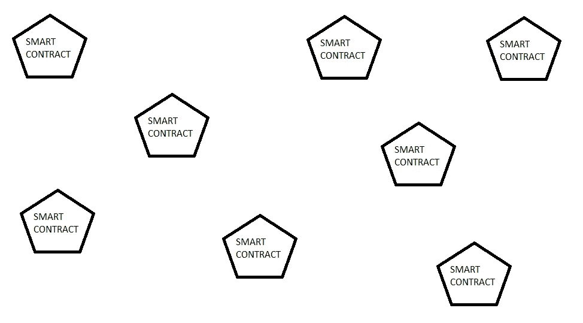
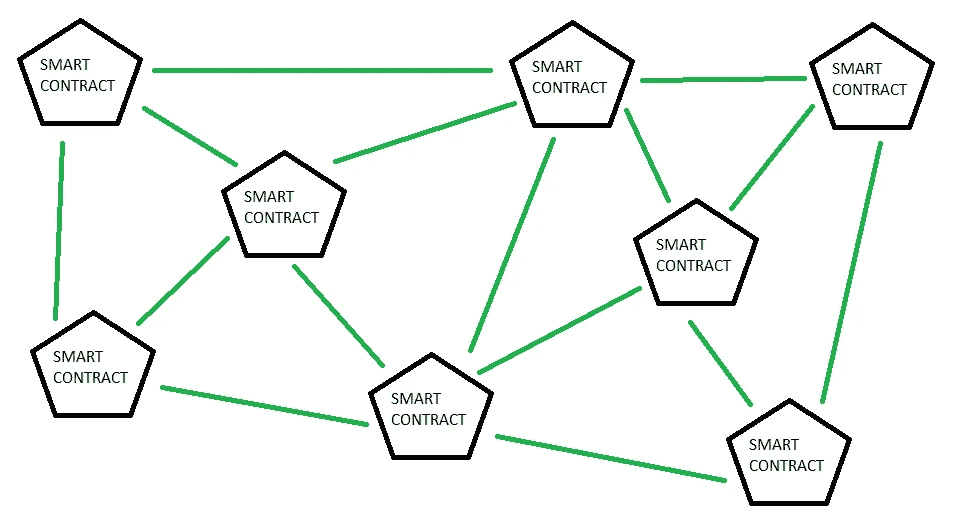
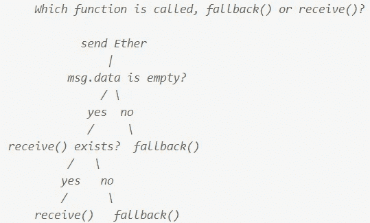

# 以太网-回退，因此让我们讨论智能合同中以太网的接收

> 原文：<https://medium.com/coinmonks/ethernaut-fallback-thus-lets-talk-about-receiving-of-ether-in-smart-contract-5d9f67c53c7b?source=collection_archive---------47----------------------->

智能合同的想法很棒。在他们看来，以太坊比比特币更加灵活。我们可以编写抽象的程序，这些程序不仅仅能够跟踪以太——DAO、NFT、DApps 等等。如果没有智能合约，创造这种东西将是不可能。但是让我们花点时间来关注它们。到底是什么让它们如此强大？我认为我们可以找到两个基本的东西:

*   他们可以让每一个算法(以太坊是[图灵完成](https://academy.binance.com/en/glossary/turing-complete))，
*   一个智能协定可以与另一个协定连接。

第一，我们如何能够容易地猜测，这给了我们构建智能契约的可能性，智能契约能够完成各种不同的、非平凡的任务。在编写智能契约的过程中，我们可以使用典型的编程语言元素，如 while 循环或 for 循环。因此，结果是我们可以签订一个大合同，我们可以互动。这是极好的信息，但还有什么呢？现在我们在分散链上有了一个程序，我们可以使用它内部实现的任何函数。但就目前而言，我们的合同只是其他孤立合同的巨大空间中的一个孤岛。

Blockchain if smart contracts weren’t able to ‘talk’ with others.

在这里我们看到了第二次提到的真正力量。智能合约有自己唯一的地址，可以有以太网。感谢一个智能合同能够与另一个智能合同开始交易，为该交易付款并取得结果。所以智能合同现在可以制造我们能制造的所有东西，而且还可以使之自动化。太棒了，因为现在我们可以以更高级的方式使用我们的智能合约，并通过它们创建具有许多节点的逻辑结构，这些节点还可以选择增长。

Idea how blockchain looks like thanks to the ability of smart contract to interact with each others.

我们如何看待两种能力的联系创造了某种至高无上的东西。但是让我们花几分钟思考一下这样做的后果。如果我们使用了正确的地址，但是使用的函数名称不正确，会发生什么情况？我们会失去我们的资金还是会回到我们的合同？如何将乙醚送到我们的合同中？有这个选择吗？以太坊通过一些特殊的功能给了我们答案:接收和回退。

当发送方没有将任何数据附加到交易中时，接收功能允许合同接收。所以当 msg.data 为空时(什么是 msg.data 你可以在我的另一篇[帖子](/@eszymi/ethernaut-telephone-who-are-there-a2a24c65a129)中查看)。

回退函数是这样一个函数，当没有其他函数与被调用的函数匹配时，或者当有人向约定发送以太网而该约定没有实现接收函数时，将调用该函数。

这两个函数之间的相关性，我们可以在一个图表上显示出来(这是我在这里找到的)。

Algorithm to decide which function will be used when someone sent Ether to the smart contract.

当我们知道应该在智能契约中实现什么函数来接收以太时，现在我们应该考虑如何从我们的契约发送以太，以及如何使用我们的契约从其他智能契约调用函数。我将在下一篇文章中写下这一点。

我希望这篇文章对你有用。如果你有任何想法，我如何能使我的帖子更好，请告诉我。我随时准备学习。你可以通过 [LinkedIn](https://pl.linkedin.com/in/szymon-skrzy%C5%84ski-881462214) 和 [Telegram](https://t.me/eszymi) 与我联系。

如果你想和我谈论这个话题或者我写的其他话题，请随意。我乐于交谈。

快乐学习！

> 交易新手？试试[密码交易机器人](/coinmonks/crypto-trading-bot-c2ffce8acb2a)或[复制交易](/coinmonks/top-10-crypto-copy-trading-platforms-for-beginners-d0c37c7d698c)