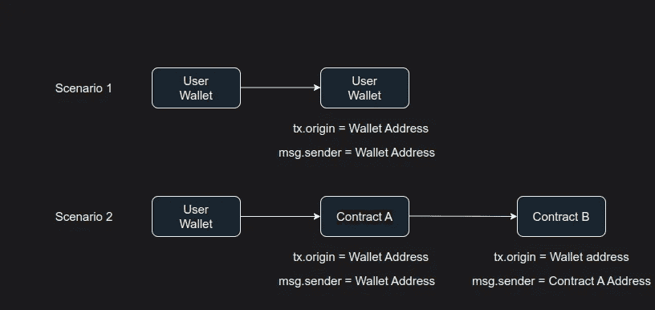

# 以太四级电话[铸造厂-安全帽]

> 原文：<https://medium.com/coinmonks/ethernaut-level-4-telephone-foundry-hardhat-599aff68a9b4?source=collection_archive---------21----------------------->


> [Ethernaut-Solutions](https://github.com/Chirag21/Ethernaut-solutions) 库包含使用 Foundry 和 Hardhat 的解决方案。

这个关卡教你`tx.origin`和`msg.sender`的区别。`tx.origin`和`msg.sender`都是全局可用的变量。

> 交易新手？在[最佳加密交易](/coinmonks/crypto-exchange-dd2f9d6f3769)上尝试[加密交易机器人](/coinmonks/crypto-trading-bot-c2ffce8acb2a)或[复制交易](/coinmonks/top-10-crypto-copy-trading-platforms-for-beginners-d0c37c7d698c)

# 目标

*   成为合同的所有者

`tx.origin:`

*   [EOA](https://ethereum.org/en/developers/docs/accounts/) (外部拥有的账户)或发起交易的用户的钱包地址
*   变量`tx.origin`将始终指向外部账户
*   合同地址不能是 `tx.origin`,因为合同不能启动交易

`msg.sender:`

*   调用该函数的直接帐户
*   `msg.sender`可以是合同或外部账户

考虑以下场景，



*   在场景 1 中，`tx.origin`和`msg.sender`相同
*   在场景 2 中，`tx.origin`保持不变，而`msg.sender` 改变为中间契约的地址。

# 分析

注意`Telephone`契约的`changeOwner()`函数是`public`，可以被任何人调用。

```
 function changeOwner(address _owner) public {
    if (tx.origin != msg.sender) {
      owner = _owner;
    }
  }
```

它检查`tx.origin != msg.sender`是否。因此，为了利用这个函数，我们需要确保`tx.origin`不等于`msg.sender`。我们可以通过创建一个调用该函数的中介契约来实现这一点。我们可以使用场景 2 来利用这种情况，如图所示。

# 剥削

让我们创建一个契约来破解关卡。

转到 [Remix IDE](https://remix.ethereum.org/#optimize=false&runs=200&evmVersion=null&version=soljson-v0.8.17+commit.8df45f5f.js) 并创建以下合同。

在部署协定时，将实例地址传递给构造函数。您可以通过在 dev 控制台中键入`instance`来获得实例地址。上述合同的`changeOwner`功能调用`Telephone`合同的`changeOwner`。

在此交易中，`tx.origin`是您的钱包地址，而`msg.sender`是`TelephoneHack`合同的`address`。这将通过`tx.origin != msg.sender`检查，并将您的地址设置为`owner`。

在 Ehternaut 站点的开发控制台中，通过键入以下命令来检查所有者，

```
await contract.owner()
```

提交实例。

关卡通过！！！😄

# 关键要点

*   切勿使用`tx.origin`进行授权检查
*   使用`msg.sender`对即时发送者进行授权
*   使用`(tx.origin == msg.sender)`如果你想只有 EOA 可以调用你的合同。

> *[*以太解决方案*](https://medium.com/r?url=https%3A%2F%2Fgithub.com%2FChirag21%2FEthernaut-solutions) *库包含使用 Foundry 和 Hardhat 的解决方案。**
> 
> **解决使用铸造厂:-**
> 
> *[测试](https://github.com/Chirag21/Ethernaut-Solutions-using-Foundry-Hardhat/blob/main/test/foundry/4_Telephone.t.sol)，[漏洞利用脚本](https://github.com/Chirag21/Ethernaut-Solutions-using-Foundry-Hardhat/blob/main/script/4_TelephoneScript.sol)*
> 
> **使用安全帽的解决方案:-**
> 
> *[测试](https://github.com/Chirag21/Ethernaut-Solutions-using-Foundry-Hardhat/blob/main/test/hardhat/4_Telephone.test.ts)，[漏洞利用脚本](https://github.com/Chirag21/Ethernaut-Solutions-using-Foundry-Hardhat/blob/main/scripts/4_telephone_exploit.ts)*

*[](https://www.buymeacoffee.com/0xcsp)*

# *更多级别*

*[](/coinmonks/ethernaut-level-5-token-foundry-hardhat-d9d52e5ce39a) [## 以太 5 级令牌[铸造厂-安全帽]

### Ethernaut-Solutions 存储库包含使用 Foundry 和 Hardhat 的解决方案。

medium.com](/coinmonks/ethernaut-level-5-token-foundry-hardhat-d9d52e5ce39a) [](https://coinsbench.com/ethernaut-level-3-coin-flip-foundry-hardhat-7387686fec3d) [## 以太 3 级——掷硬币[铸造-安全帽]

### Ethernaut-Solutions 存储库包含使用 Foundry 和 Hardhat 的解决方案。

coinsbench.com](https://coinsbench.com/ethernaut-level-3-coin-flip-foundry-hardhat-7387686fec3d) 

> 加入 Coinmonks [电报频道](https://t.me/coincodecap)和 [Youtube 频道](https://www.youtube.com/c/coinmonks/videos)了解加密交易和投资

# 另外，阅读

*   [火币的加密交易信号](https://coincodecap.com/huobi-crypto-trading-signals) | [HitBTC 审核](/coinmonks/hitbtc-review-c5143c5d53c2)
*   [TraderWagon 回顾](https://coincodecap.com/traderwagon-review) | [北海巨妖 vs 双子星 vs BitYard](https://coincodecap.com/kraken-vs-gemini-vs-bityard)
*   [如何在 FTX 交易所交易期货](https://coincodecap.com/ftx-futures-trading)
*   [OKEx vs KuCoin](https://coincodecap.com/okex-kucoin) | [摄氏替代品](https://coincodecap.com/celsius-alternatives) | [如何购买 VeChain](https://coincodecap.com/buy-vechain)
*   [ProfitFarmers 点评](https://coincodecap.com/profitfarmers-review) | [如何使用 Cornix Trading Bot](https://coincodecap.com/cornix-trading-bot)*