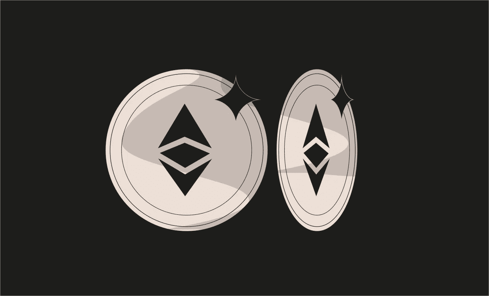
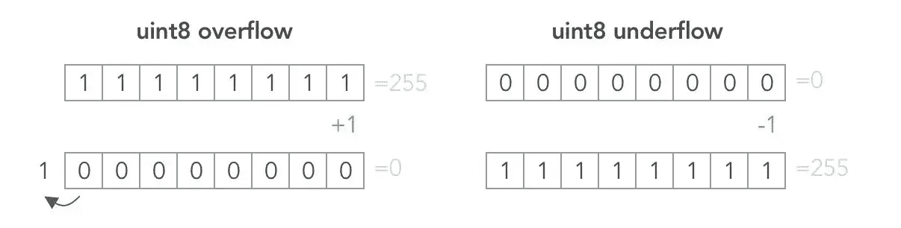

# 以太 5 级令牌[铸造厂-安全帽]

> 原文：<https://medium.com/coinmonks/ethernaut-level-5-token-foundry-hardhat-d9d52e5ce39a?source=collection_archive---------9----------------------->



> *[*以太解决方案*](https://github.com/Chirag21/Ethernaut-solutions) *库包含使用 Foundry 和 Hardhat 的解决方案。**

# *目标*

*   *你最初获得 20 枚代币作为启动资金。您需要将合同的 20 个令牌增加到更多令牌*

*`Integer Overflow and Underflows`*

*当算术运算超过类型的最大或最小大小时，就会发生上溢或下溢。例如，如果一个数字被保存为一个`uint8`类型，它被存储为一个无符号的 8 位数字，范围从 0 到 255(2⁸-1).255 加 1 就是 0，减 1 就是 255。*

> *交易新手？在[最佳加密交易](/coinmonks/crypto-exchange-dd2f9d6f3769)上尝试[加密交易机器人](/coinmonks/crypto-trading-bot-c2ffce8acb2a)或[复制交易](/coinmonks/top-10-crypto-copy-trading-platforms-for-beginners-d0c37c7d698c)*

*在计算机编程中，当一个算术运算试图产生一个大于最大值或小于最小值的数值时，就会发生整数溢出。如果您将令牌余额存储在一个变量中，并在不检查的情况下增减它，这可能会变得很麻烦。*

*在比特级别发生的情况如下，*

**

# *分析*

*为了完成这一关，我们必须下溢代币余额。*

*在旧版本的 Solidity 中，没有对溢出和下溢的保护。开发人员必须实现他们的检查或者使用像 [SafeMath](https://github.com/OpenZeppelin/openzeppelin-contracts/blob/master/contracts/utils/math/SafeMath.sol) 这样的库。后来 Solidity 版原生实现了溢出或下溢。如果检测到上溢或下溢，则事务被还原。*

*看一看`transfer`功能，*

```
*function transfer(address _to, uint _value) public returns (bool) {
    require(balances[msg.sender] - _value >= 0);
    balances[msg.sender] -= _value;
    balances[_to] += _value;
    return true;
}*
```

*合同使用^0.6.0.的可靠版本因此，它容易发生上溢和下溢。该功能从`msg.sender`的账户向`_to`地址发送`_value`个令牌。语句`require(balances[msg.sender] - _value >= 0)`确保余额不会变成负数。接下来的两行代码传输令牌。我们必须利用下面几行代码，*

```
*require(balances[msg.sender] - _value >= 0);
balances[msg.sender] -= _value;*
```

*必须传递函数 _ `value` *，以便* `balances[msg.sender] - value`下溢并返回一个大数。如果我们传递 21，那么得到的值将是 uint256 所能容纳的最大数，等于 1157920892373161954235709850086879078532698466564056403945758400791312963935。可以使用`type(uint256).max`检查该值。*

1.  *`balances[msg.sender] - _value >= 0`还会真*
2.  *`balances[msg.sender] -= _value`，将天平设置为`type(uint256).max`值。*
3.  *即使我们有 20 个令牌，也有 21 个令牌将被传输到`_to`地址。*

# *剥削*

*在 Chrome 中打开开发控制台。*

*   *首先，检查你的余额*

```
*await contract.balanceOf(player)*
```

*   *用`_value` = 21 调用`transfer`*

```
*await transfer(0x4dD7ca0a5c590bc7E882AbfD873568e3128953f7, 21)*
```

*这将使余额下溢。*

*   *检查新余额*

```
*await contract.balanceOf(player)*
```

*这是一个非常大的数字，因此在控制台上无法正常显示。您可以使用 [Remix IDE](https://remix.ethereum.org/?#gist=730f1e4a5d854a3fbe175292dc1d9a08&version=soljson-v0.6.12+commit.27d51765.js&optimize=false&runs=200&evmVersion=null) 来检查余额，*

*如果您已经安装了 Foundry，请运行以下命令*

```
*cast --to-base $(cast storage --rpc-url [RPC_URL] [INSTANCE_ADDRESS] $(cast index address [PLAYER_ADDRESS] 0)) 10*
```

*开始时给了我们 20 个代币。但我们成功转移了 20 多枚代币。在这个过程中，我们的余额也增加了。*

*提交实例。*

*关卡通过！！！😄*

# *关键要点*

*   *始终使用最新的 Solidity 编译器*
*   *如果你用的是老编译器(0.8 以下)，用 [Openzeppelin 的 SafeMath 库](https://github.com/OpenZeppelin/openzeppelin-contracts/blob/master/contracts/utils/math/SafeMath.sol)。*
*   *即使在检查模式下，也不要认为您可以避免溢出错误。在这种模式下，溢出总是会恢复。如果无法避免溢出，这可能会导致智能合约卡在某个状态。*
*   *如果你确定表达式不会溢出或下溢，使用[未检查块](https://docs.soliditylang.org/en/v0.8.17/control-structures.html#checked-or-unchecked-arithmetic)。这将为您的最终用户节省一些汽油。*

> **[*以太解决方案*](https://github.com/Chirag21/Ethernaut-solutions) *库包含使用 Foundry 和 Hardhat 的解决方案。***
> 
> ***解决方案使用铸造:-***
> 
> **[*测试*](https://github.com/Chirag21/Ethernaut-Solutions-using-Foundry-Hardhat/blob/main/test/foundry/5_Token.t.sol) *，* [*漏洞利用脚本*](https://github.com/Chirag21/Ethernaut-Solutions-using-Foundry-Hardhat/blob/main/script/5_TokenScript.sol)**
> 
> ***使用安全帽的解决方案:-***
> 
> **[*测试*](https://github.com/Chirag21/Ethernaut-Solutions-using-Foundry-Hardhat/blob/main/test/hardhat/5_Token.test.ts) *，* [*漏洞利用脚本*](https://github.com/Chirag21/Ethernaut-Solutions-using-Foundry-Hardhat/blob/main/scripts/5_token_exploit.ts)**

**[](https://www.buymeacoffee.com/0xcsp)**

# **更多级别**

**[](/coinmonks/ethernaut-level-6-delegation-foundry-hardhat-917faaff3570) [## 以太 6 级-委托[铸造-安全帽]

### Ethernaut-Solutions 存储库包含使用 Foundry 和 Hardhat 的解决方案。

medium.com](/coinmonks/ethernaut-level-6-delegation-foundry-hardhat-917faaff3570) [](/coinmonks/ethernaut-level-4-telephone-foundry-hardhat-599aff68a9b4) [## 以太四级电话[铸造厂-安全帽]

### Ethernaut-Solutions 存储库包含使用 Foundry 和 Hardhat 的解决方案。

medium.com](/coinmonks/ethernaut-level-4-telephone-foundry-hardhat-599aff68a9b4) 

> 加入 Coinmonks [电报频道](https://t.me/coincodecap)和 [Youtube 频道](https://www.youtube.com/c/coinmonks/videos)了解加密交易和投资

# 另外，阅读

*   [用于 Huobi 的加密交易信号](https://coincodecap.com/huobi-crypto-trading-signals) | [HitBTC 审查](/coinmonks/hitbtc-review-c5143c5d53c2)
*   [TraderWagon 回顾](https://coincodecap.com/traderwagon-review) | [北海巨妖 vs 双子星 vs BitYard](https://coincodecap.com/kraken-vs-gemini-vs-bityard)
*   [如何在 FTX 交易所交易期货](https://coincodecap.com/ftx-futures-trading)
*   [OKEx vs KuCoin](https://coincodecap.com/okex-kucoin) | [摄氏替代品](https://coincodecap.com/celsius-alternatives) | [如何购买 VeChain](https://coincodecap.com/buy-vechain)
*   [ProfitFarmers 点评](https://coincodecap.com/profitfarmers-review) | [如何使用 Cornix 交易机器人](https://coincodecap.com/cornix-trading-bot)**