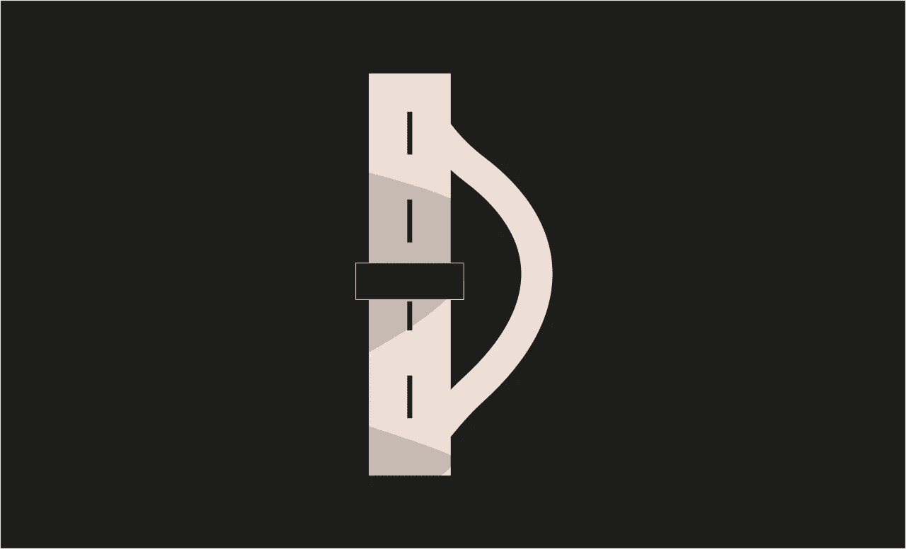

# 以太 7 级力量[铸造-安全帽]

> 原文：<https://medium.com/coinmonks/ethernaut-level-7-force-foundry-hardhat-581e92687422?source=collection_archive---------24----------------------->



> *[*以太解决方案*](https://github.com/Chirag21/Ethernaut-solutions) *库包含使用 Foundry 和 Hardhat 的解决方案。**

# *目标*

*   *使合同余额大于零。*

*`selfdestruct(address payable recipient)`*

*`selfdestruct`销毁当前合同，将其资金发送到给定地址，并结束执行。请注意，它继承了 EVM 的一些注意事项:*

*   *收货合同的`receive`或`payable fallback`功能未执行。*
*   *契约只有在事务结束时才真正被销毁，而恢复可能会“撤销”销毁。*
*   *乙醚的转移是不可避免的。*

*此外，当前契约的所有函数都是可直接调用的，包括当前函数。即使合同被`selfdestruct`删除，它仍然是区块链历史的一部分，并且可能被大多数以太坊节点保留。所以使用`selfdestruct`并不等同于从硬盘上删除数据。*

> *从顶级交易者那里复制交易机器人。免费试用。*

# *分析*

*我们得到了以下合同:*

```
*contract Force {/*
                   MEOW ?
         /\_/\   /
    ____/ o o \
  /~____  =ø= /
c (______)__m_m)
*/}*
```

*不要让可爱的小猫欺骗你。这是一个没有任何功能的空合同。我们必须设法在合同上签字。*

*我们可以通过以下方式之一向合同发送乙醚:*

*   *直接将以太发送到合同中；但是，要接收以太网传输，合同应具有`receive`或`payable fallback`功能。*
*   *通过用于挖掘或验证区块的 coinbase 交易来接收奖励*
*   *可以在部署之前预先计算约定地址。攻击者可以在部署协定之前将以太发送到此地址，从而强制将以太存储在协定中。*
*   *然后，调用契约中存储的所有以太网将被转移到调用`selfdestruct()`时指定的地址。接收者没有机制来阻止这种情况，因为它发生在 EVM 级。*

# *剥削*

*让我们创建一个契约来破解关卡。*

*转到 [**混合 IDE**](https://remix.ethereum.org/#optimize=false&runs=200&evmVersion=null&version=soljson-v0.8.17+commit.8df45f5f.js) 并创建以下合同。*

*注意，构造函数被声明为`payable`。在部署上述契约的同时，发送一些以太(1 卫)，这些以太将被添加到契约余额中。`selfdestruct`将销毁合同并将乙醚转移至`instance`即 Force.sol*

*在 Ethernaut 站点上，打开开发控制台并检查实例平衡。*

```
*await getBalance(instance)*
```

*它将大于 0。*

*提交实例。*

*关卡通过！！！😄*

# *关键要点*

*   *不要靠`address(this).balance`记账。参见[自毁](https://solidity-by-example.org/hacks/self-destruct/)。*
*   *如果`selfdestruct`被实现，验证`msg.sender = owner`。实施适当的访问控制。*
*   *如果你想停用你的合同，你应该通过改变一些内部状态来代替`disable`它们，这将导致所有的功能恢复。这使得无法使用契约，因为它会立即返回以太网。*

> **[***Ethernaut-Solutions***](https://github.com/Chirag21/Ethernaut-solutions)*资源库包含使用 Foundry 和 Hardhat 的解决方案。***
> 
> ***解决方案使用铸造:-***
> 
> **[***测试***](https://github.com/Chirag21/Ethernaut-Solutions-using-Foundry-Hardhat/blob/main/test/foundry/7_Force.t.sol)*[***漏洞利用脚本***](https://github.com/Chirag21/Ethernaut-Solutions-using-Foundry-Hardhat/blob/main/script/7_ForceScript.sol)***
> 
> ***使用安全帽的解决方案:-***
> 
> **[**测试**](https://github.com/Chirag21/Ethernaut-Solutions-using-Foundry-Hardhat/blob/main/test/hardhat/7_force.test.ts)**[***漏洞利用脚本***](https://github.com/Chirag21/Ethernaut-Solutions-using-Foundry-Hardhat/blob/main/scripts/7_force_exploit.ts)****

****[](https://www.buymeacoffee.com/0xcsp)****

# ****更多级别****

****[](/coinmonks/ethernaut-level-8-vault-foundry-hardhat-ed135ba10978) [## 以太 8 级金库[铸造厂-安全帽]

### Ethernaut-Solutions 存储库包含使用 Foundry 和 Hardhat 的解决方案。

medium.com](/coinmonks/ethernaut-level-8-vault-foundry-hardhat-ed135ba10978) [](/coinmonks/ethernaut-level-6-delegation-foundry-hardhat-917faaff3570) [## 以太 6 级-委托[铸造-安全帽]

### Ethernaut-Solutions 存储库包含使用 Foundry 和 Hardhat 的解决方案。

medium.com](/coinmonks/ethernaut-level-6-delegation-foundry-hardhat-917faaff3570) 

> 加入 Coinmonks [电报频道](https://t.me/coincodecap)和 [Youtube 频道](https://www.youtube.com/c/coinmonks/videos)了解加密交易和投资

# 另外，阅读

*   [3 商业评论](/coinmonks/3commas-review-an-excellent-crypto-trading-bot-2020-1313a58bec92) | [Pionex 评论](https://coincodecap.com/pionex-review-exchange-with-crypto-trading-bot) | [Coinrule 评论](/coinmonks/coinrule-review-2021-a-beginner-friendly-crypto-trading-bot-daf0504848ba)
*   [莱杰 vs n rave](/coinmonks/ledger-vs-ngrave-zero-7e40f0c1d694)|[莱杰 nano s vs x](/coinmonks/ledger-nano-s-vs-x-battery-hardware-price-storage-59a6663fe3b0) | [币安评论](/coinmonks/binance-review-ee10d3bf3b6e)
*   [加密交易机器人](/coinmonks/crypto-trading-bot-c2ffce8acb2a) | [Bingbon 评论](https://coincodecap.com/bingbon-review)
*   [Bybit Exchange 评论](/coinmonks/bybit-exchange-review-dbd570019b71) | [Bityard 评论](https://coincodecap.com/bityard-reivew) | [Jet-Bot 评论](https://coincodecap.com/jet-bot-review)
*   [3 commas vs crypto hopper](/coinmonks/3commas-vs-pionex-vs-cryptohopper-best-crypto-bot-6a98d2baa203)|[赚取秘密利息](/coinmonks/earn-crypto-interest-b10b810fdda3)****