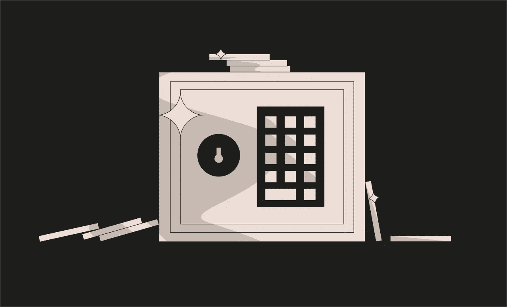

# 以太 8 级金库[铸造厂-安全帽]

> 原文：<https://medium.com/coinmonks/ethernaut-level-8-vault-foundry-hardhat-ed135ba10978?source=collection_archive---------25----------------------->



> *[*以太解决方案*](https://github.com/Chirag21/Ethernaut-solutions) *库包含使用 Foundry 和 Hardhat 的解决方案。**

# *目标*

*   *解锁保险库以通过，即将`locked`存储变量设置为`false`。*

*每个智能合约都有自己的存储空间。存储是智能合约的永久数据存储。存储中的数据在不同的函数调用中保持不变。以太坊将数据存储在存储“[槽](https://docs.soliditylang.org/en/latest/internals/layout_in_storage.html)”中，这是 32 字节大小的槽。每次将变量保存到存储器时，它会自动占用序列中当前槽或下一个槽的剩余空间。数据按照声明的顺序存储在这些槽中。存储在区块链上的所有数据都是公开可见的；谁都可以看。*

> *从顶级交易者那里复制交易机器人。免费试用。*

> *将变量设为私有意味着它只能在声明它的契约中被访问；它不隐藏变量。*

*我们可以使用声明变量的槽号直接访问契约的存储。*

# *分析*

*看一下保险库合同。*

```
*contract Vault {
  bool public locked;          // slot 0
  bytes32 private password;    // slot 1

  constructor(bytes32 _password) {
    locked = true;
    password = _password;
  }
  function unlock(bytes32 _password) public {
    if (password == _password) {
      locked = false;
    }
  }
}*
```

*请注意，在保险存储合同中，密码存储在插槽 1”的私有变量中。我们可以通过读取“插槽 1”并调用`unlock()`函数来轻松获得密码，从而解锁金库。*

# *剥削*

*   *在浏览器上打开开发控制台。使用 [](https://web3js.readthedocs.io/en/v1.2.11/web3-eth.html#getstorageat) `[web3.eth.getStorageAt()](https://web3js.readthedocs.io/en/v1.2.11/web3-eth.html#getstorageat)`获取密码。这将返回字节 32 形式的密码。*

```
*const password = await web3.eth.getStorageAt(instance,1)*
```

*   *打开保险库*

```
*await contract.unlock(password)*
```

*   *要查看实际的密码，请使用十六进制到字符串的转换器。*

```
*web3.utils.hexToAscii(password)*
```

*该函数将字节 32 `password`转换为人类可读的文本，从而显示`“A very strong secret password :)”`。*

*   *您可以通过读取插槽 0 来检查`locked`变量的值*

```
*await web3.eth.getStorageAt(instance,0)  // returns false*
```

*提交实例。*

*关卡通过！！！😄*

# *关键要点*

*   *重要的是要记住，将变量标记为私有只会阻止其他契约访问它。标记为私有和局部变量的状态变量仍然可以公开访问。*
*   *不要在智能合约中存储敏感数据。*
*   *当使用带有存储变量的契约的 [delegatecall](/coinmonks/ethernaut-lvl-7-walkthrough-how-to-selfdestruct-and-create-an-ether-blackhole-eb5bb72d2c57) 时，要小心数据损坏。*
*   *私有函数和状态变量在派生契约中不可见；它们只能在定义它们的合同中访问。*
*   *为了确保数据的私密性，需要在将数据放入区块链之前对其进行加密。在这种情况下，解密密钥不应该在链上发送，因为任何寻找它的人都会看到它。*

> **[***Ethernaut-Solutions***](https://github.com/Chirag21/Ethernaut-solutions)*资源库包含使用 Foundry 和 Hardhat 的解决方案。***
> 
> ***使用铸造厂的解决方案:-***
> 
> **[***测试***](https://github.com/Chirag21/Ethernaut-Solutions-using-Foundry-Hardhat/blob/main/test/foundry/8_Vault.t.sol)*[***漏洞利用脚本***](https://github.com/Chirag21/Ethernaut-Solutions-using-Foundry-Hardhat/blob/main/script/8_VaultScript.sol)***
> 
> ***使用安全帽的解决方案:-***
> 
> **[***测试***](https://github.com/Chirag21/Ethernaut-Solutions-using-Foundry-Hardhat/blob/main/test/hardhat/8_vault.test.ts)*[***漏洞利用脚本***](https://github.com/Chirag21/Ethernaut-Solutions-using-Foundry-Hardhat/blob/main/scripts/8_vault_exploit.ts)***

**[](https://www.buymeacoffee.com/0xcsp)**

# **更多级别**

**[](/coinmonks/ethernaut-level-9-king-foundry-hardhat-528cea17a8b1) [## 以太 9 级王者[铸造-安全帽]

### Ethernaut-Solutions 存储库包含使用 Foundry 和 Hardhat 的解决方案。

medium.com](/coinmonks/ethernaut-level-9-king-foundry-hardhat-528cea17a8b1) [](/coinmonks/ethernaut-level-7-force-foundry-hardhat-581e92687422) [## 以太 7 级力量[铸造-安全帽]

### Ethernaut-Solutions 存储库包含使用 Foundry 和 Hardhat 的解决方案。

medium.com](/coinmonks/ethernaut-level-7-force-foundry-hardhat-581e92687422) 

> 加入 Coinmonks [电报频道](https://t.me/coincodecap)和 [Youtube 频道](https://www.youtube.com/c/coinmonks/videos)了解加密交易和投资

# 另外，阅读

*   [网格交易机器人](https://coincodecap.com/grid-trading) | [Cryptohopper 审查](/coinmonks/cryptohopper-review-a388ff5bae88) | [Bexplus 审查](https://coincodecap.com/bexplus-review)
*   [7 个最佳零费用加密交易平台](https://coincodecap.com/zero-fee-crypto-exchanges)
*   [氹欞侊贸易评论](https://coincodecap.com/anny-trade-review) | [火币保证金交易](/coinmonks/huobi-margin-trading-b3b06cdc1519)
*   [分散交易所](https://coincodecap.com/what-are-decentralized-exchanges) | [比特 FIP](https://coincodecap.com/bitbns-fip) | [Pionex 评论](https://coincodecap.com/pionex-review-exchange-with-crypto-trading-bot)
*   [用信用卡购买密码的 10 个最佳地点](https://coincodecap.com/buy-crypto-with-credit-card)**