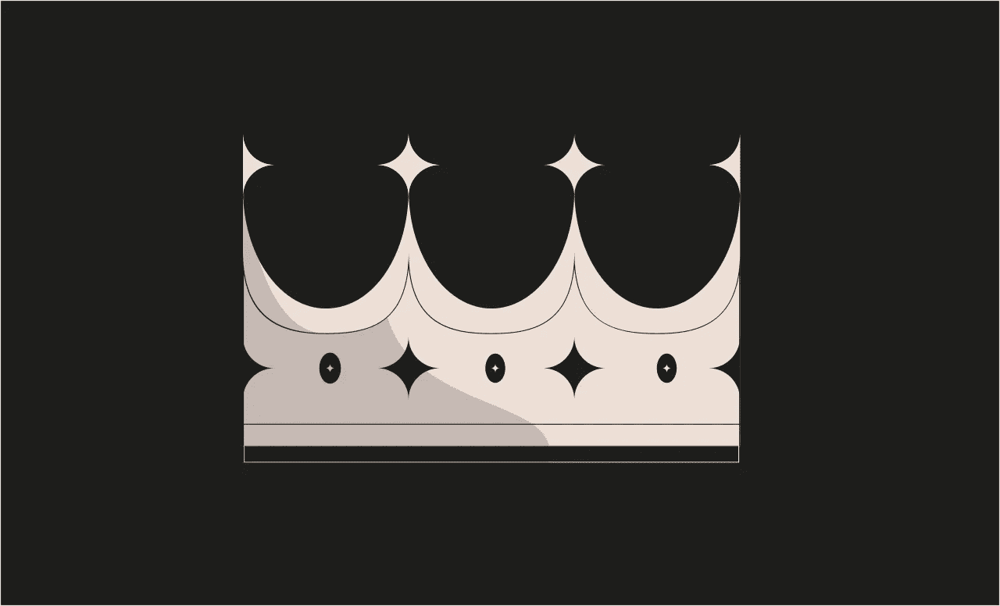
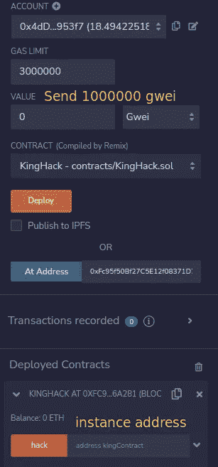

# 以太 9 级王者[铸造-安全帽]

> 原文：<https://medium.com/coinmonks/ethernaut-level-9-king-foundry-hardhat-528cea17a8b1?source=collection_archive---------23----------------------->



> [Ethernaut-Solutions](https://github.com/Chirag21/Ethernaut-solutions) 库包含使用 Foundry 和 Hardhat 的解决方案。

# 目标

*   谁给合同送去的乙醚量大于当前的奖金，谁就成为新国王。声称拥有该契约的所有权。当你把实例提交回关卡时，关卡会收回王权。如果你能避免这样的自我宣告，你就会超越这个水平。

# 分析

在[一级](/coinsbench/ethernaut-level-1-fallback-analysis-and-solution-bd7d4eea343f)中，我们讨论了`fallback()`和`receive()`功能。每次我们发送以太到另一个契约，事务的成功依赖于那个契约。如果合同没有`receive()`功能或`payable fallback()`功能，则交易被恢复。

> 不知道什么时候买卖 cryp，试试[复制交易](http://coincodecap.com/go/bityard)。

看看王者契约的接收功能，

```
receive() external payable {
  require(msg.value >= prize || msg.sender == owner);
  payable(king).transfer(msg.value);
  king = msg.sender;
  prize = msg.value;
}
```

业主可以发送任何数量的乙醚合同，并声称王权。不错的庞氏骗局。😎

我们可以通过发送大于`prize`的金额来主张王权。奖品设置为`0.001 ether`或`1000000 gwei`。

该功能将发送的数量传送给前一个国王，并将`msg.sender`替换为新国王，并将`prize`设置为`msg.value`。当我们提交实例时，关卡会通过触发王者契约的`receive()`功能来尝试夺回王权。我们必须确保这笔交易会失败。我们将创建一个充当中介的契约，并将以太从`msg.sender`转发到国王契约。我们不会实现任何`fallback()`或`receive()`方法，因此我们的契约将无法接收任何以太。交易将恢复。

1.  发送`0.001 ether`即`1000000 gwei`到我们的合同，我们的合同会将以太转发到国王合同。这会触发王者契约中的`receive()`功能。由此，中介合同将被设定为新的王。
2.  当你提交实例时，关卡会通过发送一些以太来试图收回王权。
3.  该功能将尝试发送金额给上一个国王，这是我们的恶意合同，但交易将失败，因为在我们的合同中没有办法接收以太转移，该级别将无法成为新的国王。

# 剥削

让我们创建一个合同，将声称王权。

转到 [**混音 IDE**](https://remix.ethereum.org/#optimize=false&runs=200&evmVersion=null&version=soljson-v0.8.17+commit.8df45f5f.js) **。**创建并部署以下合同。

*   通过在开发控制台的 level 页面上键入`instance`来获取实例地址。
*   调用`hack()`函数，将实例地址作为参数传递。在值字段发送`0.001 ether`，即`1000000 gwei`。



这样可以防止关卡收回王权。

提交实例。

关卡通过！！！😄

# 关键要点

*   始终确保处理失败的事务。
*   如果你使用像`call()`、`delegatecall()`、`staticcall()`这样的函数，一定要检查返回值。如果事务失败，这些函数不会抛出异常，而是返回`false`。

> [Ethernaut-Solutions](https://github.com/Chirag21/Ethernaut-solutions) 库包含使用 Foundry 和 Hardhat 的解决方案。
> 
> 使用铸造的解决方案:-
> 
> [测试](https://github.com/Chirag21/Ethernaut-Solutions-using-Foundry-Hardhat/blob/main/test/foundry/9_King.t.sol)，[漏洞利用脚本](https://github.com/Chirag21/Ethernaut-Solutions-using-Foundry-Hardhat/blob/main/script/9_KingScript.sol)
> 
> 使用安全帽的解决方案:-
> 
> [测试](https://github.com/Chirag21/Ethernaut-Solutions-using-Foundry-Hardhat/blob/main/test/hardhat/9_king.test.ts)，[漏洞利用脚本](https://github.com/Chirag21/Ethernaut-Solutions-using-Foundry-Hardhat/blob/main/scripts/9_king_exploit.ts)

[](https://www.buymeacoffee.com/0xcsp)

# 更多级别

[](/coinmonks/ethernaut-level-10-reentrancy-foundry-hardhat-ce9291eadf04) [## 以太 10 级——可重入[铸造厂-安全帽]

### Ethernaut-Solutions 存储库包含使用 Foundry 和 Hardhat 的解决方案。

medium.com](/coinmonks/ethernaut-level-10-reentrancy-foundry-hardhat-ce9291eadf04) [](/coinmonks/ethernaut-level-8-vault-foundry-hardhat-ed135ba10978) [## 以太 8 级金库[铸造厂-安全帽]

### Ethernaut-Solutions 存储库包含使用 Foundry 和 Hardhat 的解决方案。

medium.com](/coinmonks/ethernaut-level-8-vault-foundry-hardhat-ed135ba10978) 

> 加入 Coinmonks [电报频道](https://t.me/coincodecap)和 [Youtube 频道](https://www.youtube.com/c/coinmonks/videos)了解加密交易和投资

# 另外，阅读

*   [用于 Huobi 的加密交易信号](https://coincodecap.com/huobi-crypto-trading-signals) | [HitBTC 审核](/coinmonks/hitbtc-review-c5143c5d53c2)
*   [TraderWagon 回顾](https://coincodecap.com/traderwagon-review) | [北海巨妖 vs 双子星 vs BitYard](https://coincodecap.com/kraken-vs-gemini-vs-bityard)
*   [如何在 FTX 交易所交易期货](https://coincodecap.com/ftx-futures-trading)
*   [OKEx vs KuCoin](https://coincodecap.com/okex-kucoin) | [摄氏替代品](https://coincodecap.com/celsius-alternatives) | [如何购买 VeChain](https://coincodecap.com/buy-vechain)