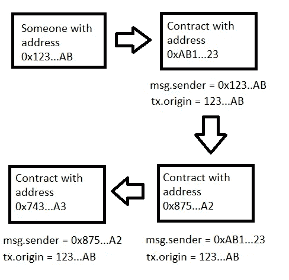

# 谁在那里？

> 原文：<https://medium.com/coinmonks/ethernaut-telephone-who-are-there-a2a24c65a129?source=collection_archive---------39----------------------->

我在[之前的帖子](/@eszymi/ethernaut-fallback-thus-lets-talk-about-receiving-of-ether-in-smart-contract-5d9f67c53c7b)中写道，每一个智能合同和每一个想要与区块链交流的人都有自己唯一的地址。

我们可以像在现实世界中思考我们的名字一样思考它(当然让我们想象只有一个人的名字是鲍勃、爱丽丝等等)。所以，当我们想要从鲍勃那里得到什么东西时，我们说‘鲍勃，你能给我吗？’或者“鲍勃，你能不能…？”。当鲍勃割草时，我们说“鲍勃割草”。区块链也是如此。我们可以说 0x123...A4 你能调用函数 xyz()？'或者“合同 0x123…A4 给我发回一份乙醚”。酷毙了。

但是在现实生活中，有时我们不得不要求某人要求其他人来做，就像“鲍勃，你能要求爱丽丝割草吗？”。如此相似，我们可以问‘0x 123…A4，你能让 0x45B…42 调用函数 XYZ()？’。看起来一样，不是吗？

# 特殊变量和函数

在很多情况下，如果我们能知道谁想制造某样东西，或者谁是第一个要求得到某样东西的人，那就太好了。幸运的是，坚固性给了我们获取这些信息的工具。我来介绍一下特殊的全局变量和函数。它们主要用于提供有关区块链的信息，或者是通用的实用函数。现在让我重点介绍其中的两个:msg.sender 和 tx.origin。

msg.sender 包含需要某些东西的对象的地址。tx.origin 包含第一个请求的对象的地址。为了更好地理解这种差异，让我们看一下图表。

Example of call chain invoked by someone with address 0x123…AB

我们怎么看，有个 0x123…AB 地址的人在不同契约之间启动了一个函数调用链。查看每个契约中 msg.sender 和 tx.origin 的值，我们注意到 tx.origin 仍然是相同的，并且包含第一个的地址。msg.sender 的情况不同。它包含以前合同的地址。

这里是说一些重要事情的好地方。当你写你自己的智能合同时，不要使用 tx.origin。它是黑客攻击你的合同的场所。怎么会？想象一下，只有你可以使用一些函数，并且为了确定你使用了函数
*require(tx . origin = = your address，"你不能使用这个函数")* 太好了，但是现在想象一下，有人让你将交易发送到他的合同，该合同与你的合同相关联。因为 tx.origin 包含您的地址，所以这个恶意契约可以使用您的函数。

## 其他特殊变量和函数

msg.sender 和 tx.origin 不仅仅是始终存在于全局名称空间中的特殊变量和函数。另一个是:

*   `blockhash(uint blockNumber) returns (bytes32)`:当`blocknumber`是 256 个最近的块之一时，给定块的散列；否则返回零
*   `block.basefee` ( `uint`):当前区块的基础费用( [EIP-3198](https://eips.ethereum.org/EIPS/eip-3198) **和** [EIP-1559](https://eips.ethereum.org/EIPS/eip-1559) )。它是指包含该区块交易所需的最小 [gas](https://www.coindesk.com/learn/what-are-ethereum-gas-fees/) 量。
*   `block.chainid` ( `uint`):当前链 id。每个区块链都有不同的 id。它就像区块链的一个名字。例如，以太坊主网的 id 是 1，多边形主网的 id 是 137，以太坊经典主网的 id 是 61。
*   `block.coinbase` ( `address payable`):当前闭塞矿工的地址
*   `block.difficulty` ( `uint`):当前块[难度](https://www.investopedia.com/terms/d/difficulty-cryptocurrencies.asp)
*   `block.gaslimit` ( `uint`):当前块[气体极限](https://www.blocknative.com/blog/ethereum-transaction-gas-limit)
*   `block.number` ( `uint`):当前块号
*   `block.timestamp` ( `uint`):当前块时间戳，自 [unix 纪元](https://en.wikipedia.org/wiki/Unix_time)以来的秒数
*   `gasleft() returns (uint256)`:剩余气体
*   `msg.data` ( `bytes calldata`):完整的调用数据。它包含我们与交易一起发送的信息。
*   `msg.sig`(`bytes4`):call data 的前四个字节(即函数标识符)
*   `msg.value` ( `uint`):随消息发送的[魏](https://www.investopedia.com/terms/w/wei.asp)号
*   `tx.gasprice` ( `uint`):交易的气价

这个列表来自于[固化](https://docs.soliditylang.org/en/develop/units-and-global-variables.html?highlight=special%20variables%20and%20functions#special-variables-and-functions)的文档。括号中是返回值的类型。

我希望这篇文章对你有用。如果你有任何想法，我如何能使我的帖子更好，请告诉我。我随时准备学习。你可以在 [LinkedIn](https://pl.linkedin.com/in/szymon-skrzy%C5%84ski-881462214) 和 [Telegram](https://t.me/eszymi) 上和我联系。

如果你想和我谈论这个话题或者我写的其他话题，请随意。我乐于交谈。

快乐学习！

> 交易新手？尝试[加密交易机器人](/coinmonks/crypto-trading-bot-c2ffce8acb2a)或[复制交易](/coinmonks/top-10-crypto-copy-trading-platforms-for-beginners-d0c37c7d698c)