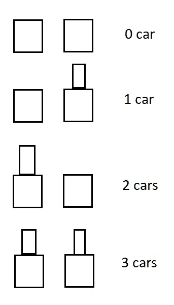
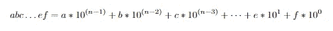
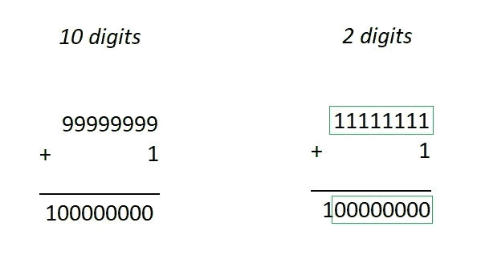

# 以太令牌——如果我们的字母表只有两个字母会怎样？

> 原文：<https://medium.com/coinmonks/ethernaut-token-what-if-our-alphabet-could-have-only-two-letters-6173d63c62ce?source=collection_archive---------38----------------------->

想象一个世界，每个人都只认识两个字母，不多也不少。他们使用的每个单词都是从这个字母创造出来的。此外，让我们假设这些字母也是数字，在这个世界上没有比这两个数字更多的数字。是不是听起来很可笑？但是如果我对你说，那种世界是存在的，我们每天都会遇到它，那会怎么样呢？

这个世界是数字电子的世界，是我们的电脑、智能手机等等的世界。这个电子电路中使用的逻辑被称为布尔代数，它只知道两个数字:0 和 1。这些数字有时被称为真假。且这两个数字被用在每个由用户使用设备中。我们保存的每个信息都被转换成 0 和 1，但不仅仅是一个数字，而是这两个数字的序列。

让我们想象一排 8 把椅子。每把椅子上都可以坐 0 或 1，但不能同时坐两个人。我们能够计算出它们可以有多少种不同坐姿。每把椅子上都可以坐 2 中的一个数字，所以我们有两种可能。其他椅子也是如此。因为我们有 8 把椅子，我们必须用 2 乘以 2 八次，因此我们得到了 2⁸=256 组合。所以我们看到，使用两个数字，并设置一个 8 的序列，我们可以有许多不同的状态。在电子学和信息学中，我们称这里描述的一把椅子为一个比特，8 个比特为一个字节。一个字节是一个数字字。我们可以把字节和更长的单词连接起来，并有越来越大的组合。如果你想一想我们每天使用的各种信息——音乐，电影，照片，游戏等等，这是必要的。它们都被保存为一个比特序列。这是惊人的，不是吗？

在 solidity 中，我们可以找到一种叫做 bytes 的类型。它们的范围很广，从字节 1 到字节 32。一个字节，我们说过，是一个 8 位的序列。32 字节是 32 字节的序列，所以它是 32*8 = 256 位的序列。我们如何知道 8 位序列给我们 2⁸组合，所以 256 位序列等于 2 ⁵⁶.这是一个非常大的数字。但是在坚固性方面，我们也可以找到像 uint256 这样的类型。这是什么？

在我回答你这个问题之前，我想让你想象一下你自己有什么奇怪的东西——你的每只手都只有一个手指。你想用手指数一数街上有多少辆车。当你注意到第一辆车时，你伸直你的食指。下一辆车时，你必须把伸直的手指藏起来，并把伸直的手指放在第二只手里。在图片上，我们看到这双手(抱歉图片质量很差，但绘画不是我最强的能力，:D)。

Counting on the hands with one finger how many cars was noticed

当我们只关注一只手时，我们可以看到手指是否被隐藏。所以它只有两种状态，比如位的值。加上二手，我们总共有 4 种可能性。太好了，现在我们知道如果我们多加一只手，我们将有 8 种可能性。但是，除了我们发现了一些伟大的东西。以 2 为基数的数学。我的意思是。

我们的日常数学包含 10 个数字:0，1，2，3，4，5，6，7，8 和 9。每个数字都是用这些数字创建的。如果数字大于 9，我们就通过按顺序设置这些数字来创建它，对吗？例如 42。但是我们怎么写这个数字呢？42 = 4 * 10 + 2.好吧，但是如何显示 4242 号？就是，4242 = 4 * 10+2 * 10+4 * 10+2 = 4 * 10+2 * 10+4 * 10+2*10⁰.所以如果我们将一个数长为 *n* 位数，我们将写成像一个

Number long for n digits. a, b, c, e and f are the digits from 0 to 9.

注意，每次我们用 10(位数)的幂乘以这个值的位置，从最后一个开始计数，从零开始。

让我们把这个模式放到只有 2 位数(二进制)的世界中。所以每一个大于 1 的数字都是按顺序排列的。所以 1001 号我们可以写成 1*2 + 0*2 + 0*2 + 1*2⁰.如果我们总结一下，我们会发现两位数数学中的 1001 等于 10 位数数学中的 9。

知道了这一点，我们可以回到我们关于 uint256 和 bytes256 的区别的讨论。在 uint256 中，数字用 10 位数的数学编号表示，类似于字节 256。但是 unit256 仍然像位序列(更准确地说是 256 位)一样保存在计算机中，因此我们有一个组合限制。256 比特给出 2 个⁵⁶ = 1.1579209*10⁷⁷组合。所以我们的数学不能超过这个数，如果我们使用这个类型的话。所以假设。uint256 和 bytes32 具有相同的体积，但在第一个数字中是用 10 位数字表示的。Bytes32 是 0 和 1 的序列。

如果我们现在讨论数字，我想展示一下 uint 和 int 类型之间的区别。现在我们知道每一个数字都是以比特序列的形式存储在计算机内存中的。但是我们如何用这些术语来表示负数呢？解决办法很简单。我们必须假设第一位代表符号。例如，如果第一位是 1，则数字为负，如果是 0，则数字为正。但是当我们花费一个比特来携带关于符号的信息时，我们能保存的最大数字就变了。我们来看看 bytes1 类型。最大值是 2⁸-1=255(我们减去 1，因为我们有 2⁸组合，我们从 0 开始计数)，最小值是 0。当一个比特将代表负时，最大的数将是 2⁷ -1= 127，最小的
-1*2⁷+1 = -127。所以结果是，增加信息只给了我们一个组合(-0 = 0)，但改变了最大值。因此，我们必须键入 uint (unsigned int)和 int。第一个没有关于符号的信息，它总是不为负。

为什么关于位数的信息如此重要？问题是，例如添加

Similar of adding in math contains 10 digits and 2 digits

当我们把一个数加到另一个数上时，结果有时会比相加的数长。在正常生活中，这不成问题。但是如果我们只保存有限的位数呢？我们在 2 位数的例子中看到，加 1 使得在我们的 8 位中只有 0，所以我们的数是 0。它叫做溢出。在减法过程中，我们也有类似的情况。那么就是下溢。

OpenZeppelin provides security products to build, automate, and operate decentralized applications

上溢和下溢可能是非常危险的，因此当我们在实体中处理数字时，我们应该使用来自 [OpenZeppelin](https://www.openzeppelin.com) 的[数学库](https://github.com/OpenZeppelin/openzeppelin-contracts/tree/master/contracts/utils/math)来保护我们免受这种情况。此外，从 0.8 实度版本，溢出和下溢将导致恢复。

我知道你现在会怎么想:它可能是 2 或 10 以外的其他数字吗？是的，有可能。如果你愿意，它可以是任意数量的它们，使用它们的算法与目前的情况相同。除了这两位，使用最多的是 16 位数字(十六进制)。为了在一个符号中表示 10、11、12、13、14 和 15，我们使用了 a、b、c、d、e 和 f，数字 AB = 10*16 +11*16⁰ = 171。十六进制常用较短的形式来表示二进制值。因为十六进制的一个数字可以表示从 0 到 15 的值，所以它等于 4 位。比如十六进制是流行的写地址。

我希望这篇文章对你有用。如果你有任何想法，我如何能使我的帖子更好，请告诉我。我随时准备学习。你可以在 [LinkedIn](https://pl.linkedin.com/in/szymon-skrzy%C5%84ski-881462214) 和 [Telegram](https://t.me/eszymi) 上和我联系。

如果你想和我谈论这个话题或者我写的其他话题，请随意。我乐于交谈。

快乐学习！

> 交易新手？尝试[加密交易机器人](/coinmonks/crypto-trading-bot-c2ffce8acb2a)或[复制交易](/coinmonks/top-10-crypto-copy-trading-platforms-for-beginners-d0c37c7d698c)